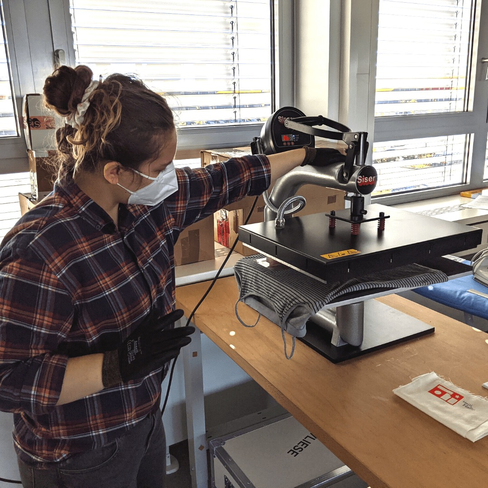
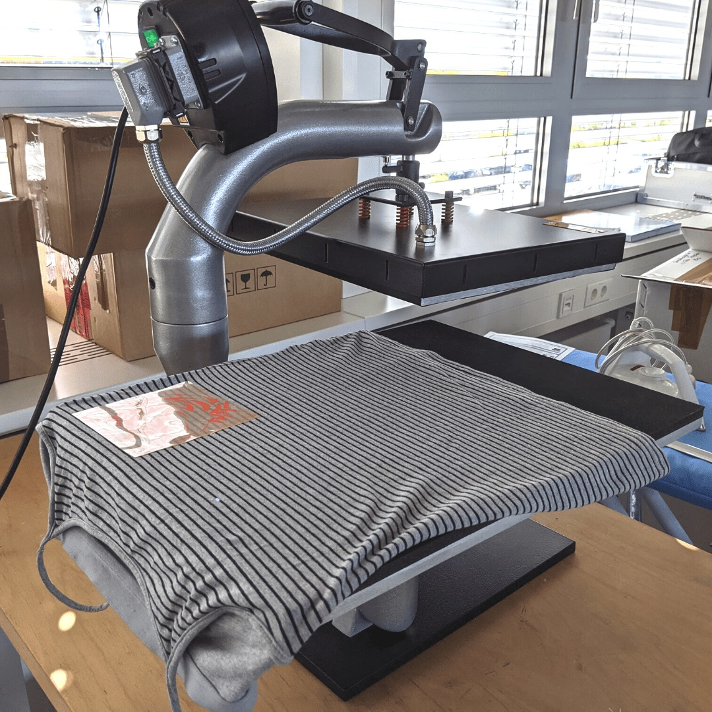
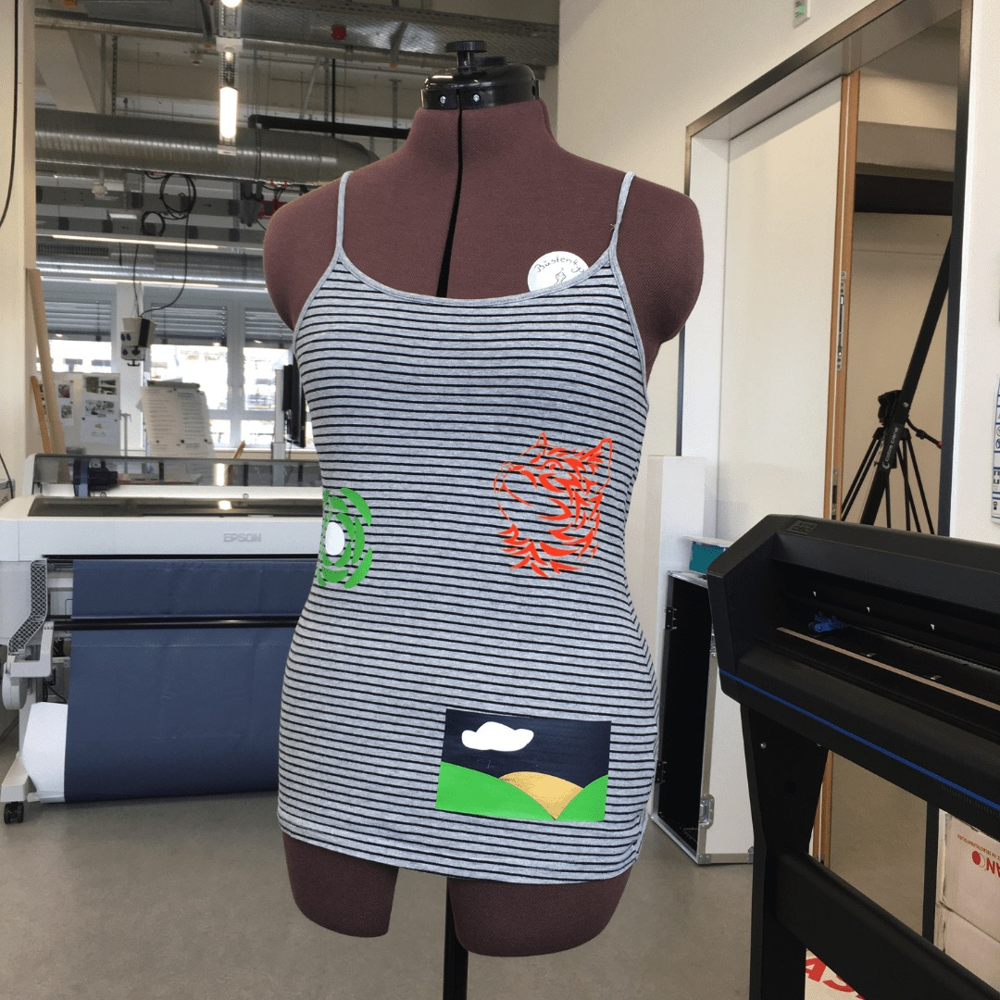

---
hide:
  - toc
date: "2021-08-05"  
---

# T-Shirts selbst gestalten?

Ihr möchtet eure eigenen T-Shirts oder Stoffe gestalten?

Sobald der RUB-Makerspace seine Tore öffnet, ist das mit der Transferpresse möglich! Dafür werden zuerst Motive mit dem Plotter auf Folie gedruckt, um diese anschließend mit Hilfe der Transferpresse auf den Stoff zu übertragen.

Klingt gut? Dann überlegt euch in der Zwischenzeit doch schon mal ein passendes Motiv für euer Projekt! 

{ width="45%" } { width="45%" } { width="45%" } { width="45%" }