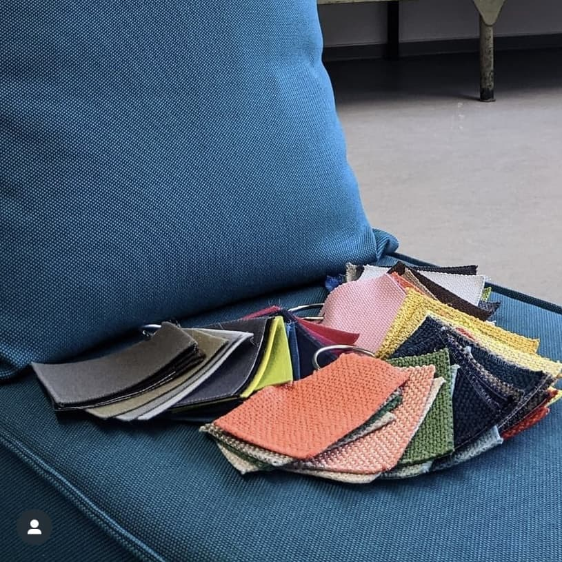
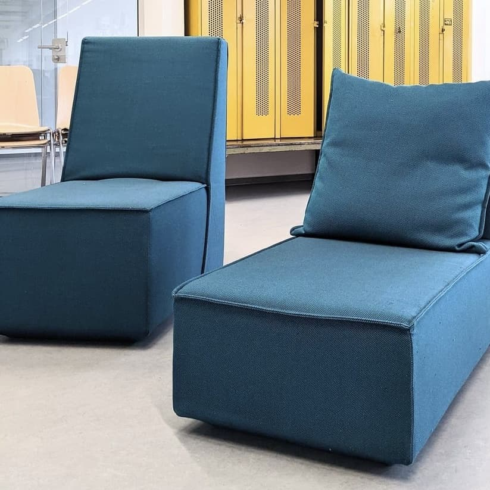

---
hide:
  - toc
date: "2021-08-12"  
---

# Es kommt Farbe in den Makerspace! 

Hier seht ihr Farb- und Möbelmuster für den Aufenthalts- und den Co-Working-Bereich! Welche Farbtöne gefallen euch am besten? 

{ width="45%" } { width="45%" }