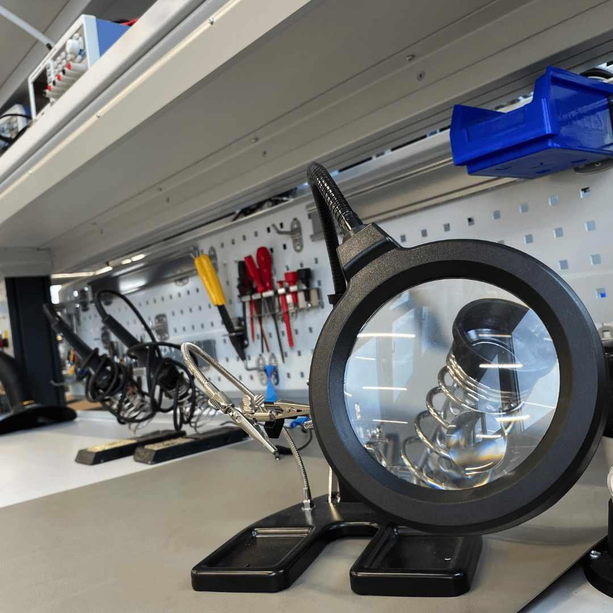
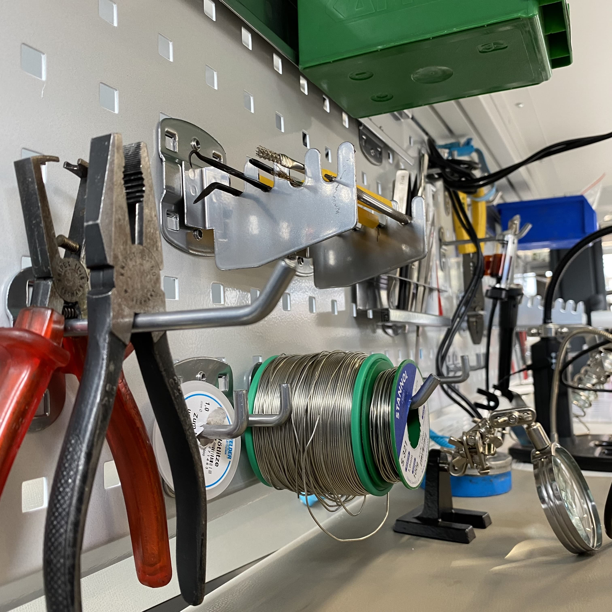

---
hide:
  - toc
date: "2021-08-19"  
---

# Digitallabor im Kleinformat 

Aufgrund des Wasserschadens in unserem UG müssen wir nun improvisieren und bauen deshalb im Erdgeschoss einige Labore im Kleinformat auf. So können wir auch auf kleinerer Fläche interne Workshops halten und uns bestmöglich auf den Start des Makerspace vorbereiten.

{ width="45%" } { width="45%" }