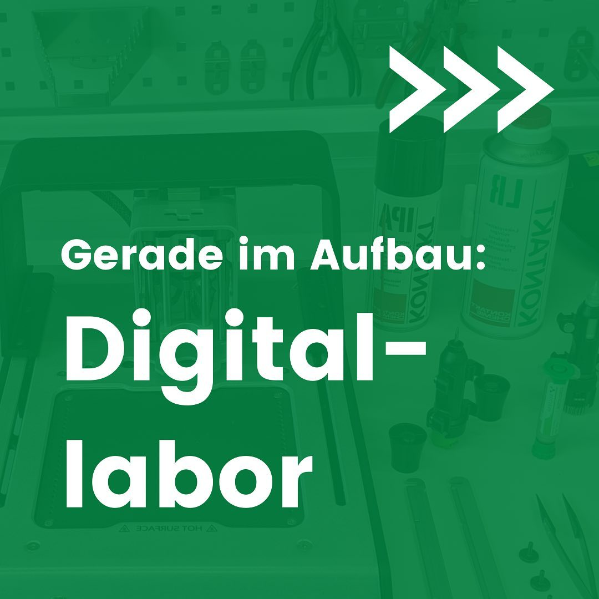
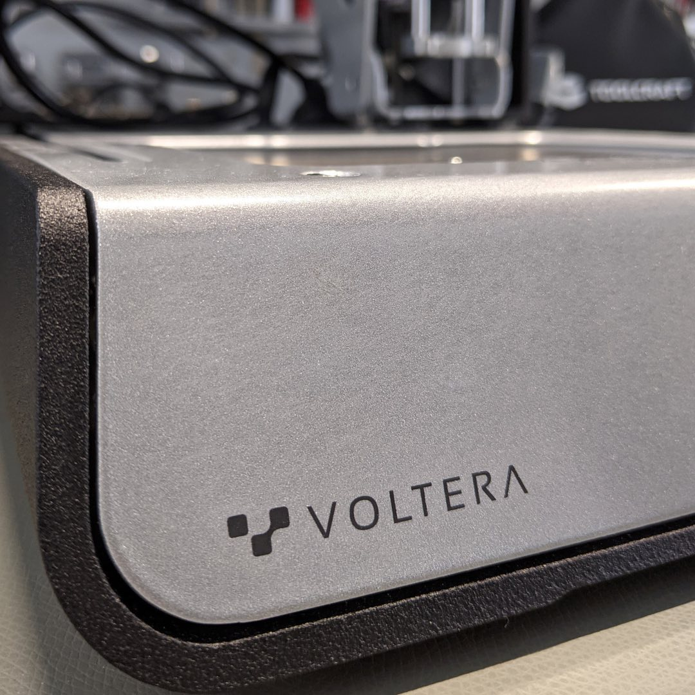
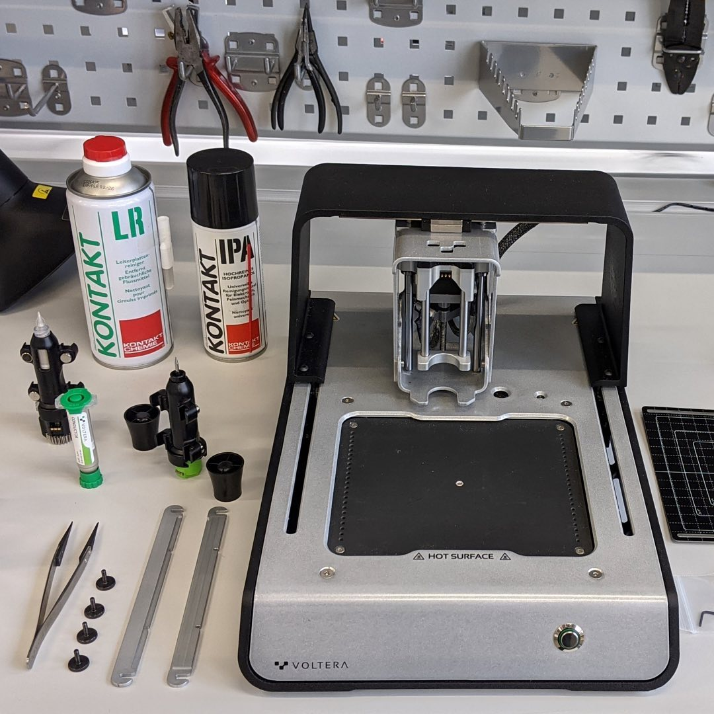

---
hide:
  - toc
date: "2021-09-03"  
authors: "LS"
---

# Update Digitallabor - Platinendrucker

In unserem Digital-Workspace richten wir gerade unter anderem einen Desktop-Platinendrucker von [voltera](https://www.voltera.io) ein. ⁠
Ihr habt eine Idee oder ein Projekt? Dann könnt ihr mit ihm später ganz einfach selbst eure Prototypen-Platinen drucken. ⁠⁠Bis wir unsere Tore öffnen können, müsst ihr euch aber noch etwas gedulden.⁠

{ width="45%" } 
{ width="45%" } 
{ width="45%" } 