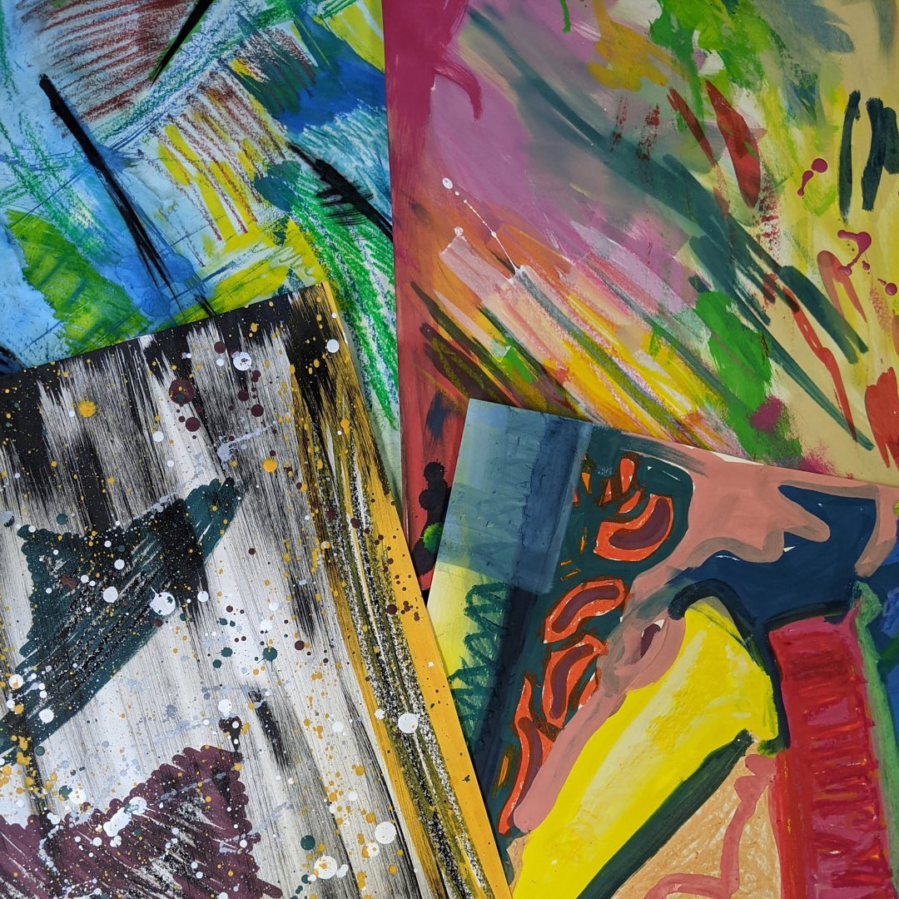
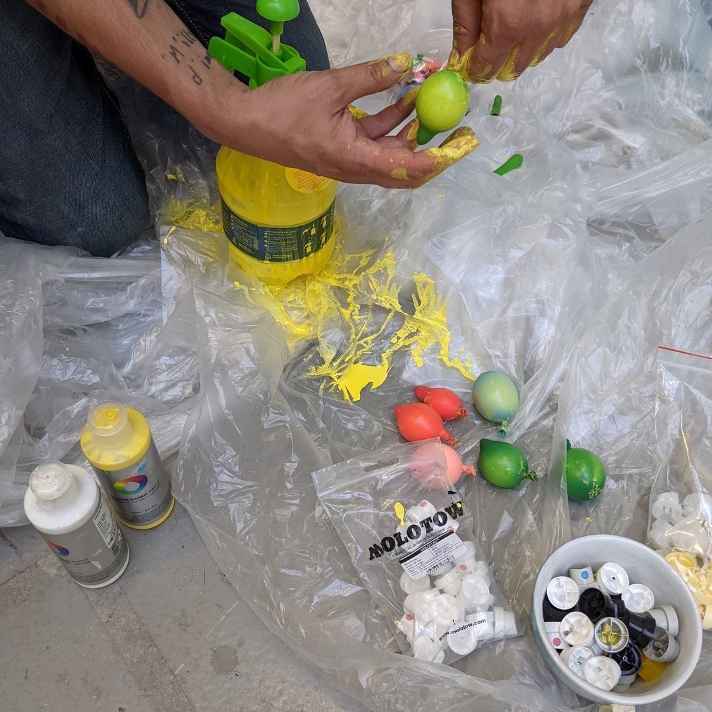
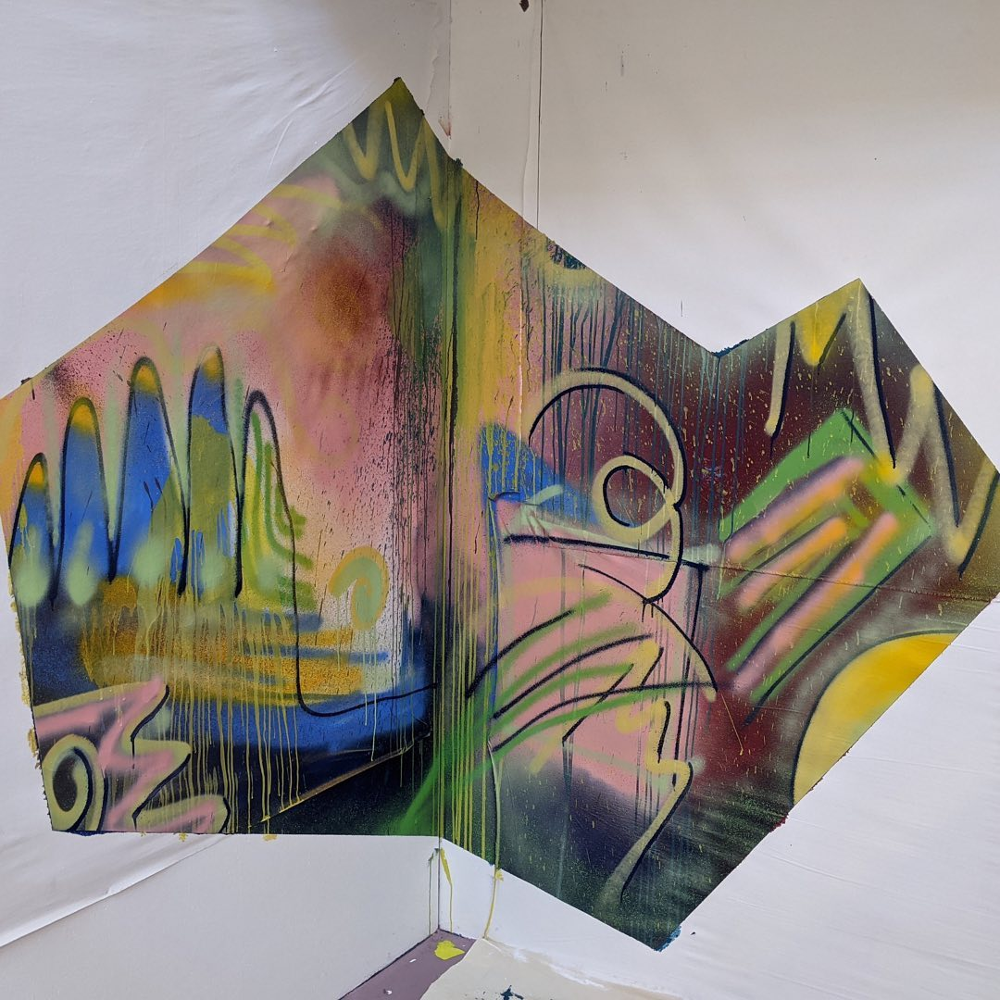

---
hide:
  - toc
date: "2021-09-09"  
authors: "LS"
---

# Farbkonzepte für unseren Crafter

Aus weiß mach bunt!⁠
⁠
In den letzten Tagen haben sich ein paar kreative Köpfe aus unserem Team und @freeters_official zusammengetan, um ein Farb- und Formenkonzept für unseren Crafter zu erarbeiten. ⁠
Es gab viele tolle Ideen und Vorschläge, also bleibt gespannt auf das Ergebnis.⁠

{ width="45%" } 
{ width="45%" } 
{ width="45%" } 