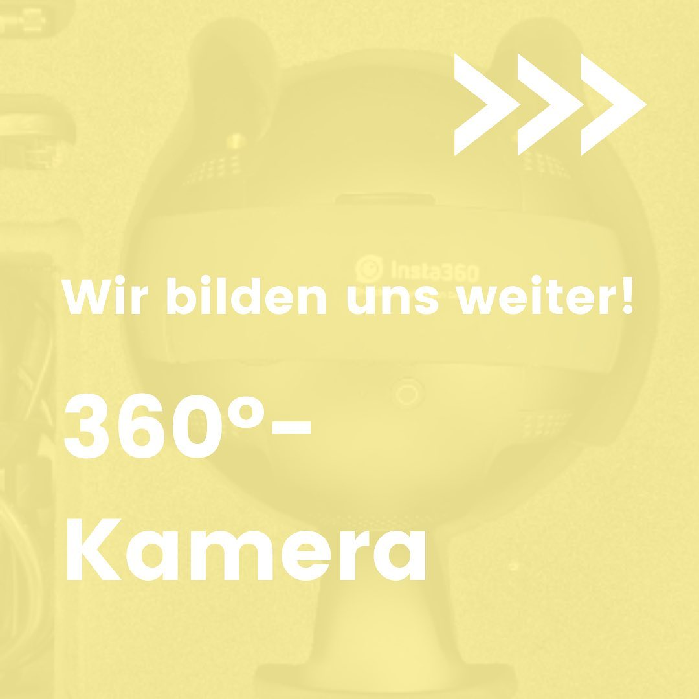

---
hide:
  - toc
date: "2021-09-16"  
authors: "LS"
---

# Interner Workshop: 360°-Kamera

Wie können wir uns am besten vorbereiten damit ihr nach unserer Eröffnung davon profitiert? Genau! Mit internen Weiterbildungen! ⁠
⁠
Diese Woche gab es eine Einführung in die Bedienung und die Nutzungsmöglichkeiten unserer 360° Kamera. ⁠
⁠Egal, ob 360° Panoramabilder oder gestochen scharfe Bilder im Livestream, mit der Insta360 pro2 gelingt euch das ohne Probleme!⁠
⁠
Wie würdet ihr am liebsten die Insta360 pro2 einsetzen?

{ width="45%" } 
{ width="45%" } 
{ width="45%" } 