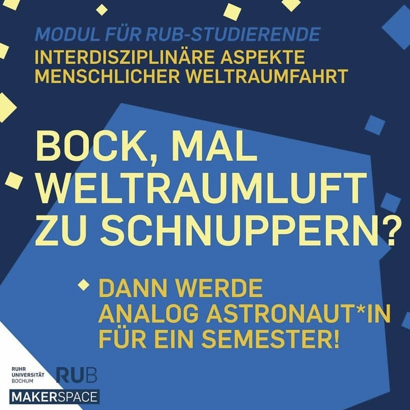

---
hide:
  - toc
date: "2021-10-01"  
authors: "LS"
---

# Weltraumseminar im Makerspace

Das erste Seminar im RUB-Makerspace: Im Rahmen eines Seminars im Optionalbereich bilden Studierenden eine Astronauten- und eine Support-Crew und simulieren so Bodenstation und Raumstation und die sozialen Zusammenhänge einer Mission. Geforscht und gearbeitet wird im MaMBA Habitat, dem Moon and Mars Base Analog, der Uni Bremen sowie im RUB-Makerspace. Und das sogar noch vor dem offiziellen Start von uns!!!

Anmeldeschluss ist der 04.10.2021 im Vorlesungsverzeichnis der RUB!

{ width="45%" } 
