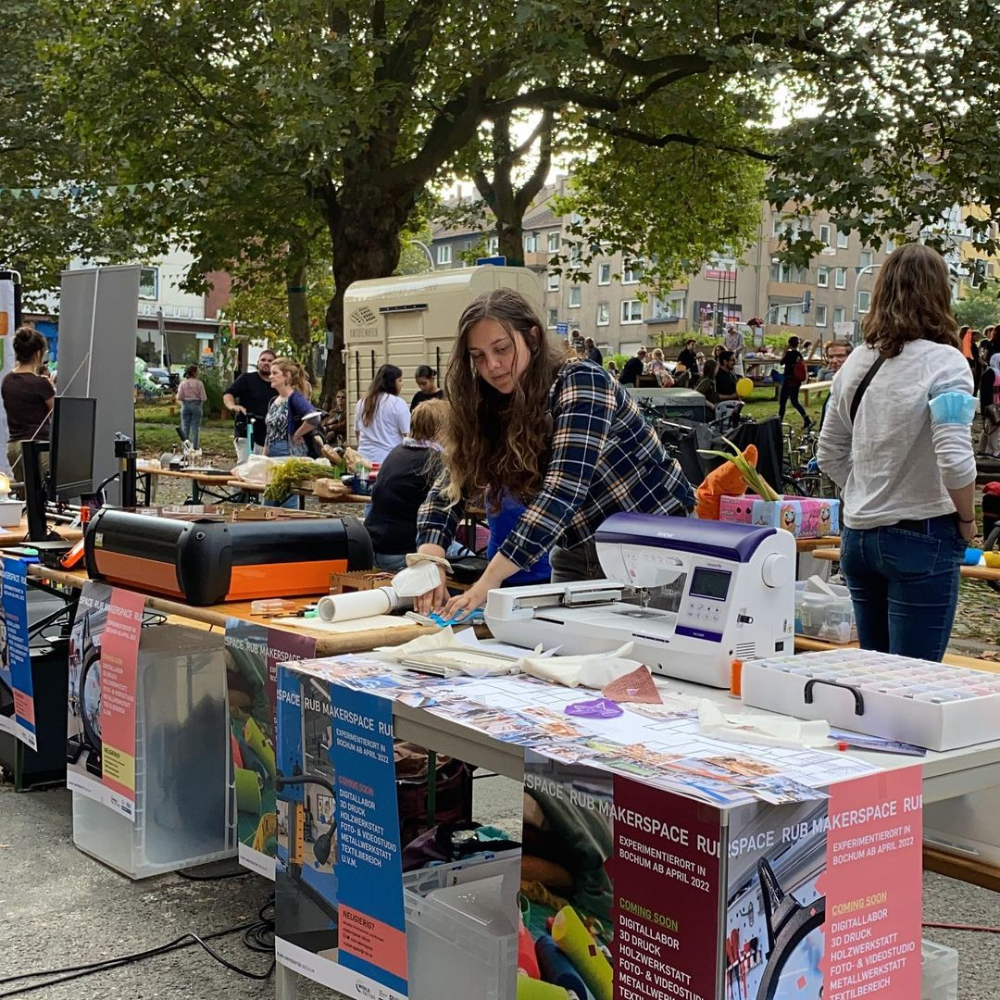
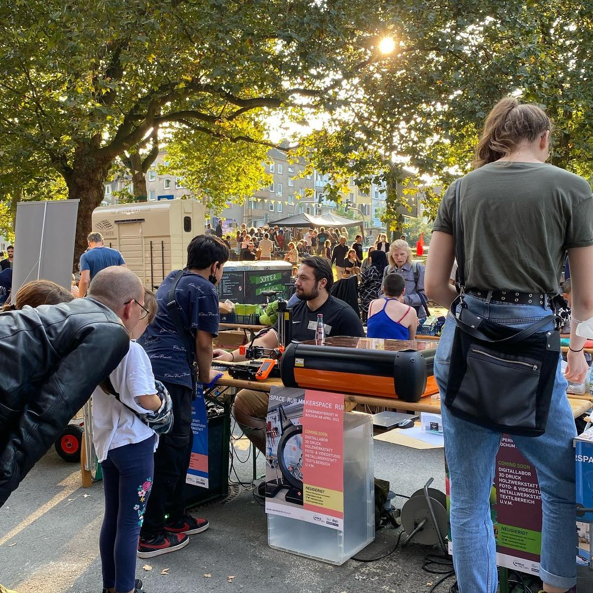
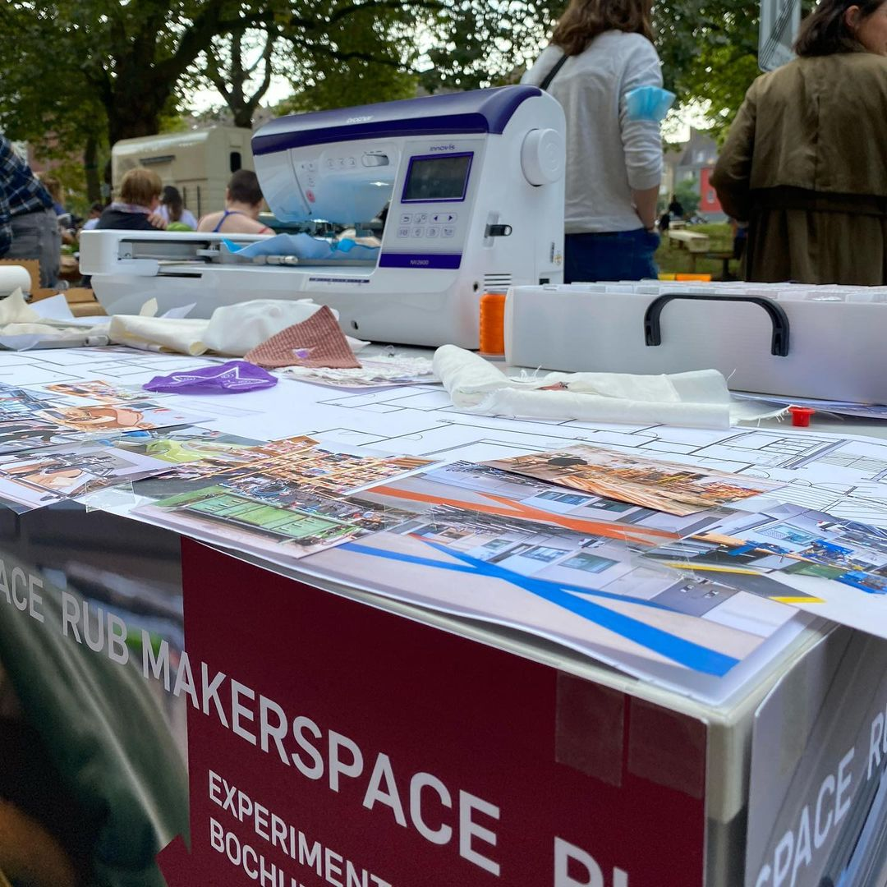

---
hide:
  - toc
date: "2021-10-07"  
authors: "LS"
---

# Projektwoche Recycling

Vielen Dank an @repaircafe.rubo und @ein_quartier_macht_theater für die Möglichkeit, dass wir uns im Rahmen der Projektwoche vorstellen durften!
Es war ein absolut gelungener Tag mit tollem Austausch untereinander und vielen interessierten Besucher\*innen.

Wir freuen uns schon auf das nächste Event!

Warst Du auch dabei und konntest einen kleinen Einblick in unsere Arbeit erhalten?

{ width="45%" } 
{ width="45%" } 
{ width="45%" }