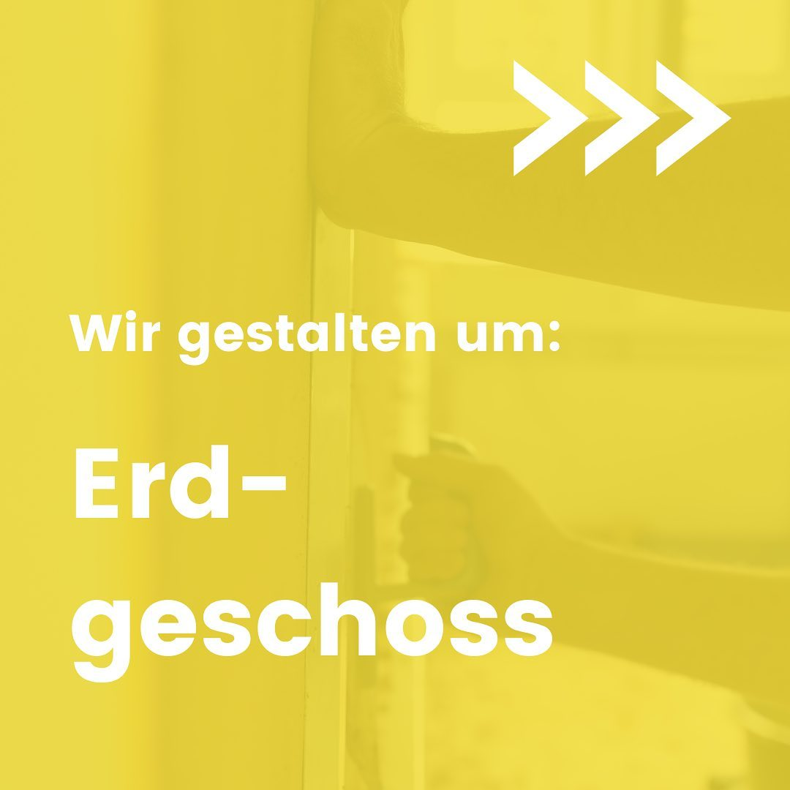
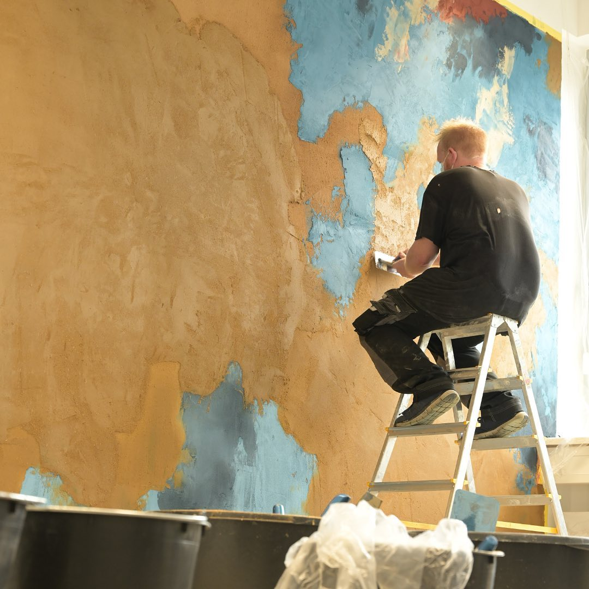
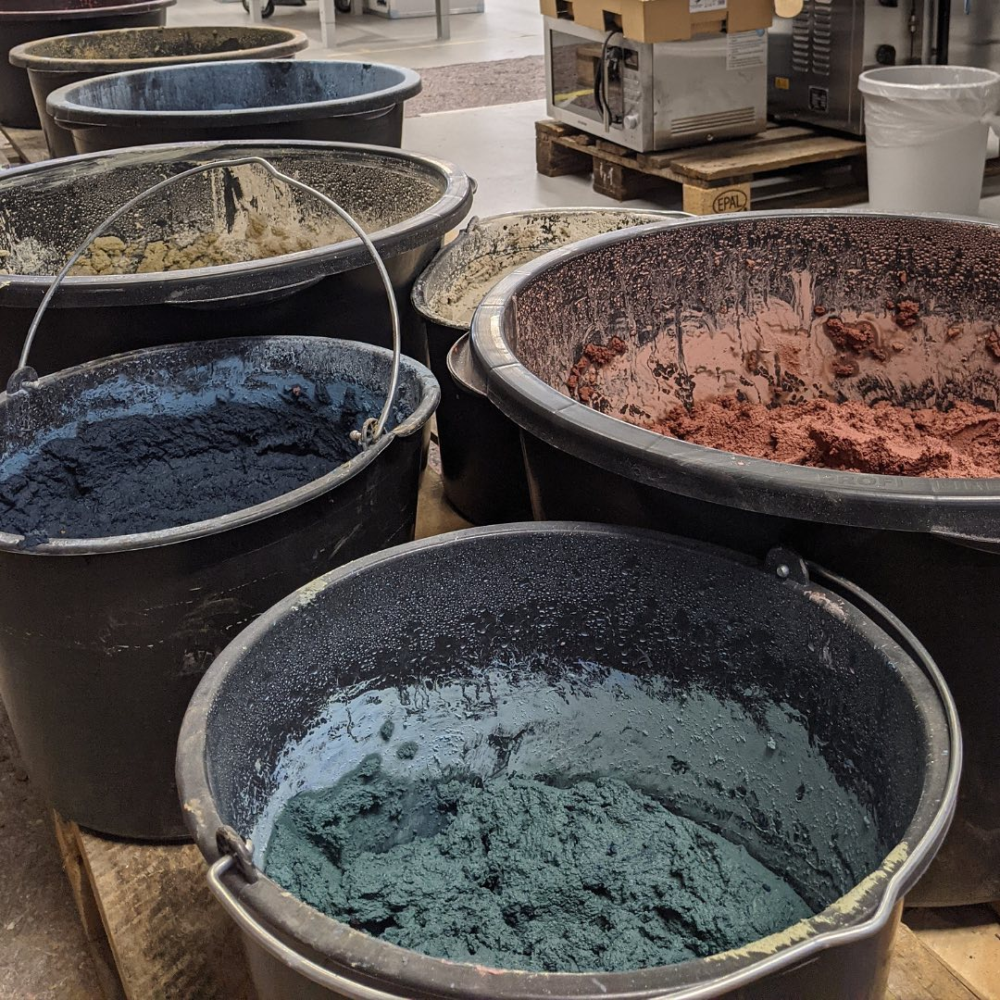

---
hide:
  - toc
date: "2021-10-14"  
authors: "LS"
---

# Wir gestalten um: Erdgeschoss

Es bleibt spannend! ⁠
⁠
In den letzten Wochen hatten wir viele tolle Menschen von [freeters](https://freeters.de) zu Besuch bei uns. Sie waren damit beschäftigt, den bisher weißen Wänden des Makerspace Struktur und Farbe zu verleihen. ⁠
Aus einem Lehmgemisch mit verschiedenen Farbpartikeln entstehen neue Wandverkleidungen, damit hier demnächst eine absolute Wohlfühlatmosphäre herrscht! 
⁠
Was würdet ihr euch, für eine tolle Atmopsphäre im Makerspace, wünschen? ⁠
⁠
{ width="45%" } 
{ width="45%" } 
{ width="45%" } 