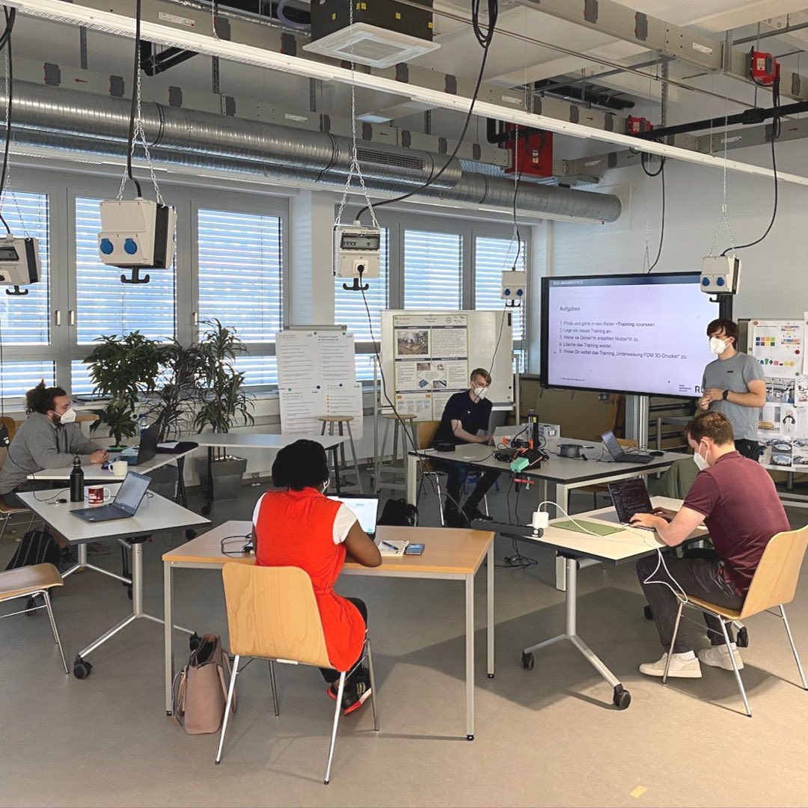
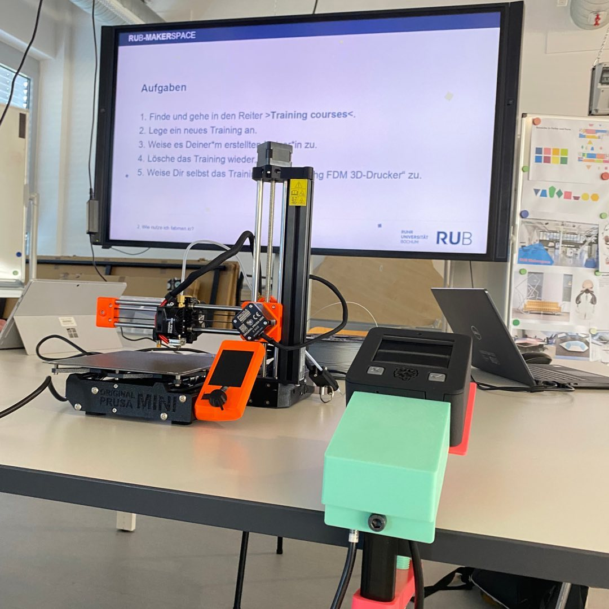
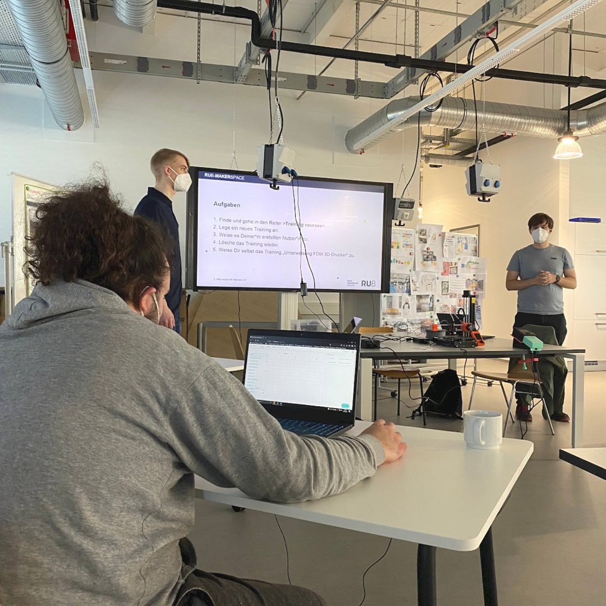

---
hide:
  - toc
date: "2021-10-21"  
authors: "LS"
---

# Interner Workshop: Fabman

Wie kannst Du, nach der Eröffnung, eigentlich unsere Geräte nutzen??⁠
⁠
Mit dieser und weiteren Fragen, mit Bezug auf die Nutzung und Sicherheit unserer Geräte und Flächen, haben wir uns im Fabman-Workshop beschäftigt. ⁠
⁠
Fabman ist ein System für die effiziente und kostengünstige Verwaltung von Usern und Ressourcen. Es soll uns und Dir später helfen, einen reibungslosen Ablauf im rubmakerspace zu gewährleisten.⁠
⁠
{ width="45%" } 
{ width="45%" } 
{ width="45%" } 