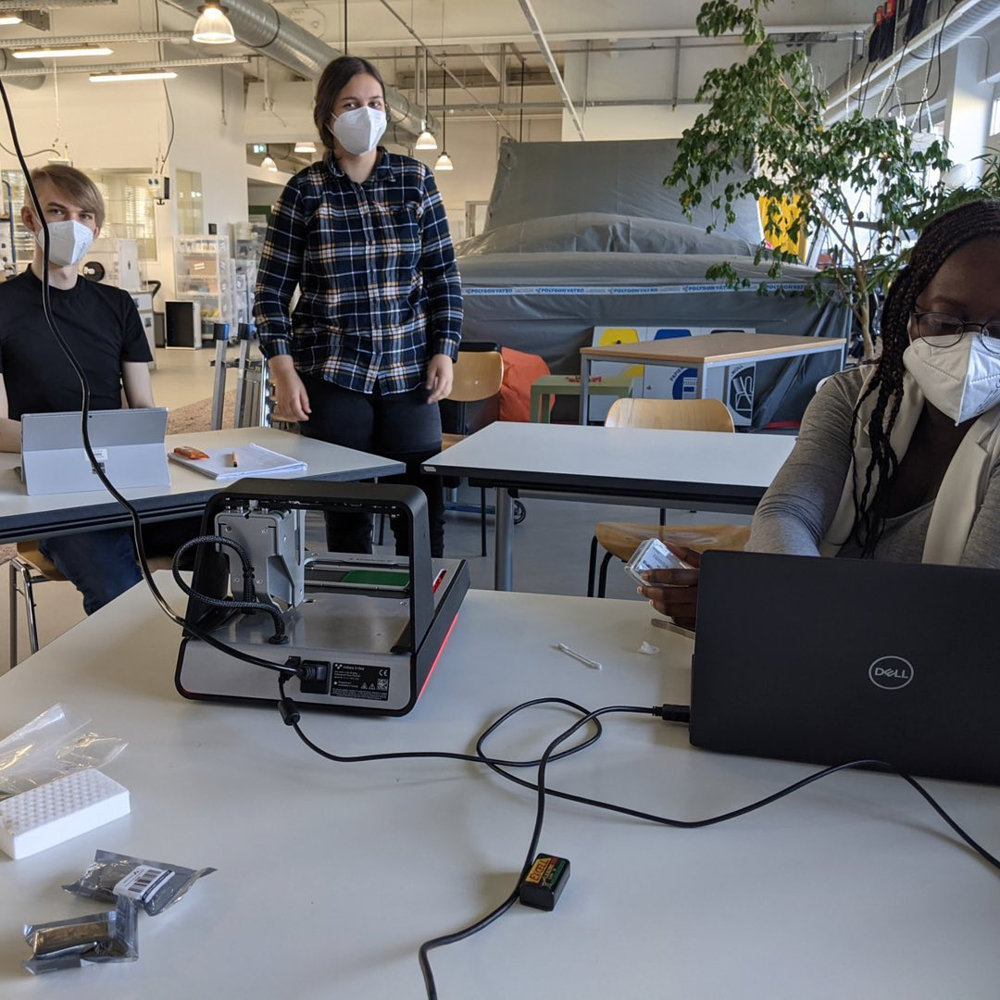
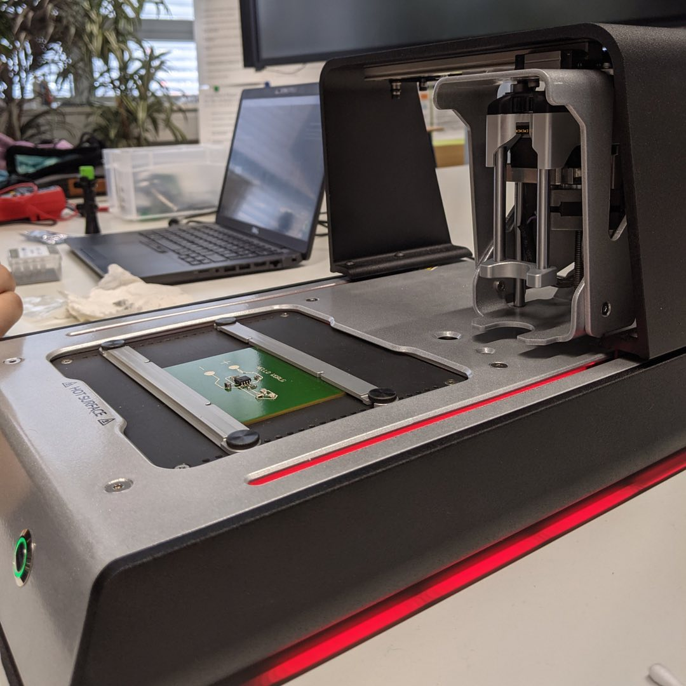

---
hide:
  - toc
date: "2021-11-07"  
authors: "LS"
---

# Platinendrucken im Makerspace

Du möchtest für Dein Projekt Deine eigenen Platinen drucken?

Dann ist der Voltera-Platinendrucker genau das Richtige! In einem internen Workshop haben unsere Mitarbeitenden das Gerät und seine Funktionen kennengelernt, damit sie Dir nach unserer Eröffnung bei all Deinen Fragen zur Seite stehen können.

{ width="45%" } 
{ width="45%" } 