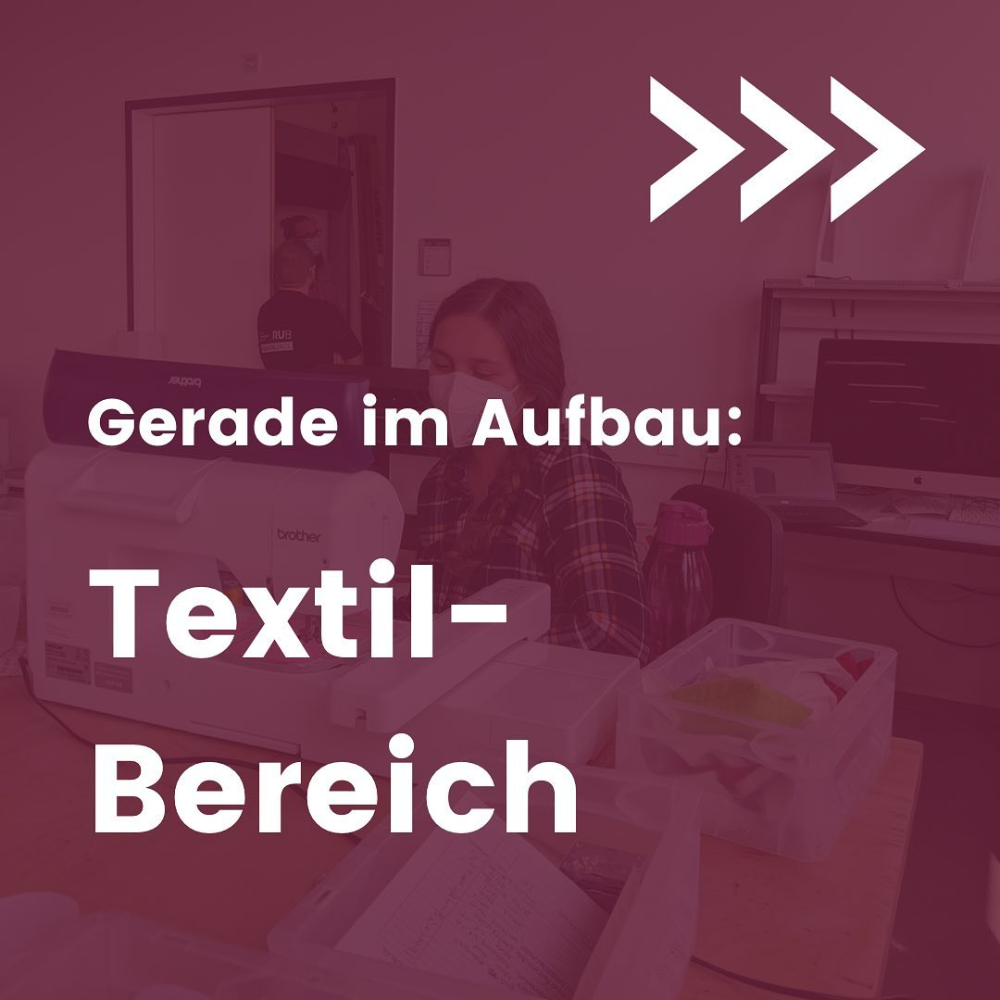
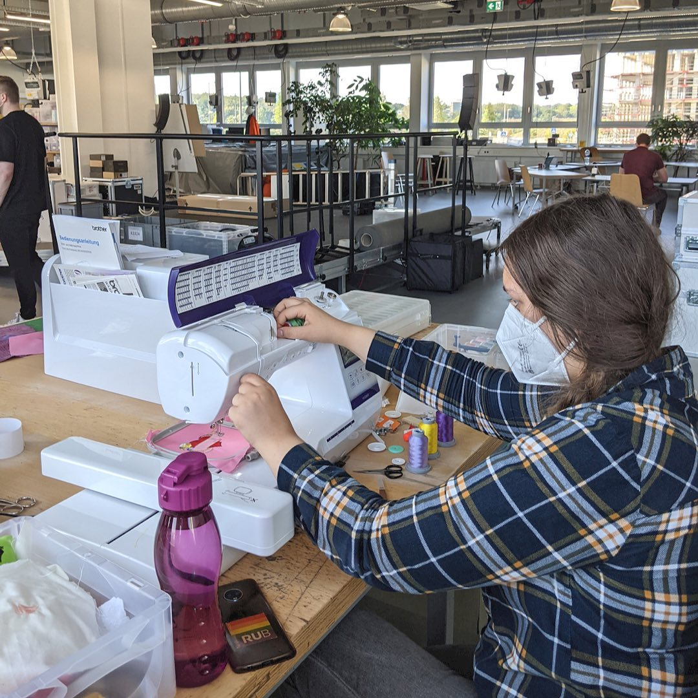

---
hide:
  - toc
date: "2021-11-11"  
authors: "LS"
---

# Gerade im Aufbau: Textillabor

Du hast ein Projekt wofür Du nähen und sticken können musst?
Dann haben wir gute Nachrichten für Dich!
Ab April 2022 kannst Du mit unserer computergesteuerten Näh-& Stickmaschine Deinen kreativen Ideen freien Lauf lassen.
Und falls Du mal Fragen hast oder Dich vielleicht in dem Bereich noch gar nicht auskennst, dann stehen Dir unsere Mitarbeitenden bei jeder Gelegenheit zur Seite.

Hättest Du Interesse an einem Workshop zu unseren Näh-& Stickmaschinen?

{ width="45%" } 
{ width="45%" } 