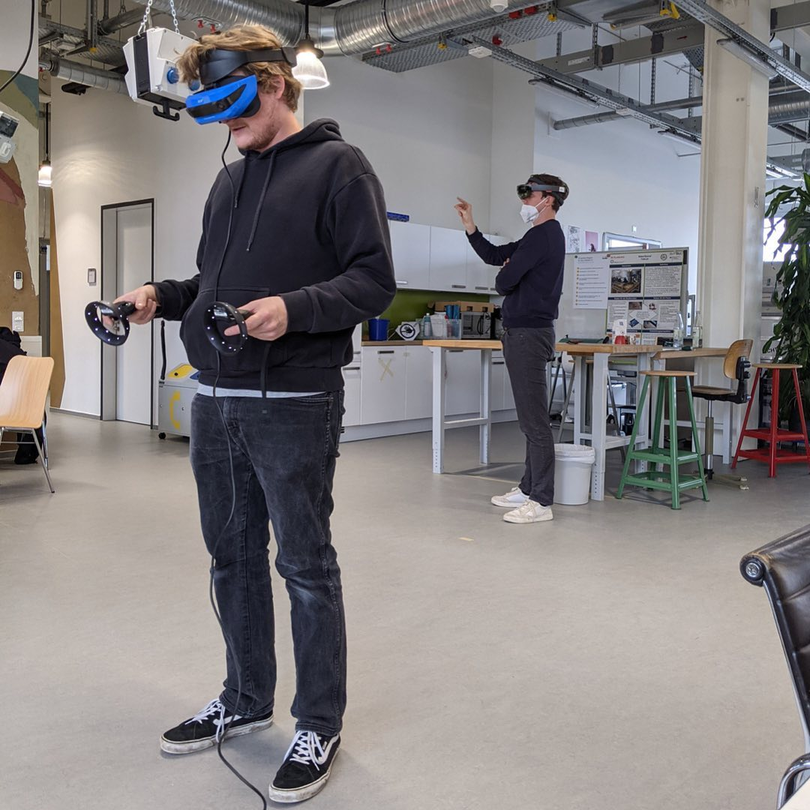

---
hide:
  - toc
date: "2021-11-21"  
authors: "LS"
---

# Virtual & Augmented Reality im Makerspace

In unserem AR & VR-Workshop haben wir unser neues Equipment getestet und ausprobiert.
VR & AR sind nicht nur für Spiele sondern auch für die Prototypenentwicklung sehr hilfreich! So kann man sich beispielsweise das selbst entworfene Produkt in voller Größe von allen Seiten anschauen und gegebenenfalls Fehler beheben, die sonst erst nach der Produktion aufgefallen wären.

Wofür würdest Du gern unser VR&AR Equipment nutzen?

{ width="45%" } 