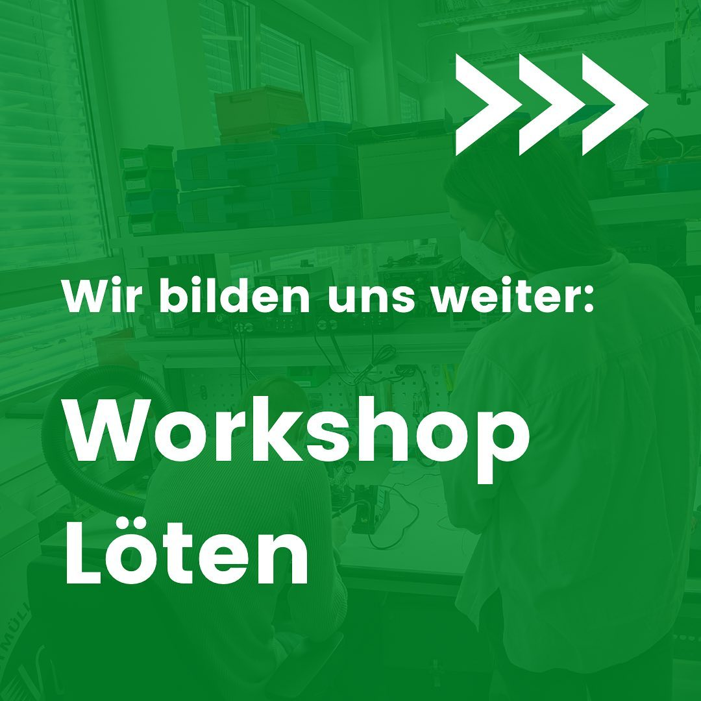
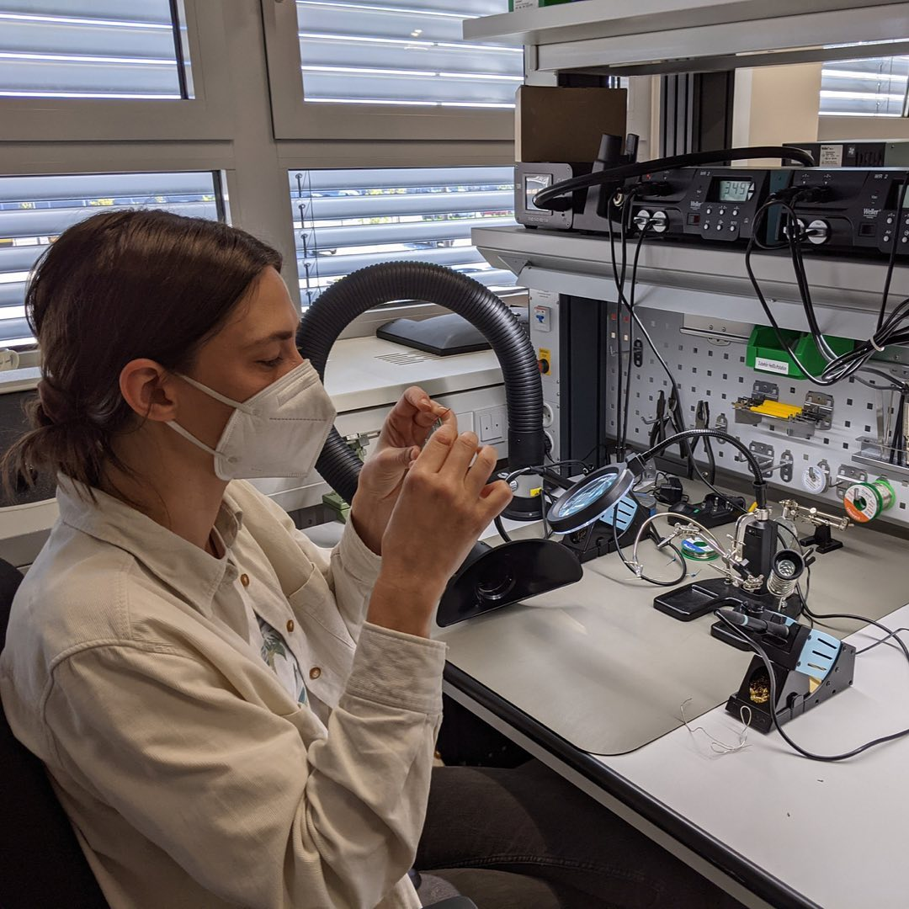
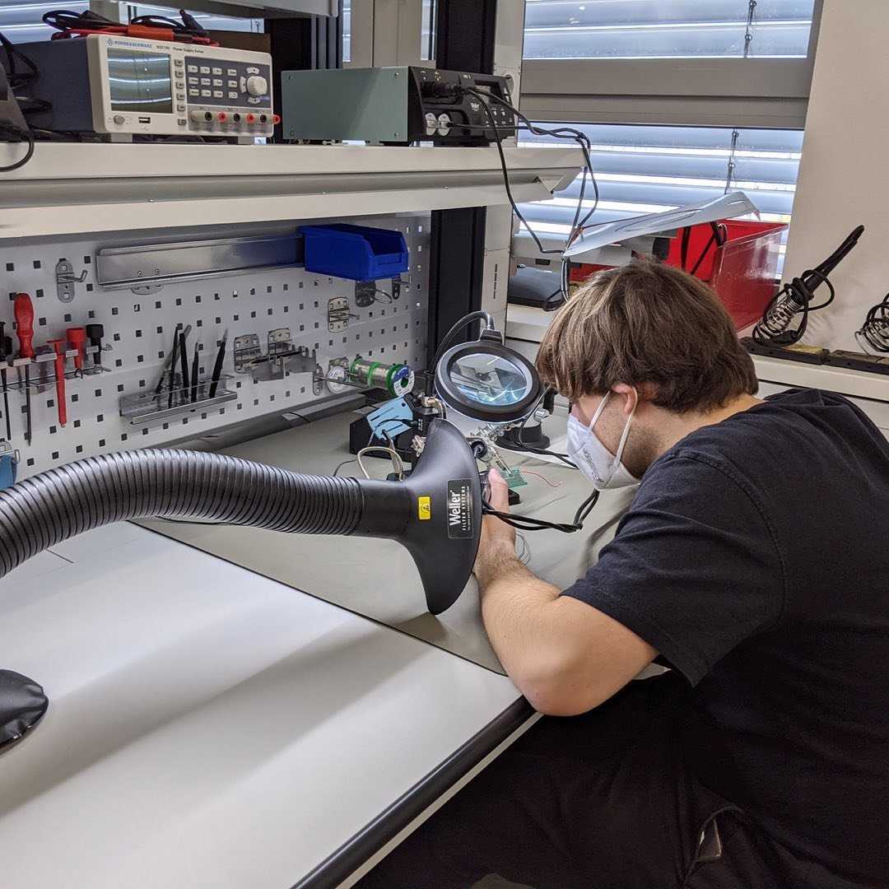

---
hide:
  - toc
date: "2021-11-27"  
authors: "LS"
---

# Workshop: Löten	

In unserem großen Digitallabor ist leider gerade noch Baustelle wegen des Wasserschadens, aber dank unserer mobilen Arbeitstische konnten wir ein Digitallabor im Kleinformat aufbauen.
Dadurch konnte nun auch unser interner Workshop für das Löten stattfinden, bei dem die Grundlagen und wichtige Fertigkeiten erlernt werden konnten.

Wer wollte auch schon immer mal Löten lernen?

{ width="45%" } 
{ width="45%" } 
{ width="45%" } 