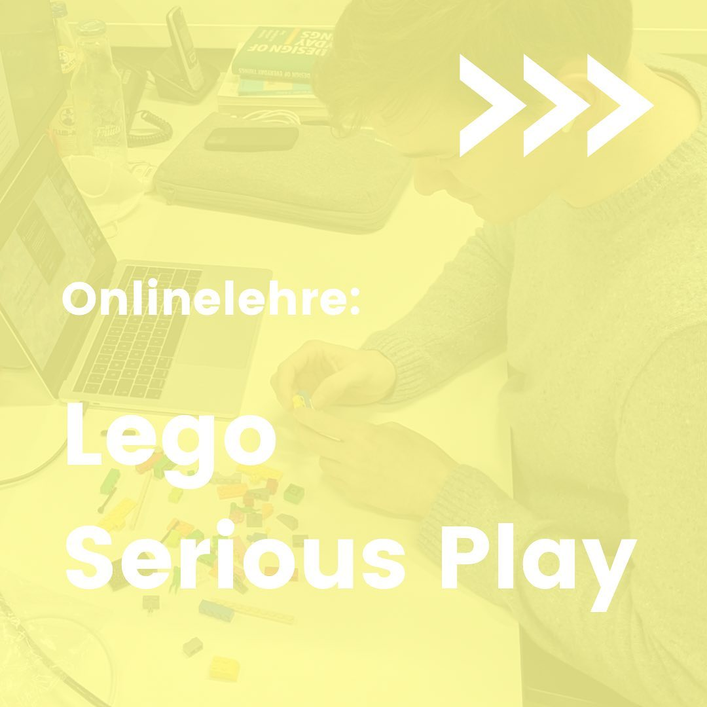
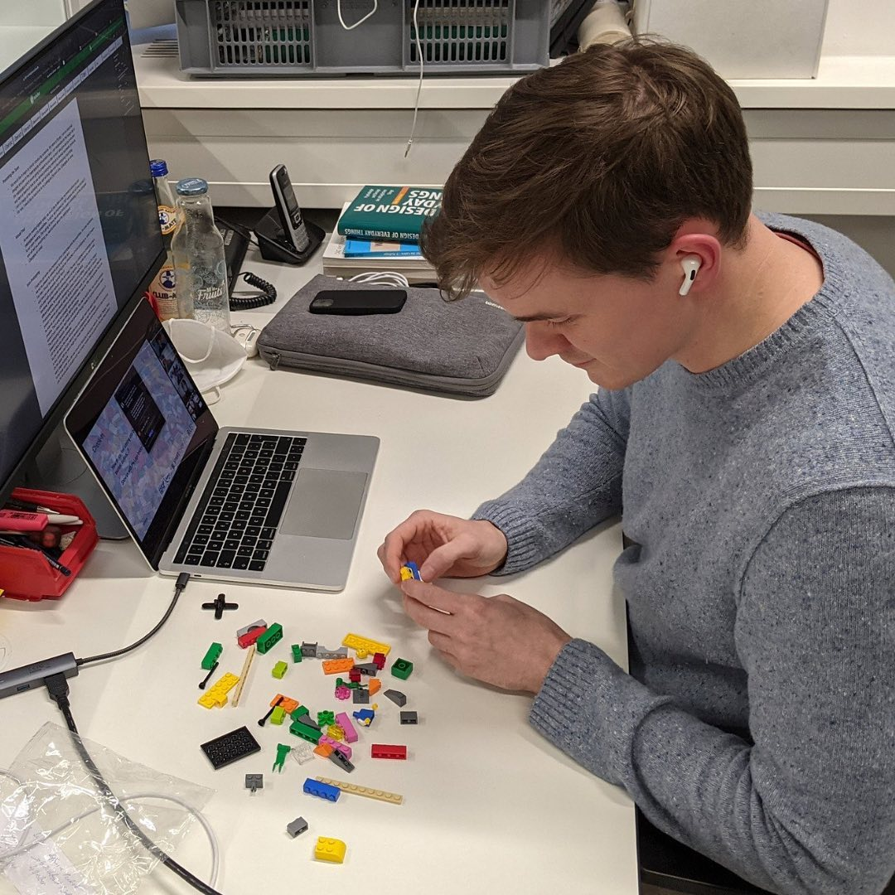
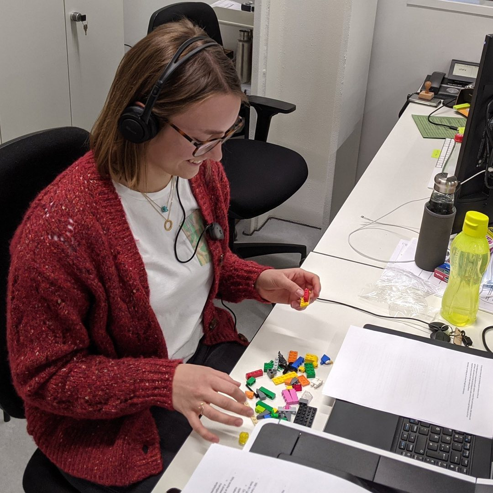
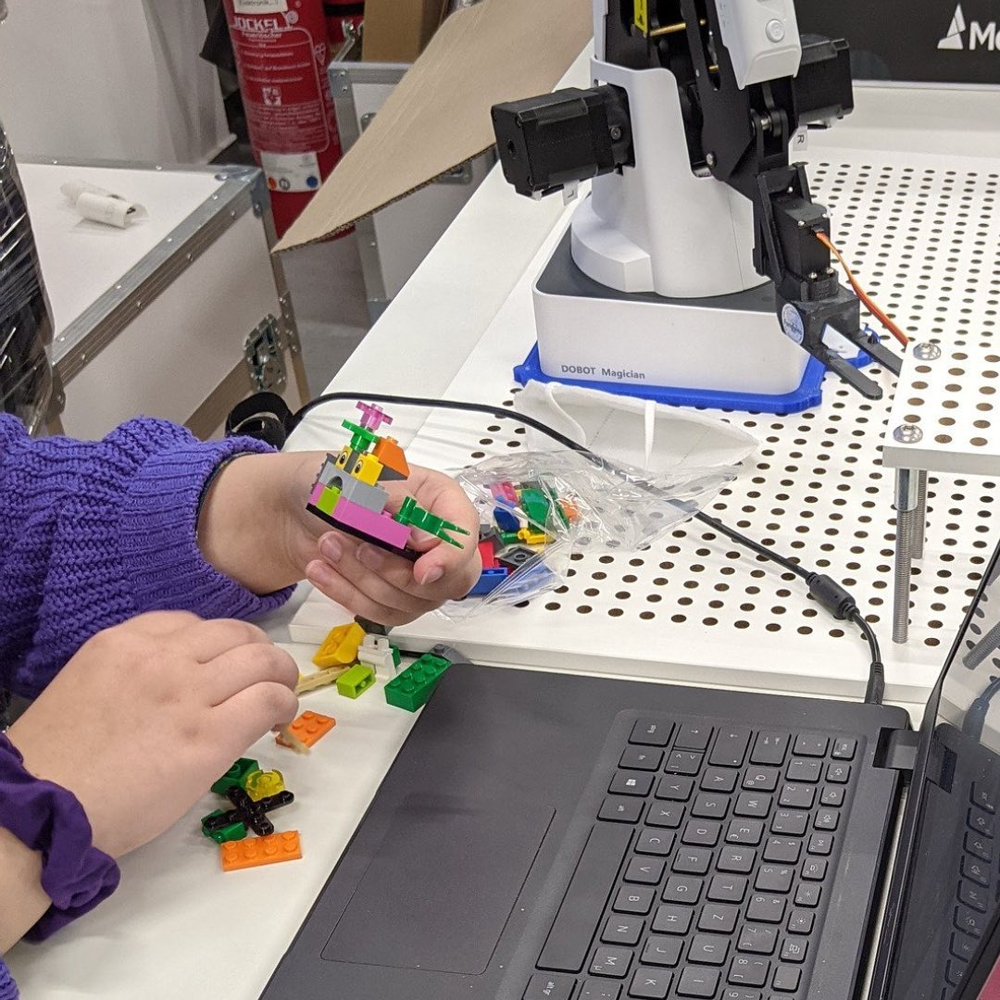

---
hide:
  - toc
date: "2021-12-09"  
authors: "LS"
---

# Lego Serious Play

Time to play and create!

Im Rahmen von Start4Chem von der [Worldfactory Bochum](https://www.worldfactory.de) durften wir einen interaktiven Gastvortrgag zum Thema Lego Serious Play geben.

Mit dieser Methode kann man abstrakte oder surreale Konzepte und Zusammenhänge visualisieren und ein besseres Verständnis dafür entwickeln, wie etwas funktioniert, indem man physische Objekte herstellt und baut.

Vielen Dank an [Worldfactory Bochum](https://www.worldfactory.de), dass wir dabei sein durften!

{ width="45%" } 
{ width="45%" } 
{ width="45%" } 
{ width="45%" } 