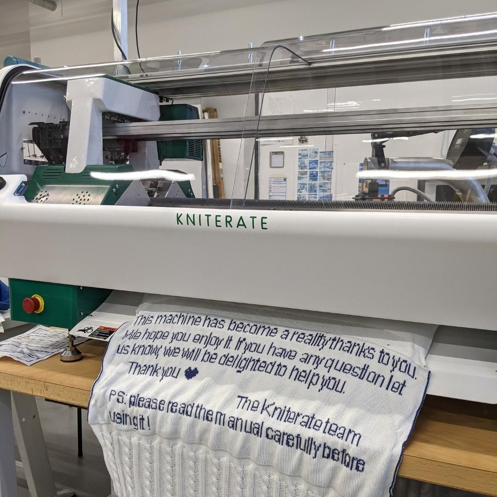

---
hide:
  - toc
date: "2022-01-06" 
authors: "LS"  
---

# Strickmaschine - Kniterate im Makerspace

Neuzugang in der Textilwerkstatt

Nach langem Warten ist nun endlich unsere Kniterate angekommen! 

Kniterate ist eine digitale Strickmaschine, mit der Du im Makerspace digitale Designs ganz einfach stricken lassen kannst, egal ob Pullover, Mütze oder sogar Schuhe!

Wer wollte auch schon immer mal eine eigene Idee verwirklichen, aber per Hand hätte es ihm\*ihr einfach zu lang gedauert?

{ width="45%" } 
