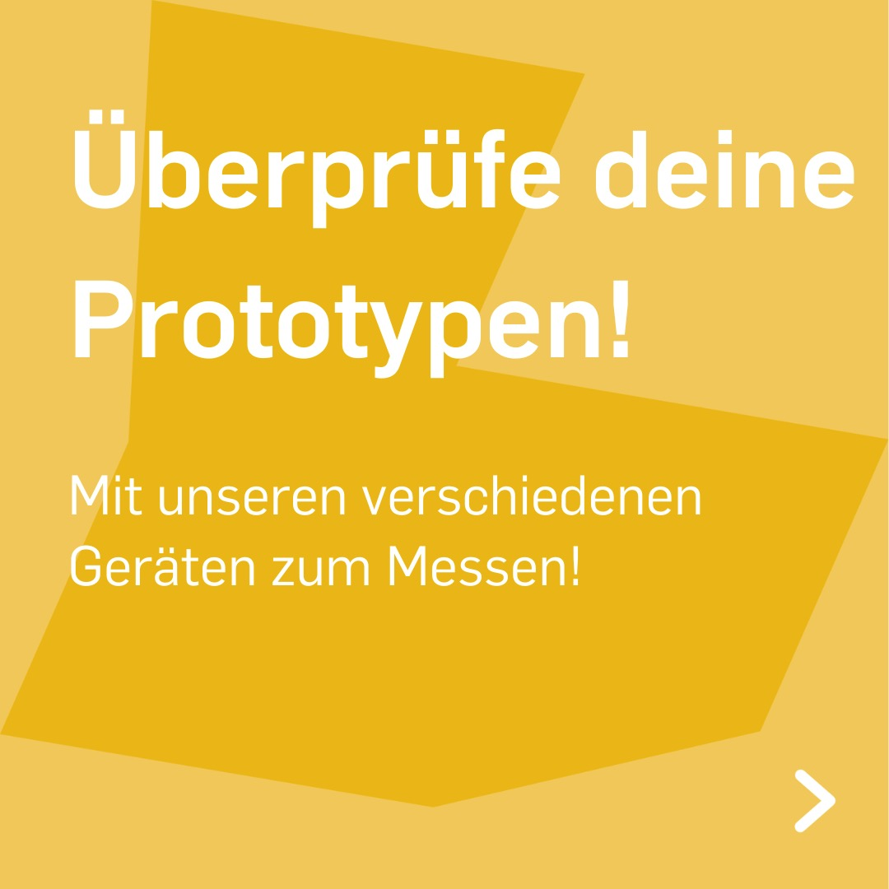
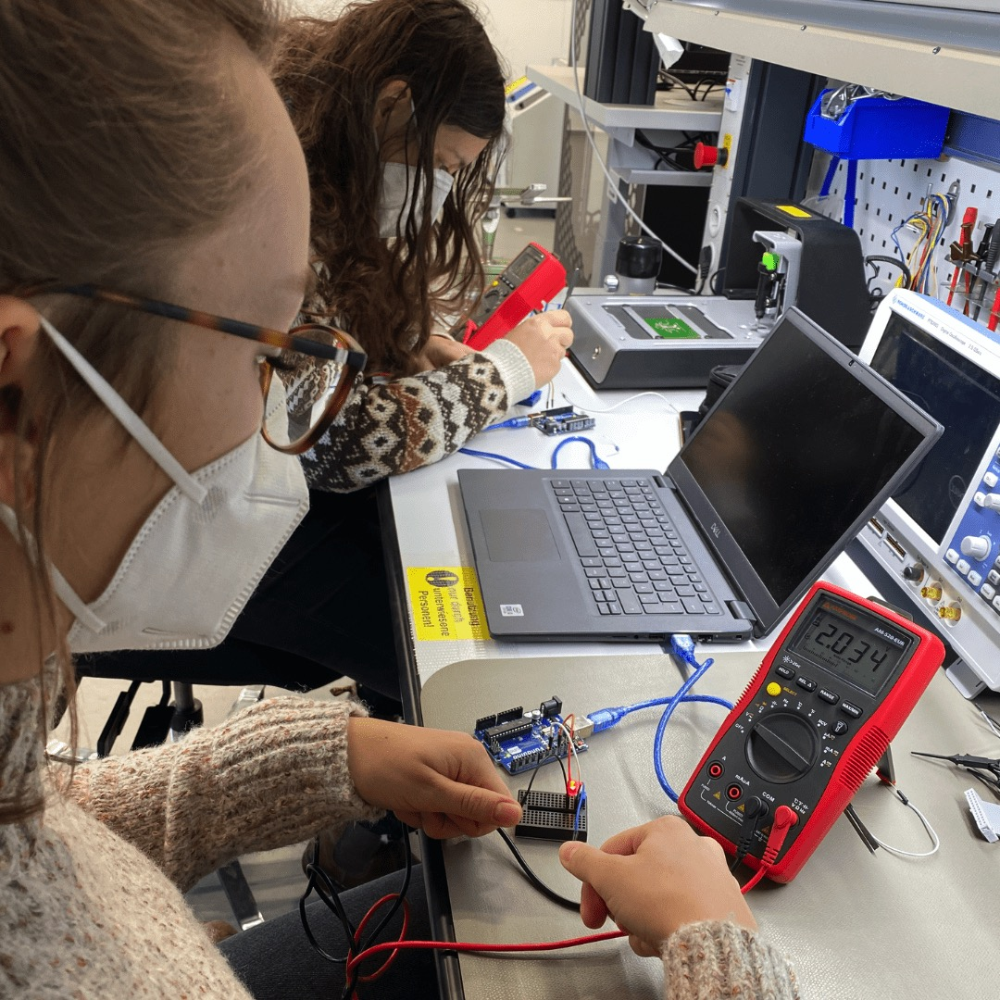
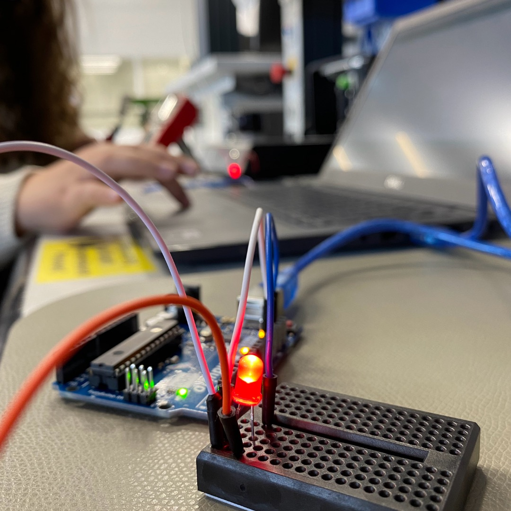
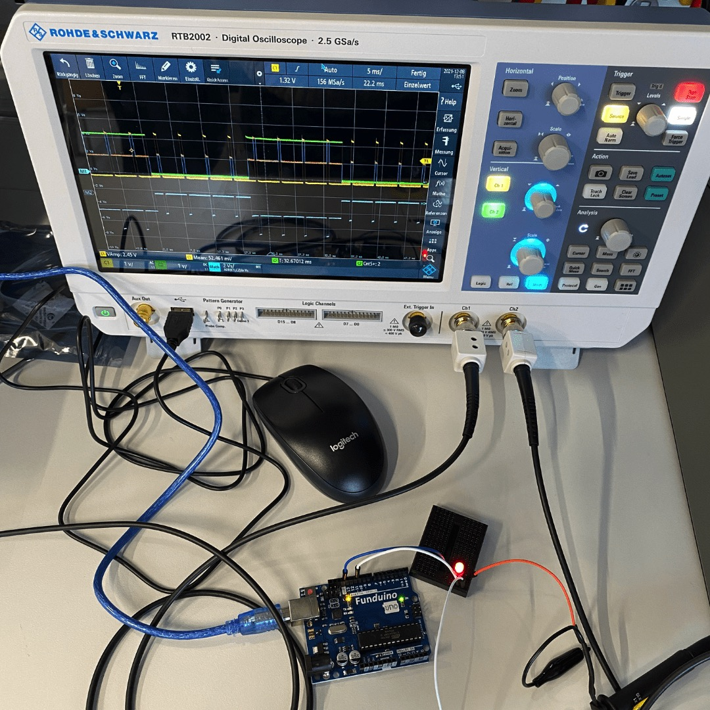

---
hide:
  - toc
date: "2022-02-13"
authors: "LS"   
---

# Überprüfe Deine Prototypen

...mit Hilfe von unseren hochqualitativen Messgeräten wie zum Beispiel den Oszilloskopen von @rohdeschwarzusa oder unseren Multimetern von @amprobetools im Digitallabor.

{ width="45%" }
{ width="45%" }
{ width="45%" }
{ width="45%" }