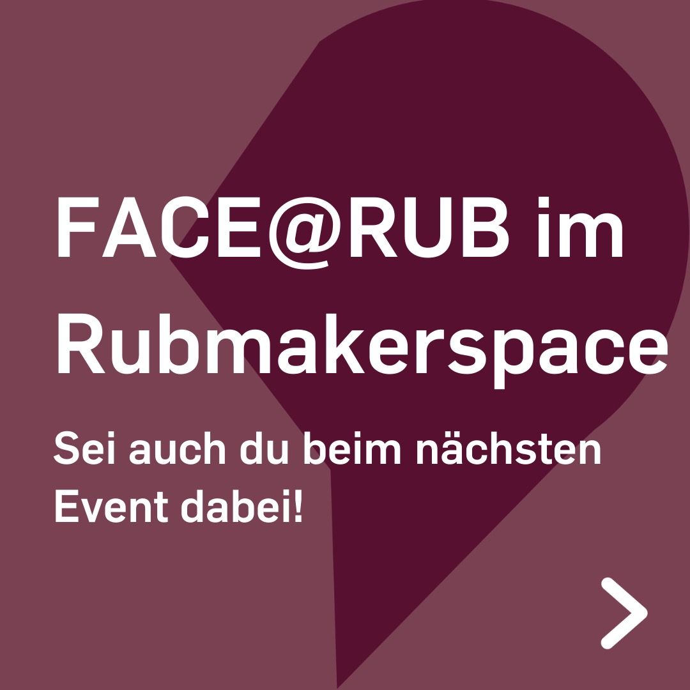
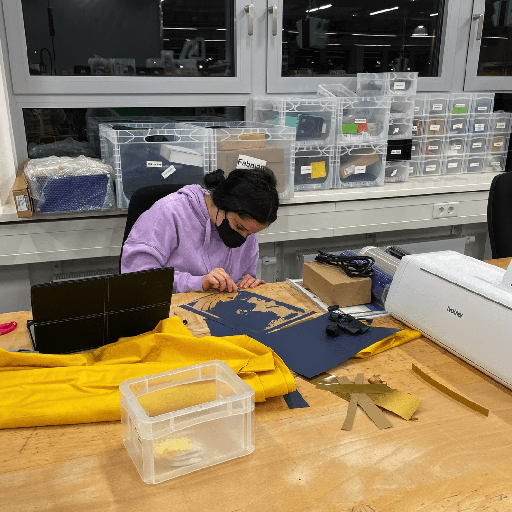
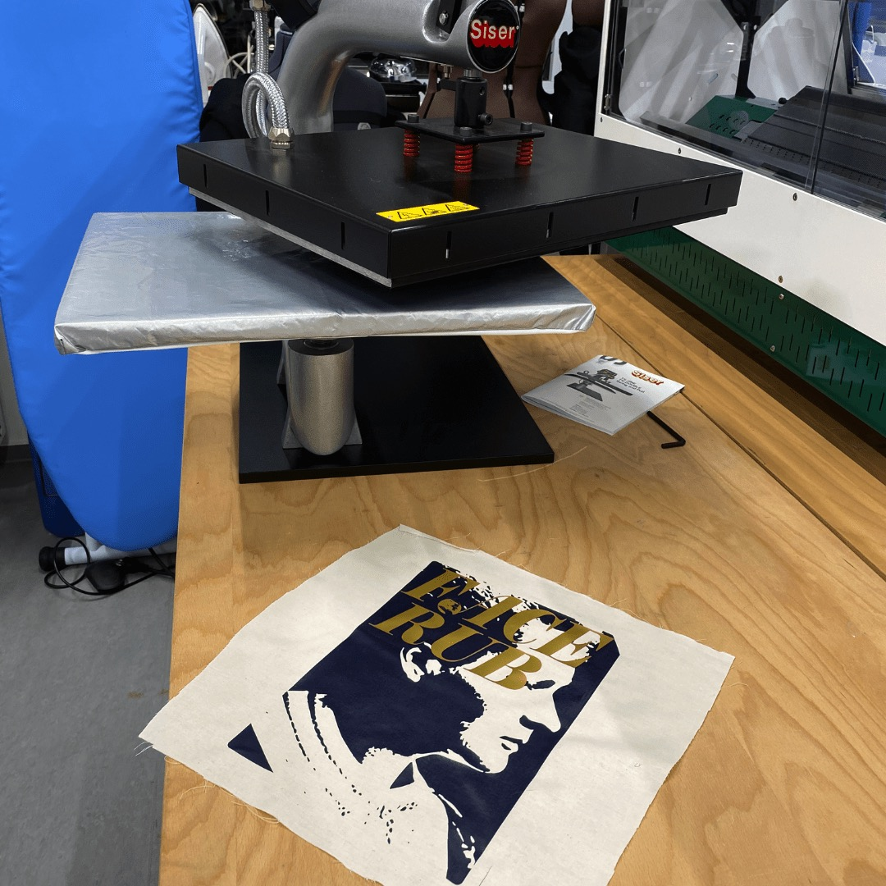
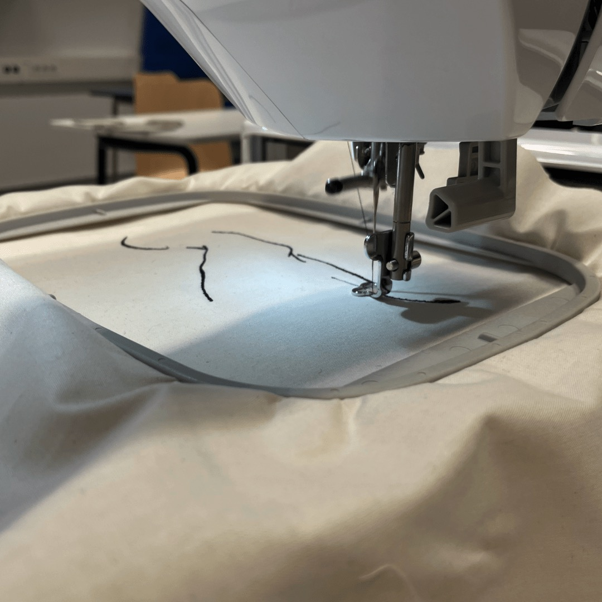
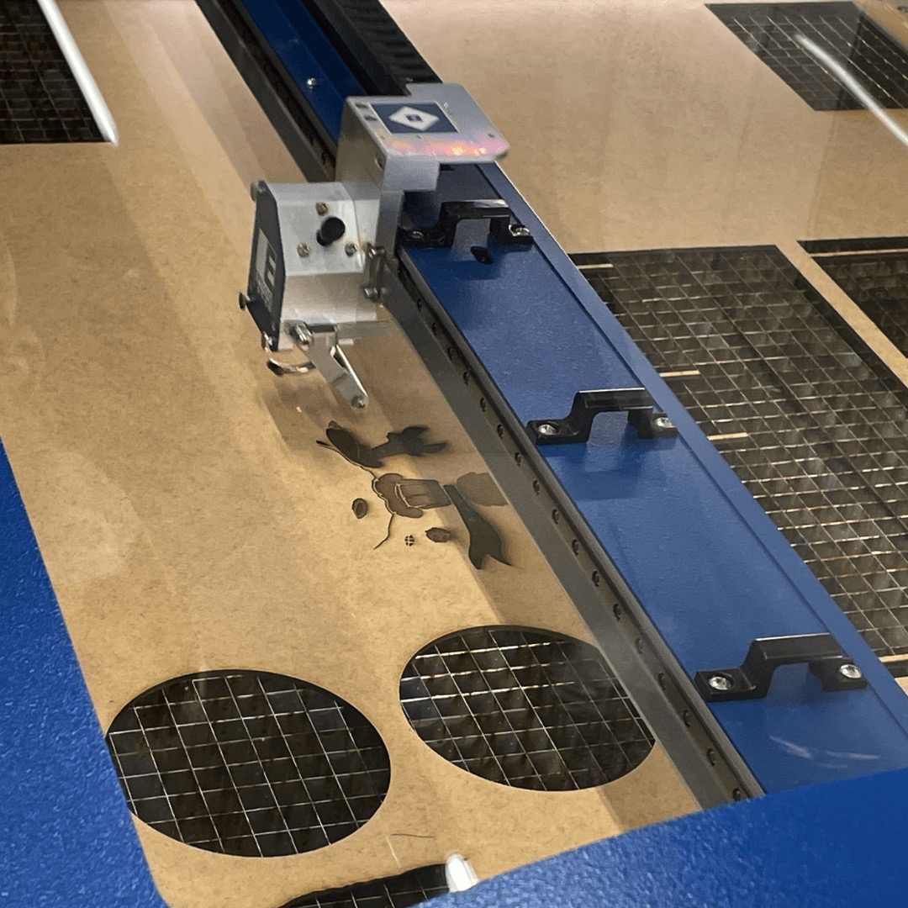

---
hide:
  - toc
date: "2022-02-27"
authors: "LS"   
---

# FACE@RUB im Makerspace	

Im Dezember waren Studentinnen im Rahmen eines Projektseminars von FACE@RUB bei uns zu Besuch.
Sie lernten Geräte wie den Lasercutter, unsere 3D-Drucker, die Näh-&Stickmaschine sowie unseren Plotter und die Transferpresse kennen und konnten direkt selbst aktiv werden und erste Prototypen herstellen.

Für weitere Infos über Frauen in der Start-up-Szene schau bei [FACE@RUB](https://www.worldfactory.de/fokusthemen/face-female-academic-entrepreneurs) vorbei!
Vielleicht sehen wir uns beim nächsten Event hier im Rubmakerspace

{ width="45%" }
{ width="45%" }
{ width="45%" }
{ width="45%" }
{ width="45%" }
