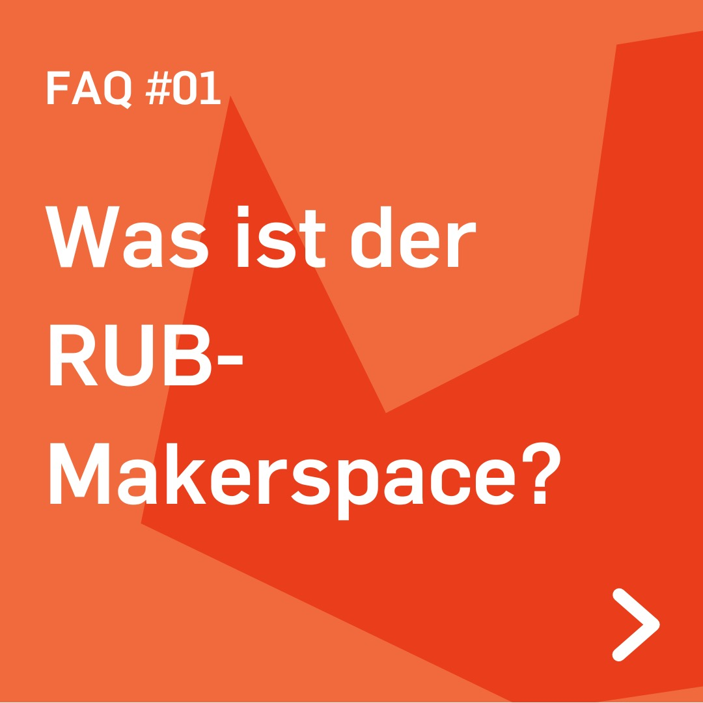
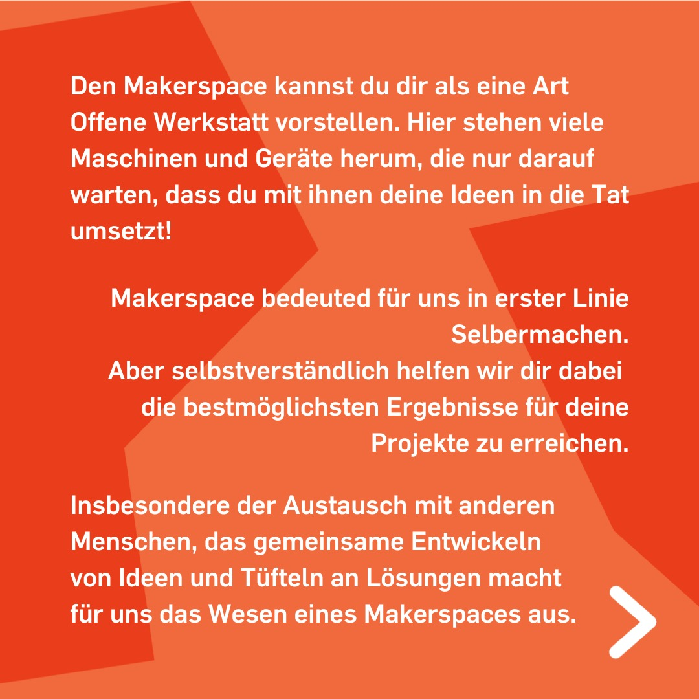
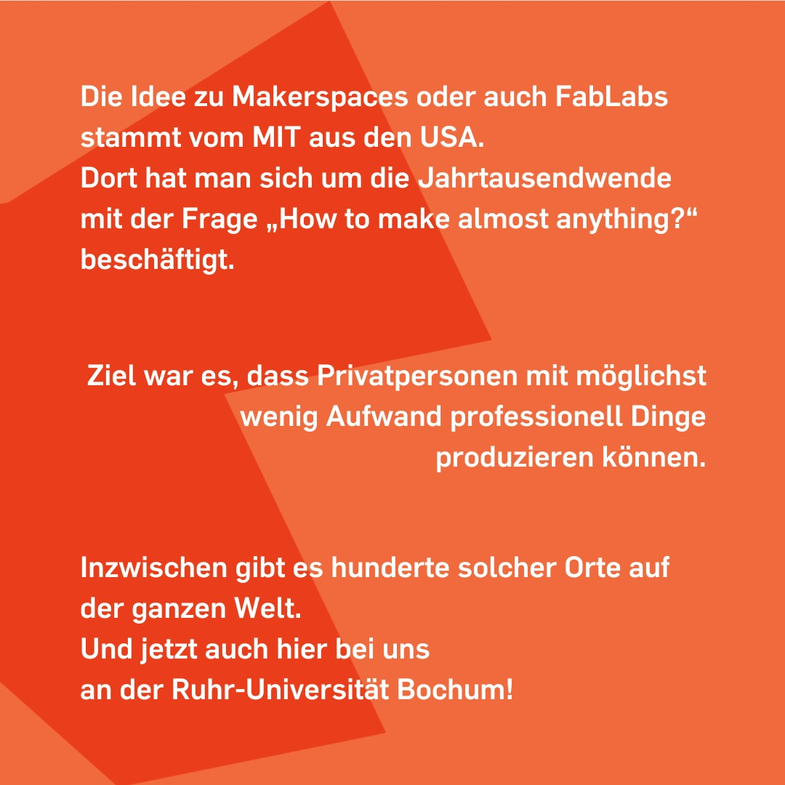

---
hide:
  - toc
date: "2022-03-13"
authors: "LS"   
---

# FAQ: Was ist der RUB-Makerspace?

Den Makerspace kannst Du Dir als eine Art Offene Werkstatt vorstellen. Hier stehen viele Maschinen und Geräte herum, die nur darauf warten, dass Du mit ihnen Deine Ideen in die Tat umsetzt!

Makerspace bedeuted für uns in erster Linie Selbermachen.
Aber selbstverständlich helfen wir Dir dabei die bestmöglichsten Ergebnisse für Deine Projekte zu erreichen.

Insbesondere der Austausch mit anderen Menschen, das gemeinsame Entwickeln von Ideen und Tüfteln an Lösungen macht für uns das Wesen eines Makerspaces aus.

Die Idee zu Makerspaces oder auch Fab Labs stammt vom MIT aus den USA.
Dort hat man sich um die Jahrtausendwende mit der Frage „How to make almost anything?“ beschäftigt.

Ziel war es, dass Privatpersonen mit möglichst wenig Aufwand professionell Dinge produzieren können.

Inzwischen gibt es hunderte solcher Orte auf der ganzen Welt.
Und jetzt auch hier bei uns an der Ruhr-Universität Bochum!

[Klick mich für weitere FAQ!](../faq.md)

{ width="45%" }
{ width="45%" }
{ width="45%" }