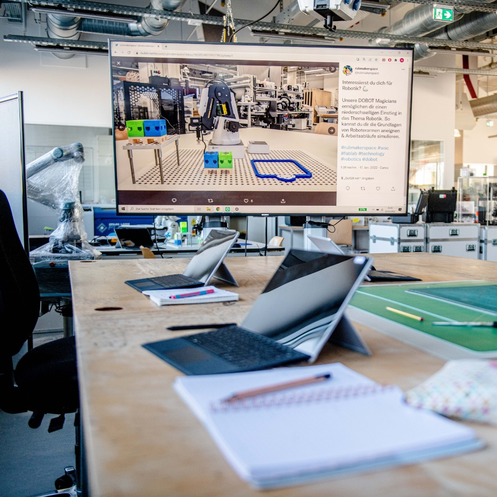

---
hide:
  - toc
date: "2022-03-17"
authors: "LS"   
---

# Theorie und Praxis im Makerspace

Praktisches Arbeiten in Kombination mit theoretischer Wissensvermittlung.

So kannst Du Dir die Arbeit bei uns vorstellen. Das "Selber Machen" steht hier ganz klar im Vordergrund!

Wir freuen uns schon sehr darauf Dich bald bei uns begrüßen zu dürfen!
Wann genau es los geht erfährst Du im nächsten Beitrag. 

{ width="45%" }  
Foto: ©RUB, Marquard
