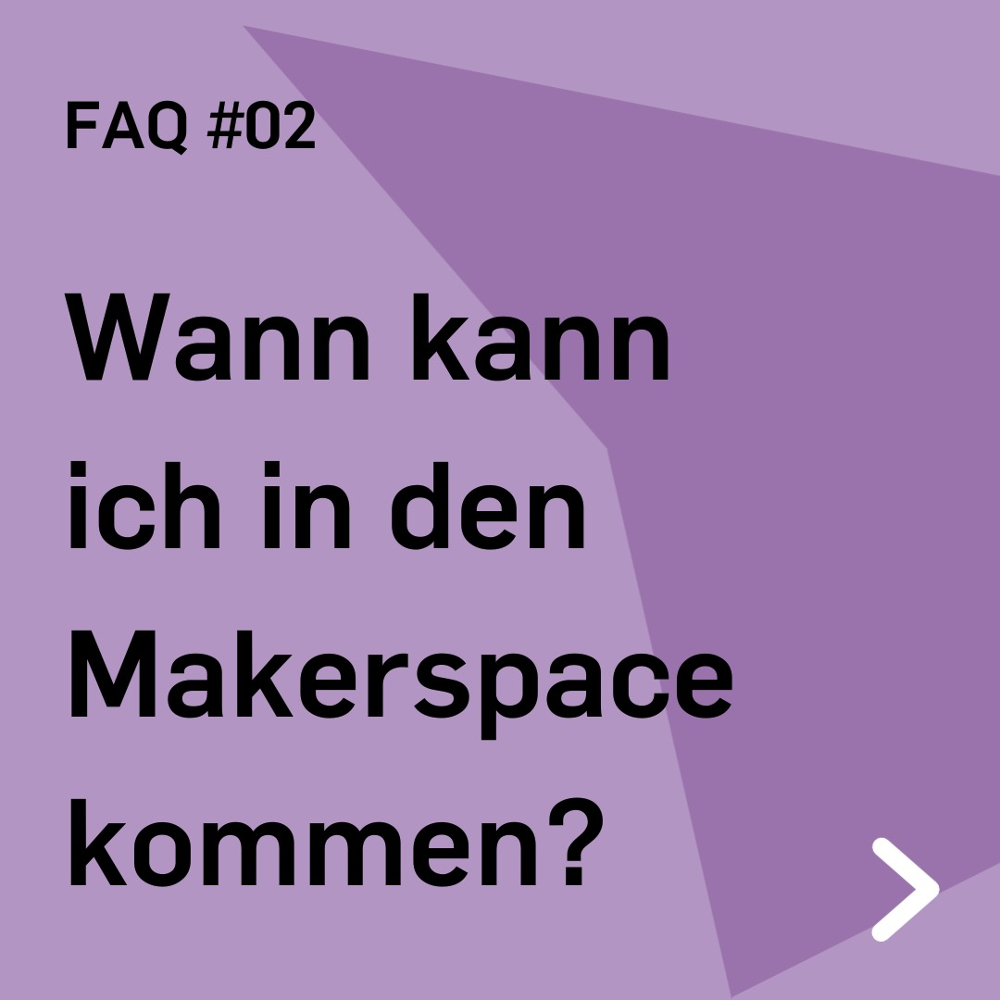
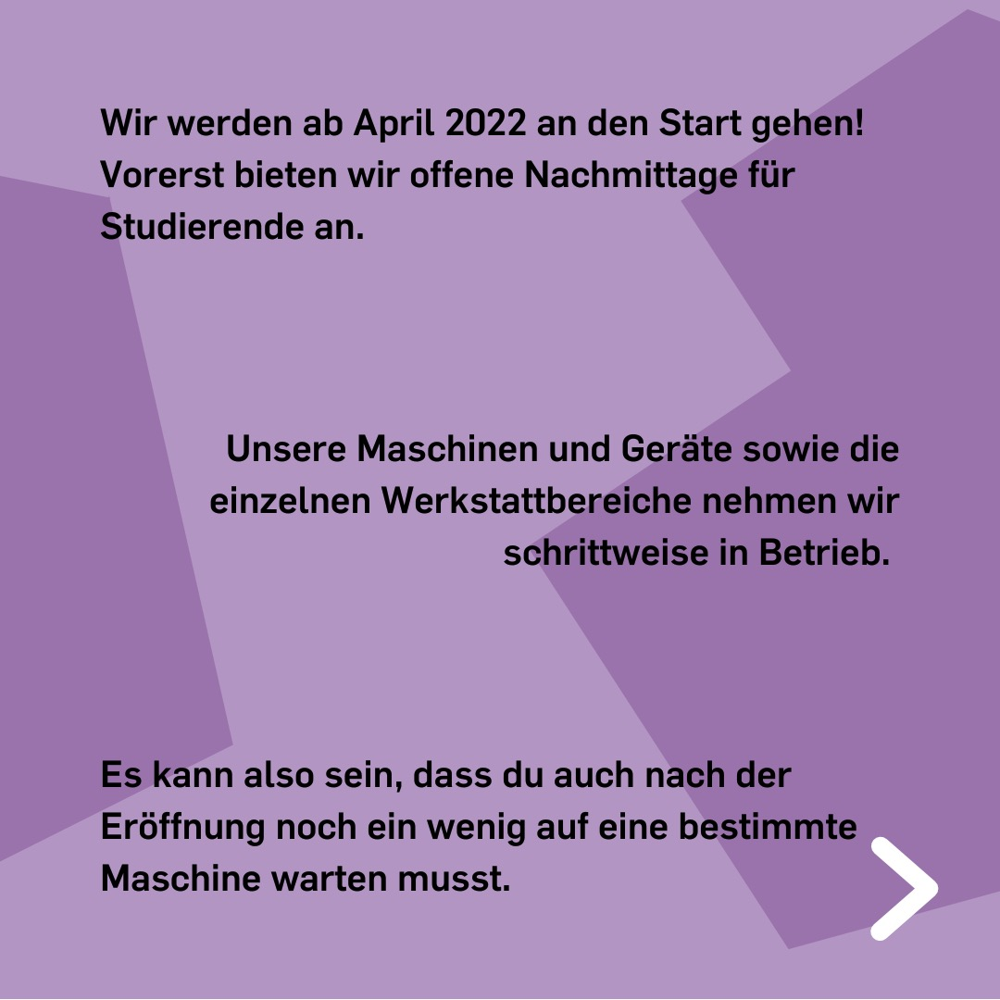
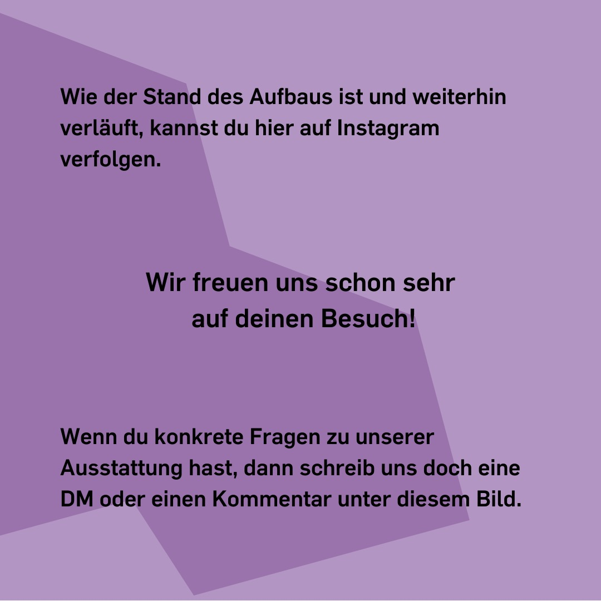

---
hide:
  - toc
date: "2022-03-26"
authors: "LS"   
---

# FAQ: Wann kann ich in den Makerspace kommen?

Wir werden ab April 2022 an den Start gehen!
Vorerst bieten wir offene Nachmittage für Studierende an.
Unsere Maschinen und Geräte sowie die einzelnen Werkstattbereiche nehmen wir schrittweise in Betrieb. So kann es auch mal sein, dass Du nach der Eröffnung noch ein wenig auf eine bestimmte Maschine warten musst.
Wie der Stand des Aufbaus ist und weiterhin verläuft, kannst Du unter [Status und Nutzbarkeit](../status.md) verfolgen.

Wir freuen uns schon sehr auf Dich!

[Klick mich für weitere FAQ!](../faq.md)

{ width="45%" } 
{ width="45%" } 
{ width="45%" } 