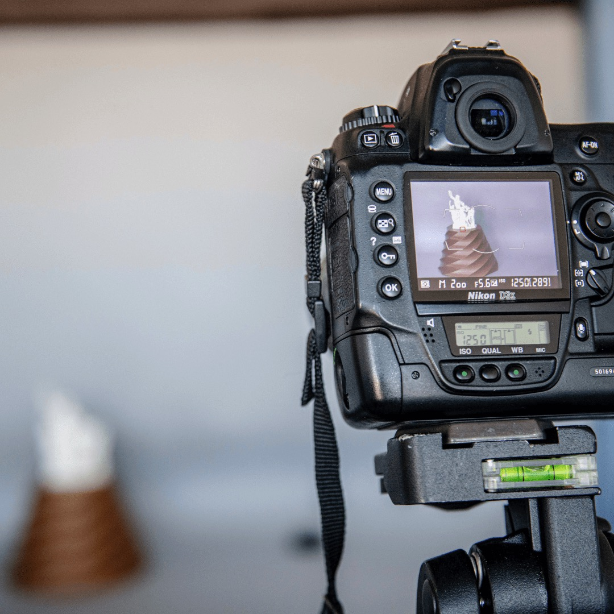

---
hide:
  - toc
date: "2022-03-31"
authors: "LS"   
---

# Produktfotos im Makerspace aufnehmen

Hochwertige Produktfotos kannst Du bei uns ganz einfach selber machen!

Alles, was Du dafür brauchst, findest Du in unserem sehr gut ausgestatteten Foto- und Videostudio.
Dir stehen eine Vielzahl an unterschiedlichen Kameras und Lichtequipment zur Verfügung.
Gerne helfen wir Dir auch dabei Deine Produkte ins beste Licht zu rücken.

{ width="45%" }  
Foto: ©RUB, Marquard  
{ width="45%" }  
Foto: ©RUB, Marquard
