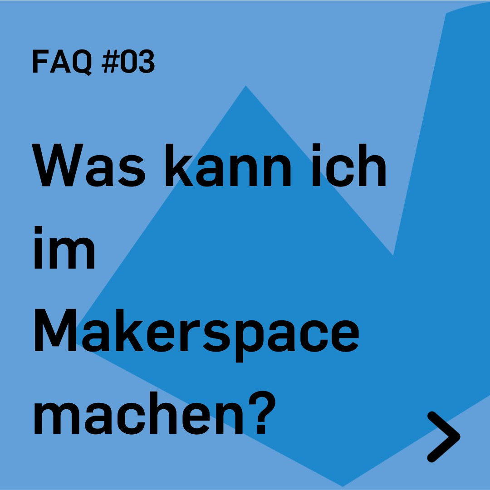
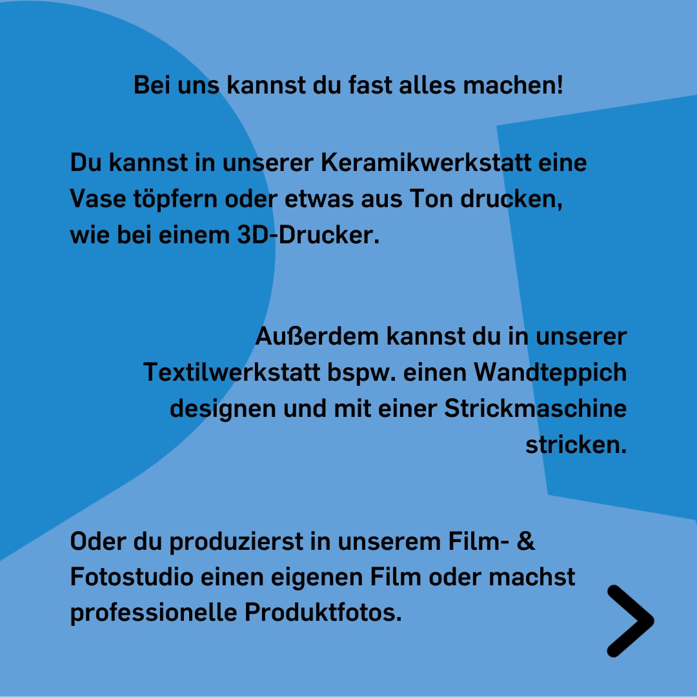
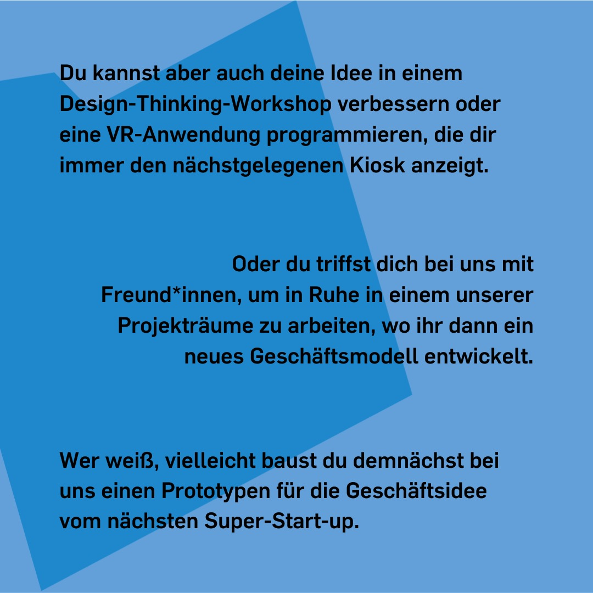

---
hide:
  - toc
date: "2022-04-08"
authors: "LS"   
---

# FAQ: Was kann ich im Makerspace machen?

Bei uns kannst Du fast alles machen!

Du kannst in unserer Keramikwerkstatt eine Vase töpfern oder etwas aus Ton drucken, wie bei einem 3D Drucker.

Außerdem kannst Du in unserer Textilwerkstatt beispielsweise einen Wandteppich designen und mit einer Strickmaschine stricken.

Oder Du produzierst in unserem Film- & Fotostudio einen eigenen Film oder machst professionelle Produktfotos.

Du kannst aber auch Deine Idee in einem Design-Thinking-Workshop verbessern oder eine VR-Anwendung programmieren, die Dir immer den nächstgelegenen Kiosk anzeigt.

Oder Du triffst Dich bei uns mit Freund\*innen, um in Ruhe in einem unserer Projekträume zu arbeiten, wo ihr dann ein neues Geschäftsmodell entwickelt.

Wer weiß, vielleicht baust Du demnächst bei uns einen Prototypen für die Geschäftsidee vom nächsten Super-Start-up.

[Klick mich für weitere FAQ!](../faq.md)

{ width="45%" }
{ width="45%" }
{ width="45%" }