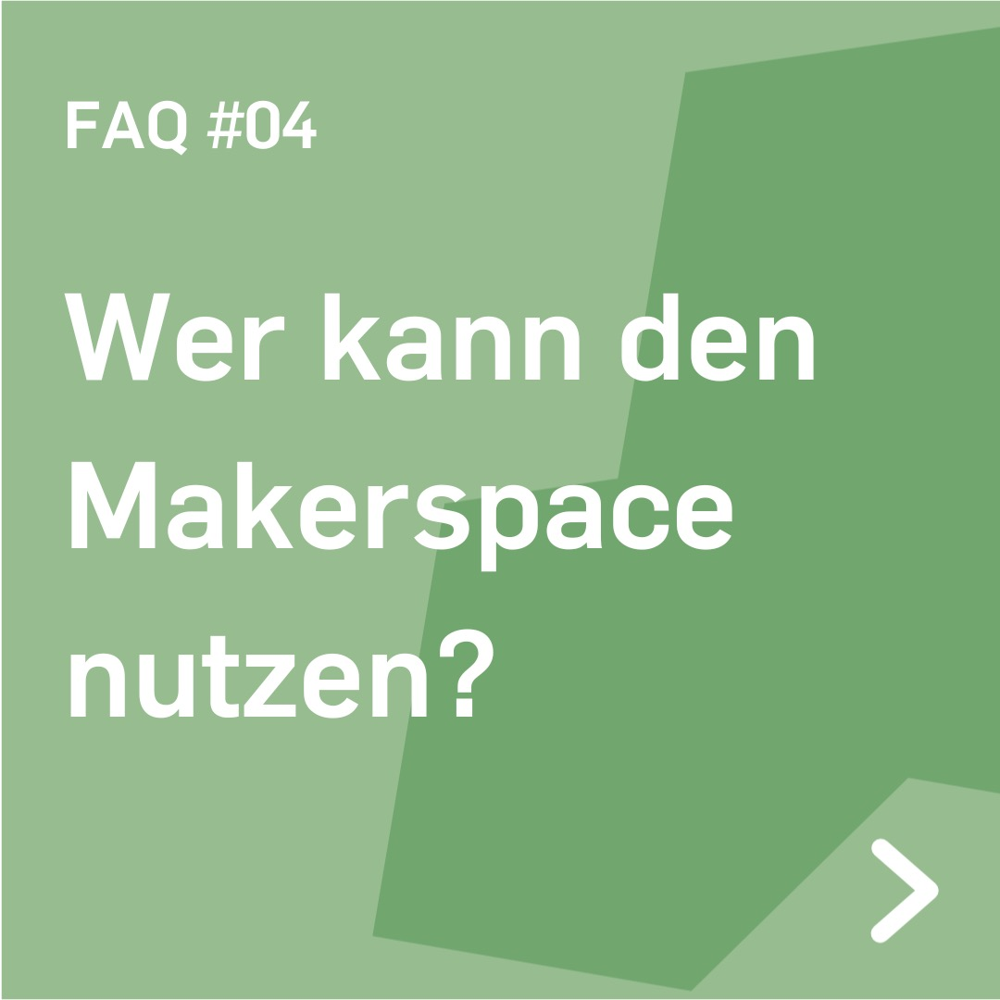
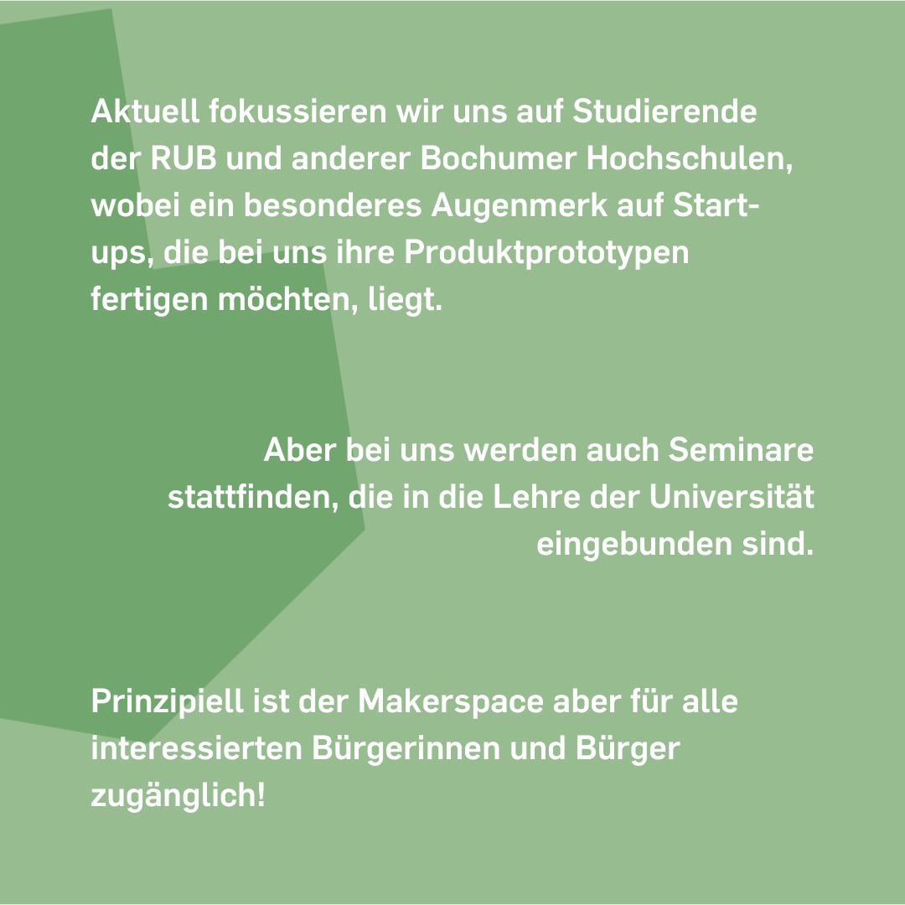

---
hide:
  - toc
date: "2022-04-25"
authors: "LS"   
---

# FAQ: Wer kann den Makerspace nutzen?

Komm vorbei! 

Aktuell fokussieren wir uns auf Studierende der RUB und anderer Bochumer Hochschulen, wobei ein besonderes Augenmerk auf Start-ups, die bei uns ihre Produktprototypen fertigen möchten, liegt.
Aber bei uns werden auch Seminare stattfinden, die in die Lehre der Universität eingebunden sind.
Prinzipiell ist der Makerspace aber für alle interessierten Bürger\*innen zugänglich!

Wenn Du eine konkrete Projektidee hast, schreib uns am besten eine E-Mail an makerspace@rub.de und wir schauen gerne, ob und wie wir Dir helfen können!

[Klick mich für weitere FAQ!](../faq.md)

{ width="45%" }
{ width="45%" }

