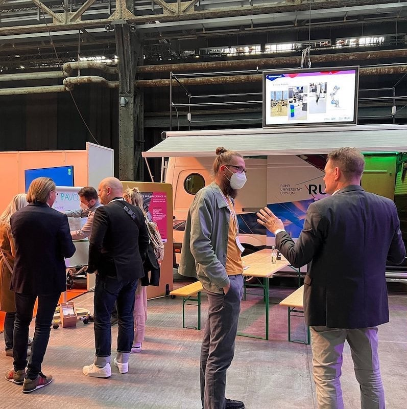
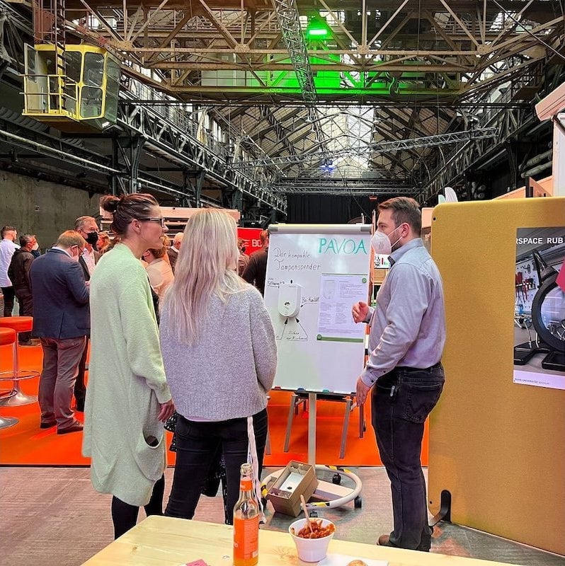
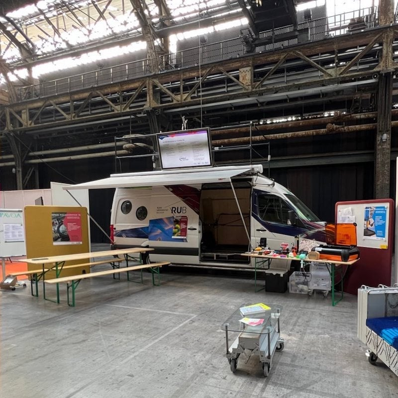

--- 
hide:
  - toc
date: "2022-05-04"
authors: "LS"
--- 
# Smart City Con Bochum

Bochum stellt sich den Herausforderungen der Digitalisierung und nutzt die Chancen, die damit einhergehen. Mit dem Konzept Smart City Bochum strebt die Stadt, auch unter dem Aspekt der Nachhaltigkeit, eine stärkere Digitalisierung an. 

Wir als RUB Makerspace können in diesem Konzept den Wissenstransfer zwischen Wirtschaft & Wissenschaft fördern und unterstützen Gründer\*innen bei der Verwirklichung ihrer Projekte & Geschäftsmodelle.

Danke, dass wir dabei sein durften!

{ width="45%" } { width="45%" } { width="45%" }  
