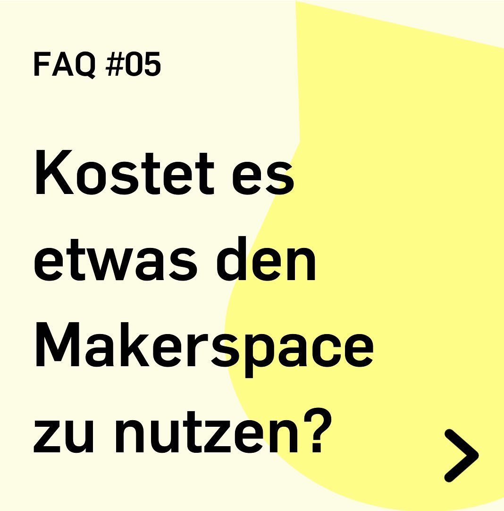
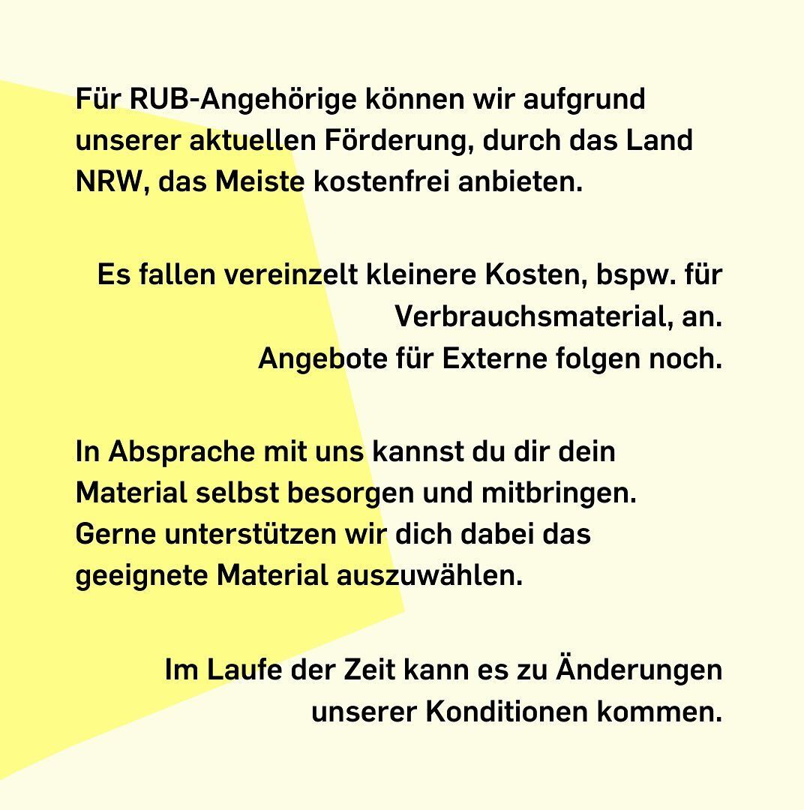

---
hide:
  - toc
date: "2022-05-15" 
authors: "LS"
---
# Kostet es Dich etwas, den Makerspace zu nutzen?

Für RUB-Angehörige können wir, aufgrund unserer aktuellen Förderung durch Landesmittel, das Meiste kostenfrei anbieten.
Es fallen vereinzelt kleinere Kosten, beispielsweise für Verbrauchsmaterial, an.
Spezielle Angebote für andere Nutzende des Makerspaces folgen noch.
In Absprache mit uns kannst Du Dir Dein Material selbst besorgen und mitbringen. Gerne unterstützen wir Dich dabei, das geeignete Material auszuwählen.
Im Laufe der Zeit kann es zu Änderungen unserer Konditionen kommen.

{ width="45%" } { width="45%" }  
