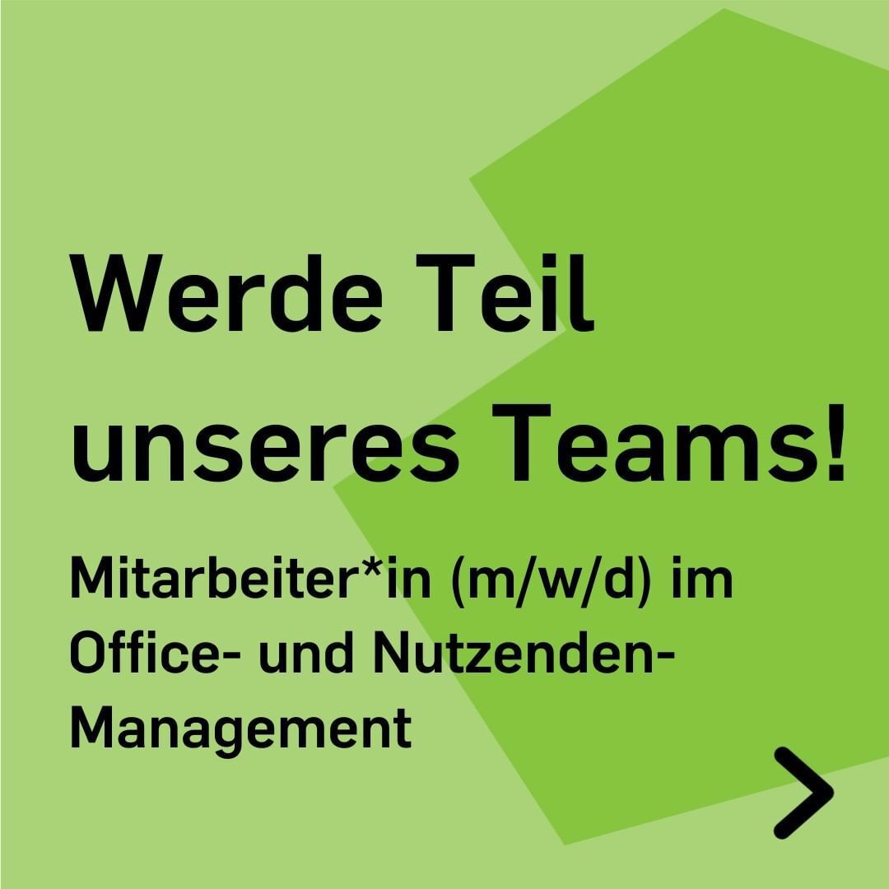
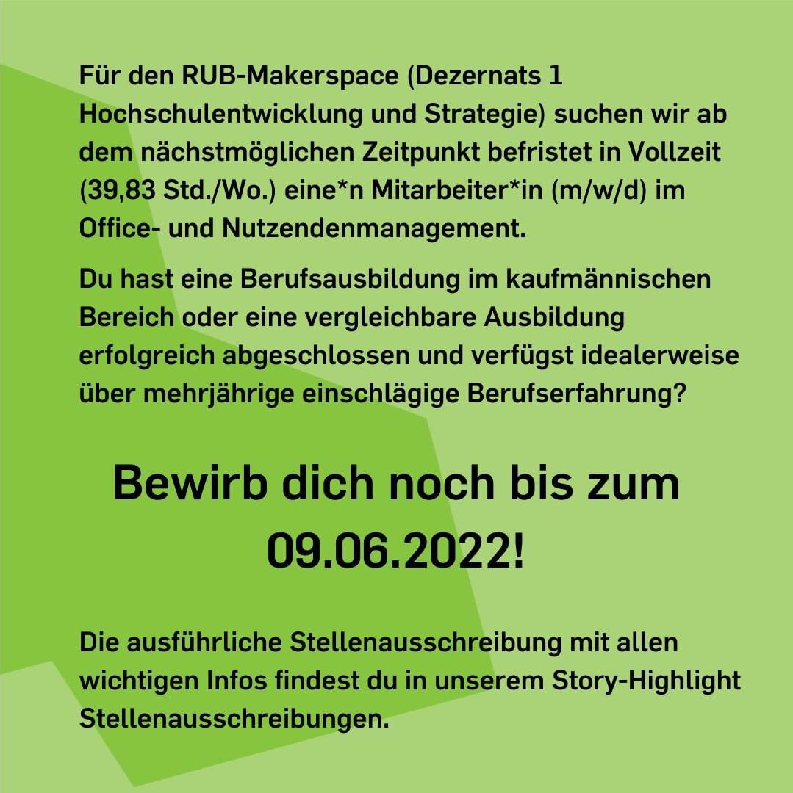

---
hide:
  - toc
date: "2022-05-24"
authors: "LS" 
---
# Werde Teil unseres Teams! 

Für den RUB-Makerspace (Dezernat 1 Hochschulentwicklung und Strategie) suchen wir ab dem nächstmöglichen Zeitpunkt befristet in Vollzeit (39,83 Std./Wo.) eine\*n Mitarbeiter\*in (m/w/d) im Office- und Nutzendenmanagement.

Du hast eine Berufsausbildung im kaufmännischen Bereich oder eine vergleichbare Ausbildung erfolgreich abgeschlossen und verfügst idealerweise über mehrjährige einschlägige Berufserfahrung? Dann...

Bewirb Dich noch bis zum 09.06.2022!

Die ausführliche Stellenausschreibung mit allen wichtigen Infos findest Du [hier](https://jobs.ruhr-uni-bochum.de/jobposting/a26bea021efd94c82d8441e5711557db8f7e5df8).

{ width="45%" } { width="45%" }