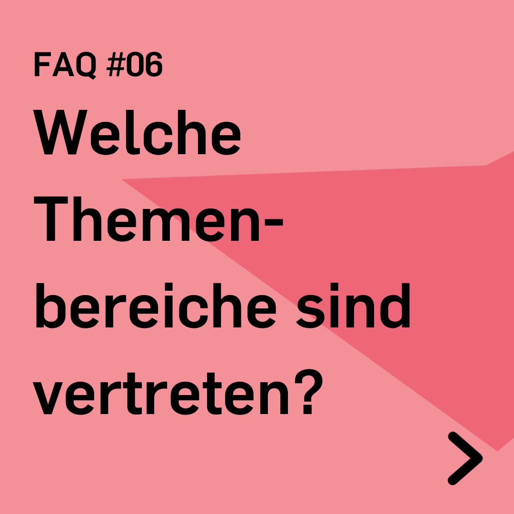
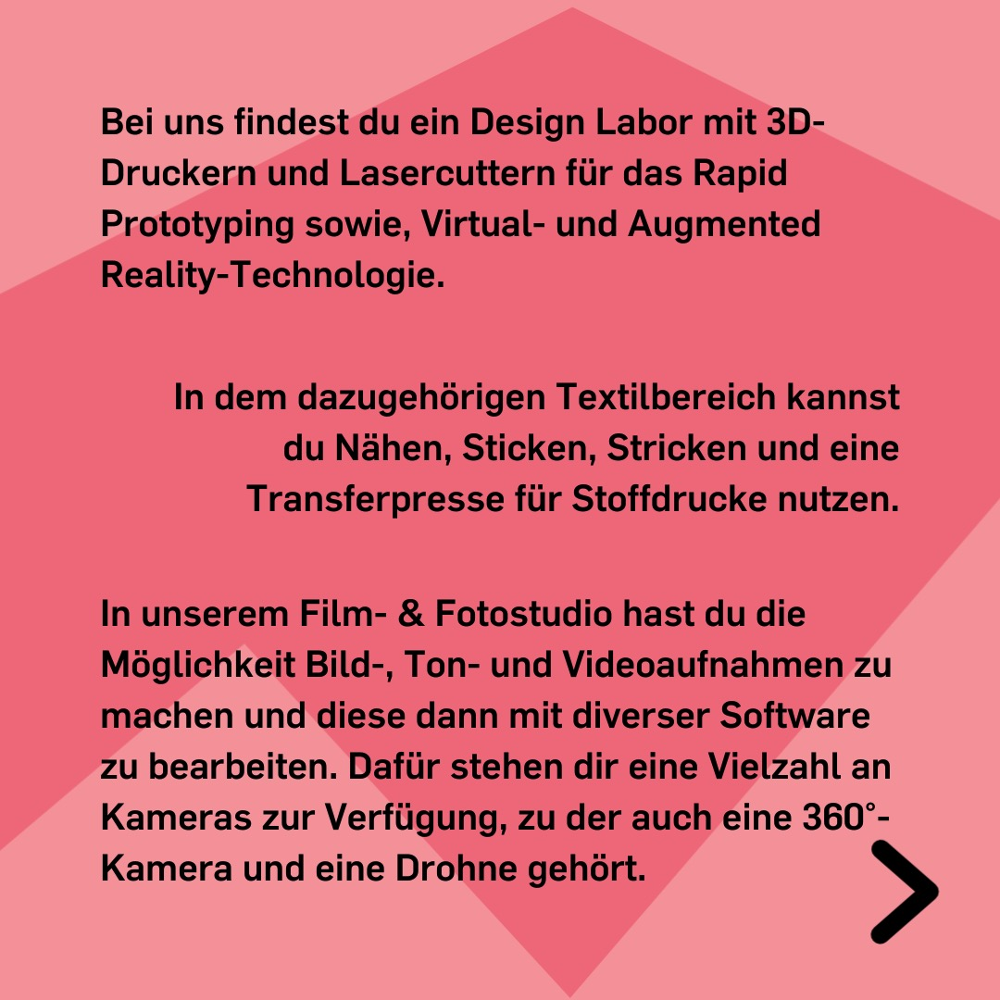
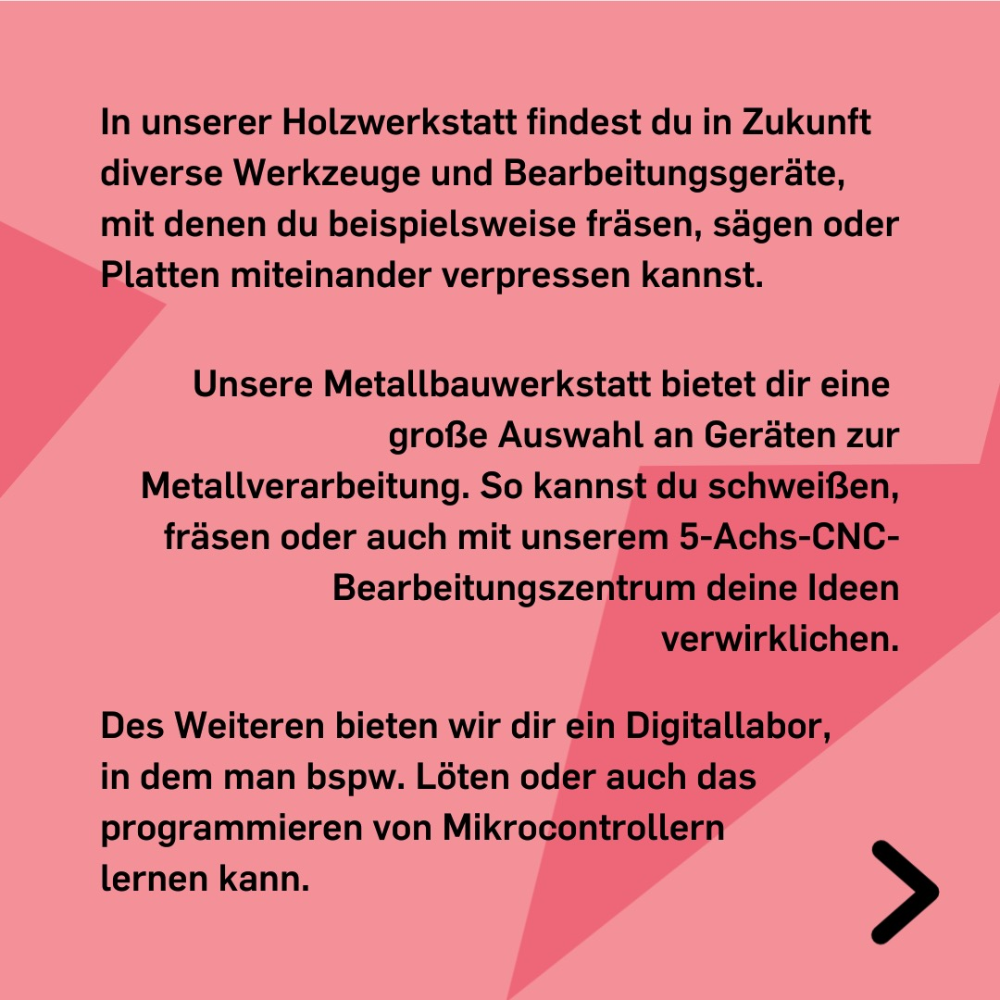
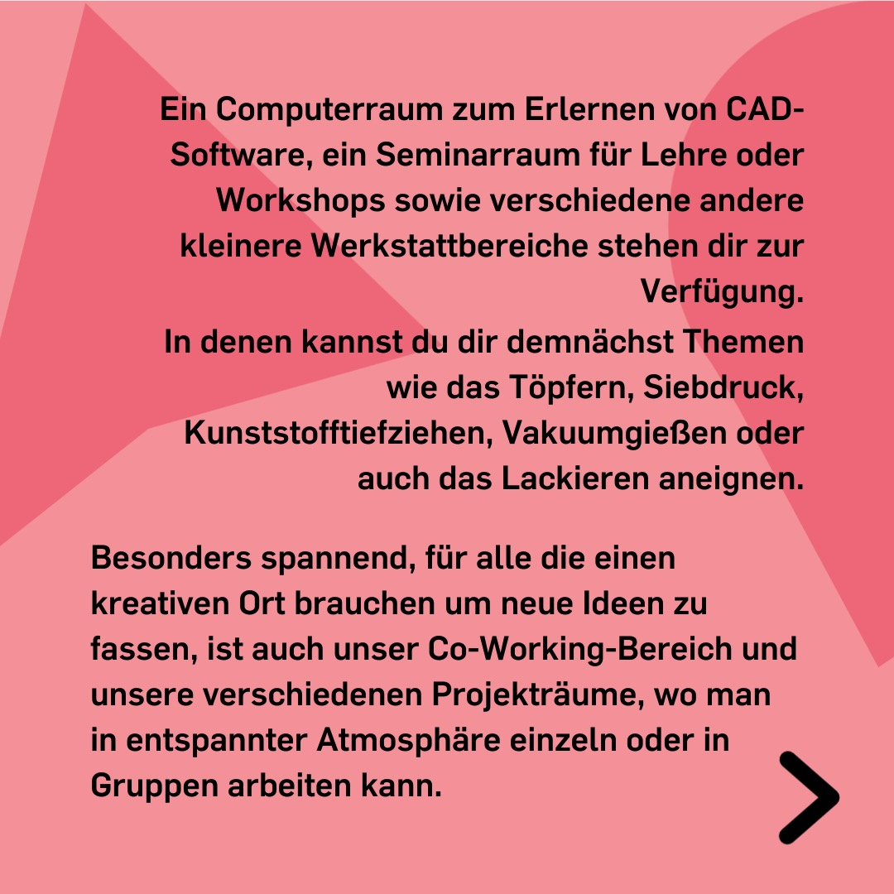
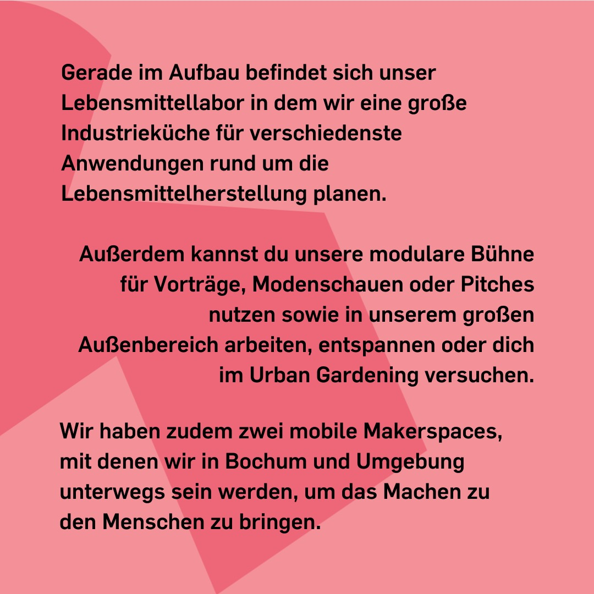

---
hide:
  - toc
date: "2022-05-29"
authors: "LS"   
---

# FAQ: Welche Themenbereiche sind vertreten?	

Von Textillabor bis Holzwerkstatt bei uns findest Du fast alles!

Bei uns findest Du ein Design Labor mit 3D-Druckern und Lasercuttern für das Rapid Prototyping sowie, Virtual- und Augmented Reality-Technologie. In dem dazugehörigen Textillabor kannst Du Nähen, Sticken, Stricken und eine Transferpresse für Stoffdrucke nutzen. In unserem Film- & Fotostudio hast Du die Möglichkeit Bild-, Ton- und Videoaufnahmen zu machen und diese dann mit diverser Software zu bearbeiten. Dafür stehen Dir eine Vielzahl an Kameras zur Verfügung, zu der auch eine 360°- Kamera und eine Drohne gehört.  

In unserer Holzwerkstatt findest Du in Zukunft diverse Werkzeuge und Bearbeitungsgeräte, mit denen Du beispielsweise fräsen, sägen oder Platten miteinander verpressen kannst. Unsere Metallbauwerkstatt bietet Dir eine große Auswahl an Geräten zur Metallverarbeitung. So kannst Du schweißen, fräsen oder auch mit unserem 5-Achs-CNC-Bearbeitungszentrum Deine Ideen verwirklichen. Des Weiteren bieten wir Dir ein Digitallabor, in dem Du beispielsweise Löten oder auch das programmieren von Mikrocontrollern lernen kannst.  

Ein Computerraum zum Erlernen von CAD-Software, ein Seminarraum für Lehre oder Workshops sowie verschiedene andere kleinere Werkstattbereiche stehen Dir zur Verfügung. In denen kannst Du Dir demnächst Themen wie das Töpfern, Siebdruck, Kunststofftiefziehen, Vakuumgießen oder auch das Lackieren aneignen.  

Besonders spannend für alle, die einen kreativen Ort brauchen, um neue Ideen zu fassen, ist auch unser Co-Working-Bereich und unsere verschiedenen Projekträume, wo Du in entspannter Atmosphäre einzeln oder in Gruppen arbeiten kannst.  

Gerade im Aufbau befindet sich unser Lebensmittellabor, in dem wir eine große Industrieküche für verschiedenste Anwendungen rund um die Lebensmittelherstellung planen.
Außerdem kannst Du unsere modulare Bühne für Vorträge, Modenschauen oder Pitches nutzen sowie in unserem großen Außenbereich arbeiten, entspannen oder Dich im Urban Gardening versuchen.  

Wir haben zudem zwei mobile Makerspaces, mit denen wir in Bochum und Umgebung unterwegs sein werden, um das Machen zu den Menschen zu bringen.

[Klick mich für weitere FAQ!](../faq.md)  
[Unsere Arbeitsbereiche](../ort.md)

{ width="45%" }
{ width="45%" }
{ width="45%" }
{ width="45%" }
{ width="45%" }