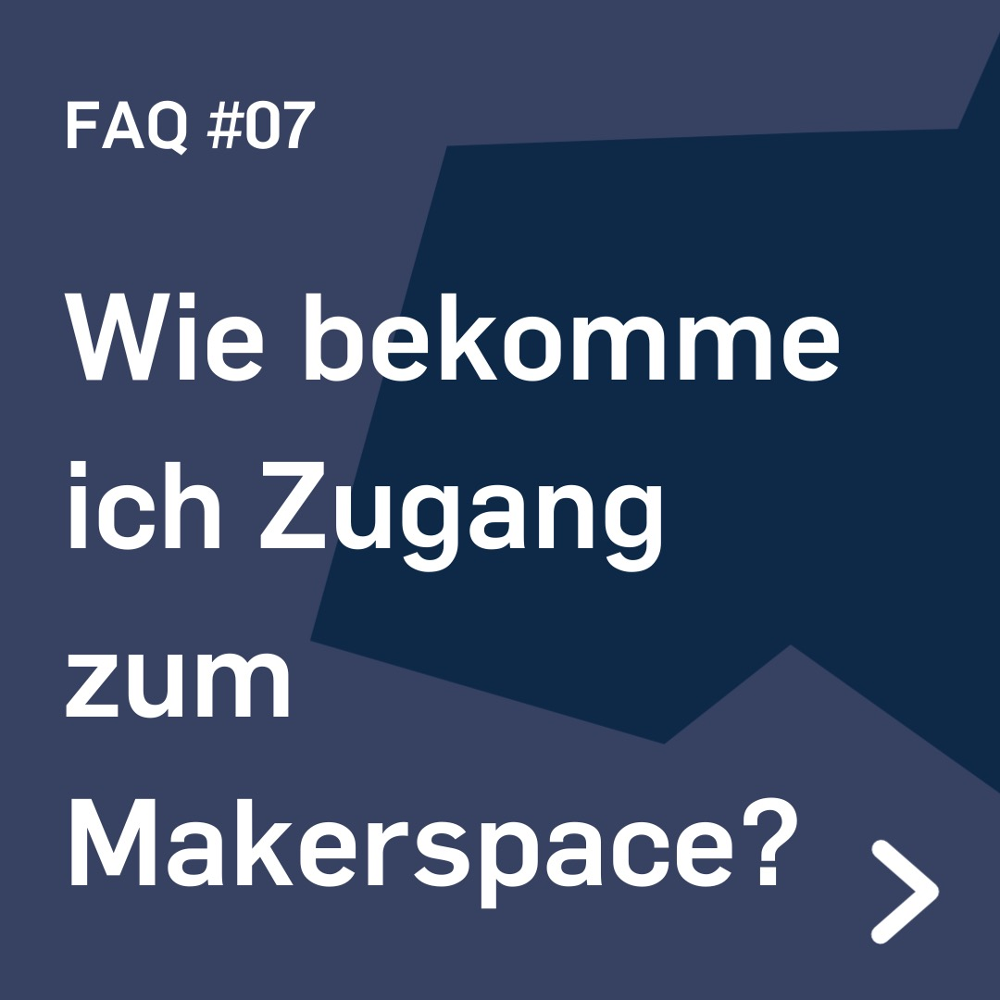
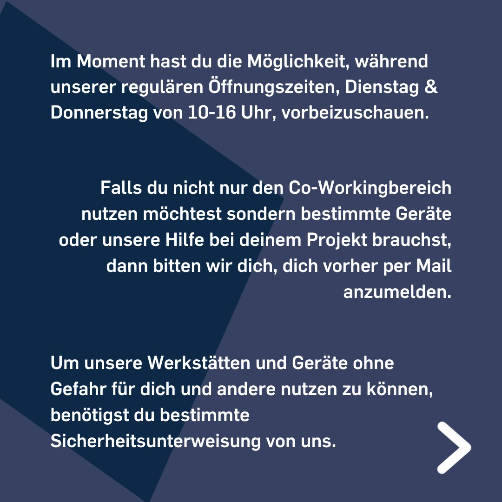
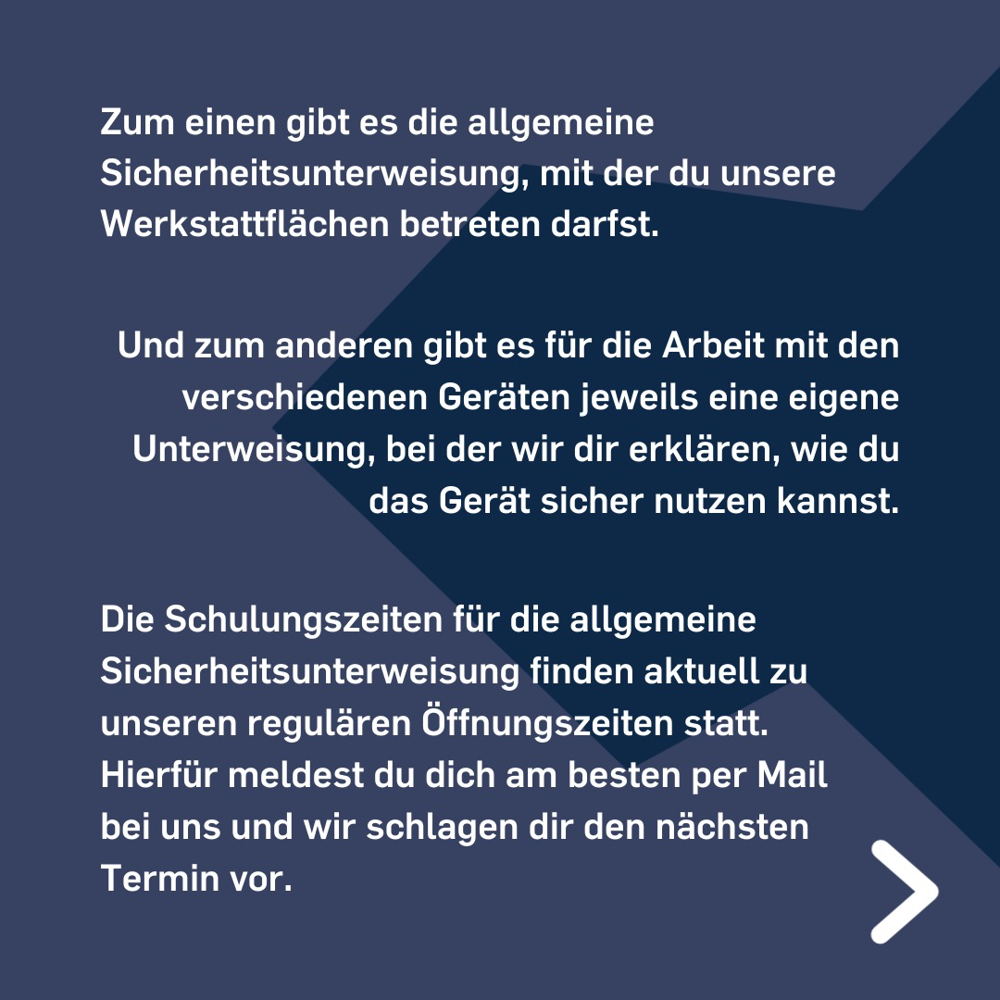
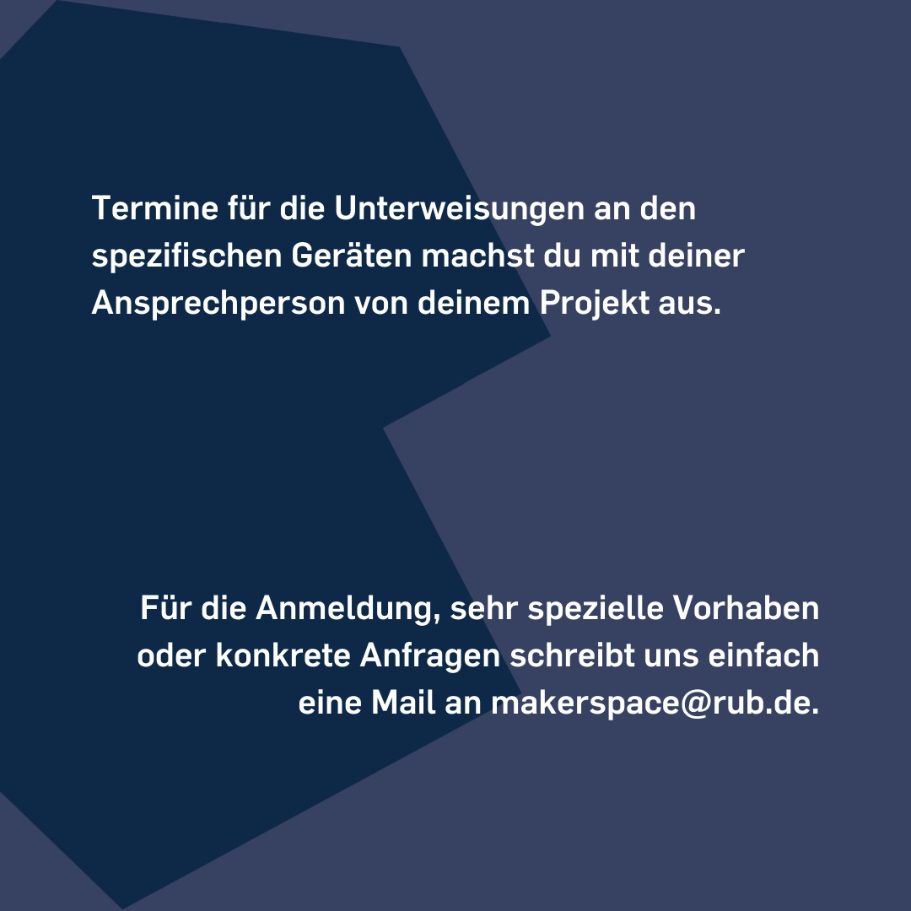

---
hide:
  - toc
date: "2022-06-10"
authors: "LS"   
---

# FAQ: Wie bekomme ich Zugang zum Makerspace?

So kommst Du rein!

Im Moment hast Du die Möglichkeit, während unserer regulären [Öffnungszeiten](../oeffnungszeiten.md), Dienstag & Donnerstag von 10-16 Uhr (Stand: 10.06.2022), vorbeizuschauen.
Falls Du nicht nur den [Co-Workingbereich](../coworking.md) nutzen möchtest, sondern bestimmte Geräte oder unsere Hilfe bei deinem Projekt brauchst, dann bitten wir Dich, Dich vorher per Mail anzumelden.

Um unsere Werkstätten und Geräte ohne Gefahr für Dich und andere nutzen zu können, benötigst Du bestimmte Sicherheitsunterweisung von uns.
Zum einen gibt es die [allgemeine Sicherheitsunterweisung](../unterweisungen.md), mit der Du unsere Werkstattflächen betreten darfst.
Und zum anderen gibt es für die Arbeit mit den verschiedenen Geräten jeweils eine eigene Unterweisung, bei der wir Dir erklären, wie Du das Gerät sicher nutzen kannst.

Die Schulungszeiten für die allgemeine Sicherheitsunterweisung finden aktuell zu unseren regulären Öffnungszeiten statt. Hierfür meldest Du Dich am besten per Mail bei uns und wir schlagen Dir den nächsten Termin vor.
Termine für die Unterweisungen an den spezifischen Geräten machst Du mit deiner Ansprechperson von deinem Projekt aus.

Für die Anmeldung, sehr spezielle Vorhaben oder konkrete Anfragen schreibt uns einfach eine Mail an makerspace@rub.de.

Bitte beachte, dass bei uns aktuell, aufgrund der Corona Pandemie, noch die 3G Regel und FFP2 Maskenpflicht gilt. (Stand: 10.06.2022)

[Klick mich für weitere FAQ!](../faq.md)  
[Mehr zu Unterweisungen](../unterweisungen.md)

{ width="45%" }
{ width="45%" }
{ width="45%" }
{ width="45%" }
