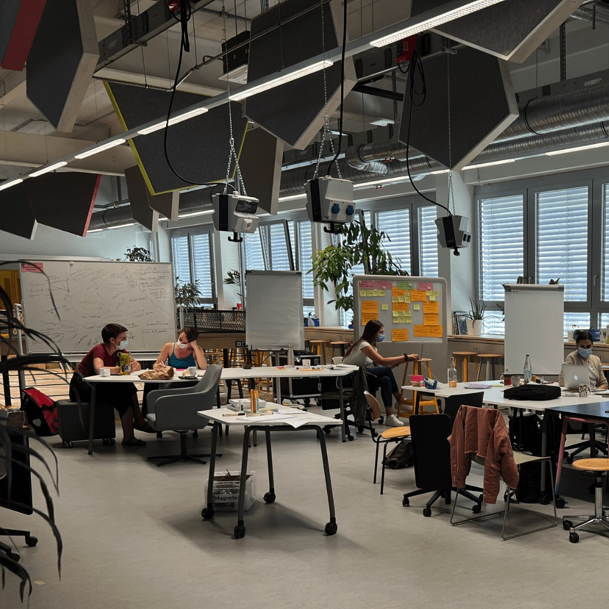
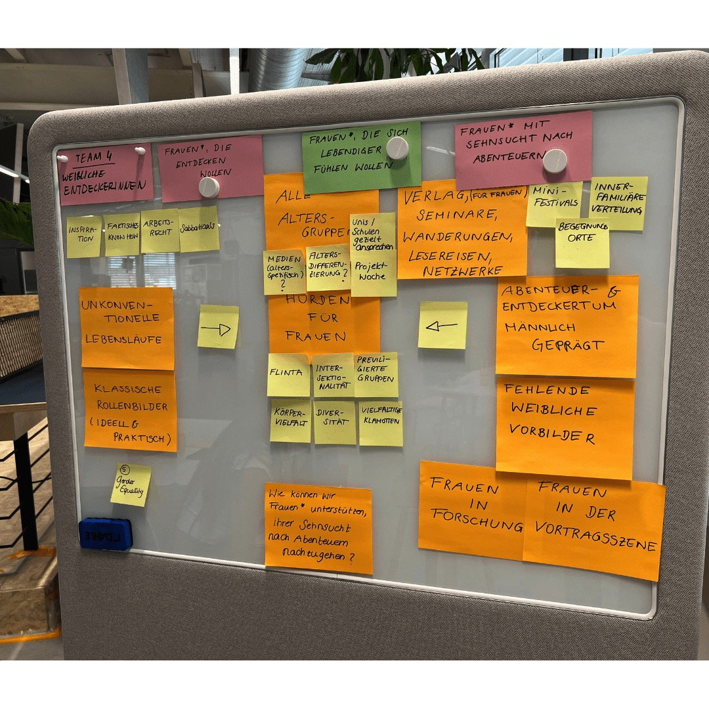

---
hide:
  - toc
date: "2022-07-20"
authors: "LS"   
---

# FACE Summer School im Makerspace

“FACE your Future“

Unter diesem Motto durften wir am 24. Juni die Teilnehmerinnen der FACE Summer School bei uns willkommen heißen.
Bei der Summer School geht es um das Thema "Frauen und Gründung. In zwei Wochen von der Inspiration zur eigenen Gründungsidee." und wir durften wieder einen Workshop zum Thema Design Thinking geben. Dort wurde den Teilnehmerinnen, anhand ihrer eigenen Ideen, der Ansatz des Design Thinking nähergebracht und wie dieser Prozess dabei helfen kann Probleme zu lösen und neue Ideen zu entwickeln.
Dabei entstanden tolle Konzepte für zukünftige Projekte.

Danke, für die schöne Zusammenarbeit, [FACE@RUB](https://www.worldfactory.de/fokusthemen/face-female-academic-entrepreneurs)!

{ width="45%" } 
{ width="45%" } 
