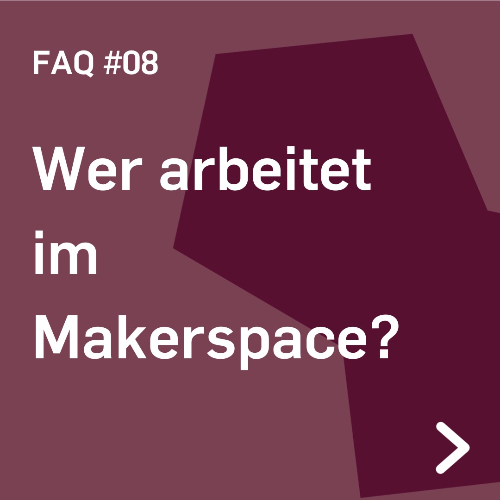
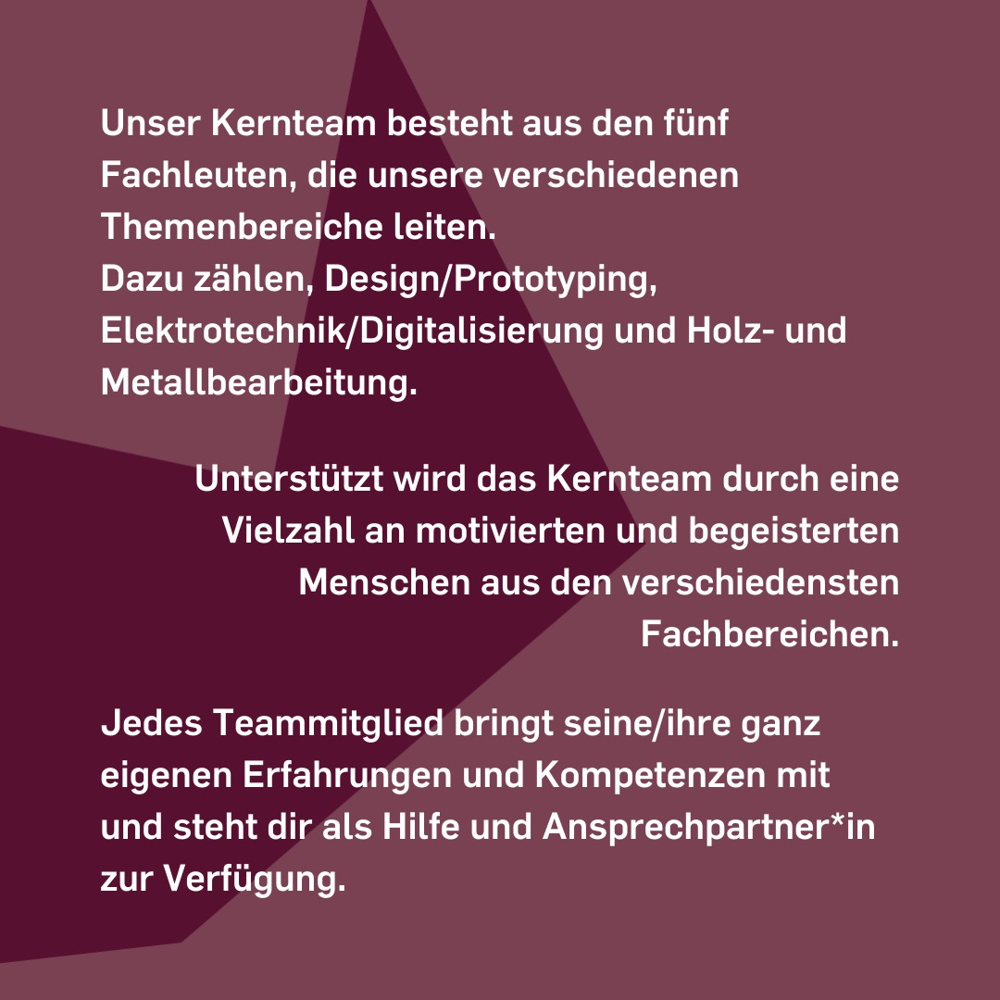

---
hide:
  - toc
date: "2022-07-27"
authors: "LS"   
---

# FAQ: Wer arbeitet im Makerspace?

Der RUB-Makerspace hat eine Vielzahl an Mitarbeiter\*innen, doch wer genau arbeitet hier eigentlich?

Das Kernteam besteht aus fünf Fachleuten, die unsere verschiedenen Themenbereiche leiten. Dazu zählen, Design/Prototyping, Elektrotechnik/Digitalisierung und Holz- und Metallbearbeitung.
Unterstützt werden diese fünf durch eine Vielzahl an motivierten und begeisterten Menschen aus verschiedenen Fachbereichen. Einige studieren nebenbei selbst noch, haben eine Ausbildung gemacht oder sind fertig und stehen fest im Berufsleben.

Jedes Teammitglied bringt seine\*ihre ganz eigenen Erfahrungen und Kompetenzen mit und steht Dir bei Fragen als Ansprechpartner\*in zur Verfügung.

Komm vorbei und lerne uns persönlich kennen! 

[Unser Team](../team.md)

{ width="45%" }
{ width="45%" }
