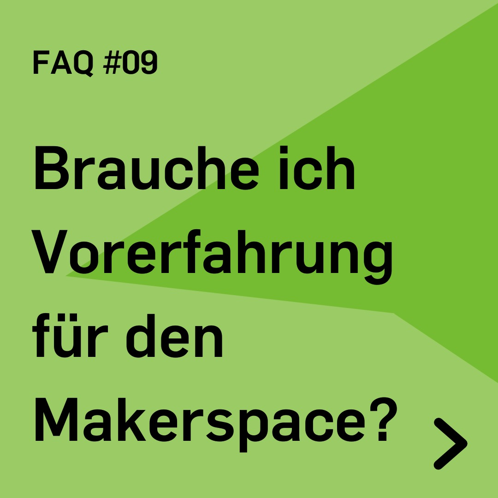
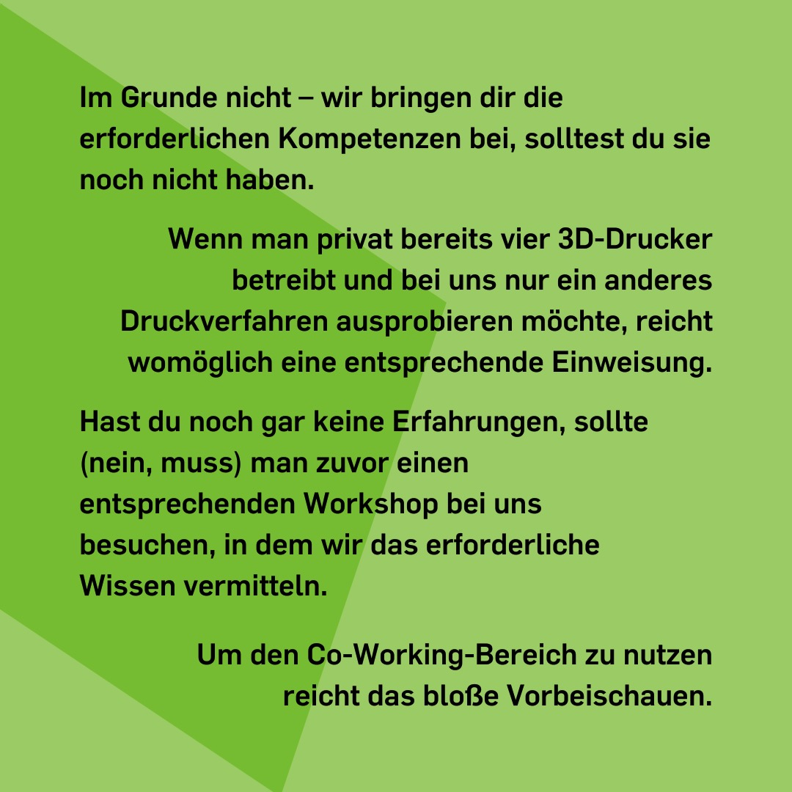

---
hide:
  - toc
date: "2022-08-08"
authors: "LS"   
---

# FAQ: Brauche ich Vorerfahrung für den RUB-Makerspace?

Im Grunde nicht – wir bringen Dir die erforderlichen Kompetenzen bei, solltest Du sie noch nicht haben.

Wenn Du privat bereits vier 3D-Drucker betreibst und bei uns nur ein anderes Druckverfahren ausprobieren möchtest, reicht Dir womöglich eine entsprechende [Sicherheitsunterweisung](../unterweisungen.md).
Hast Du noch gar keine Erfahrungen, musst Du zuvor einen entsprechenden Workshop bei uns besuchen, in dem wir Dir das erforderliche Wissen vermitteln.

Um unseren [Co-Working-Space](../coworking.md) zu nutzen, reicht das bloße Vorbeischauen. 

{ width="45%" }
{ width="45%" }