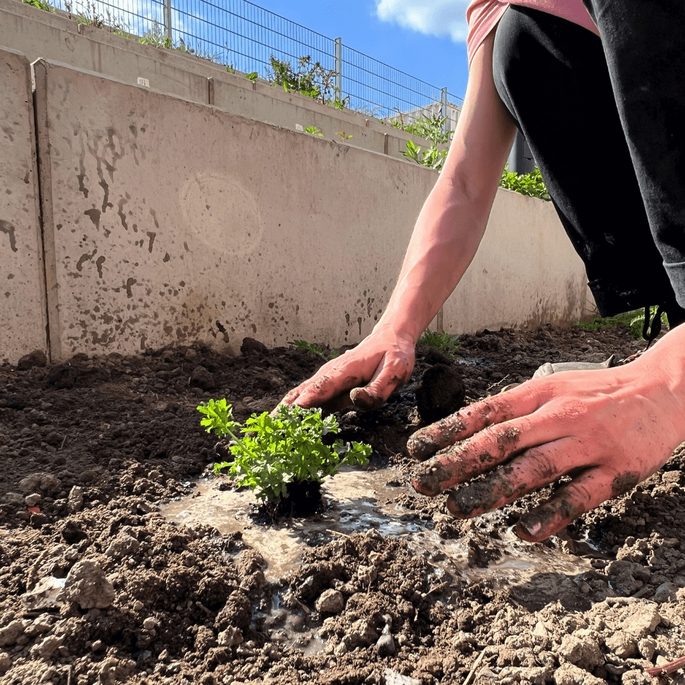

---
hide:
  - toc
date: "2022-08-16"
authors: "LS"   
---

# Unser grüner Außenbereich

Arbeitest Du gerne draußen?  

Bei uns hast Du die Möglichkeit dazu!
Dafür begrünen wir gerade unsere Terassen und legen kleine Beete für Bienen und andere Insekten an.  

Es ist noch viel zu tun bis wir endlich unseren Außenbereich für Dich öffnen können aber bis dahin steht Dir immer Dienstag und Donnerstag von 10-16 Uhr unser grüner [Co-Working Space im Erdgeschoss](../coworking.md) zur Verfügung.  

{ width="45%" }
