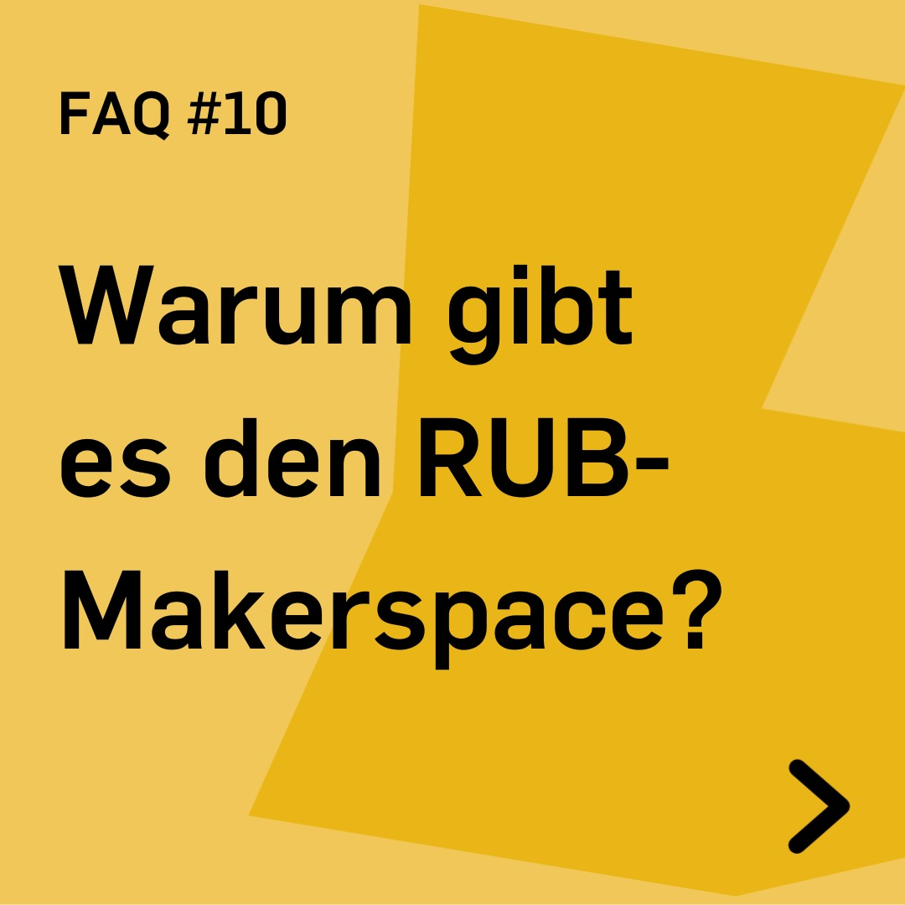
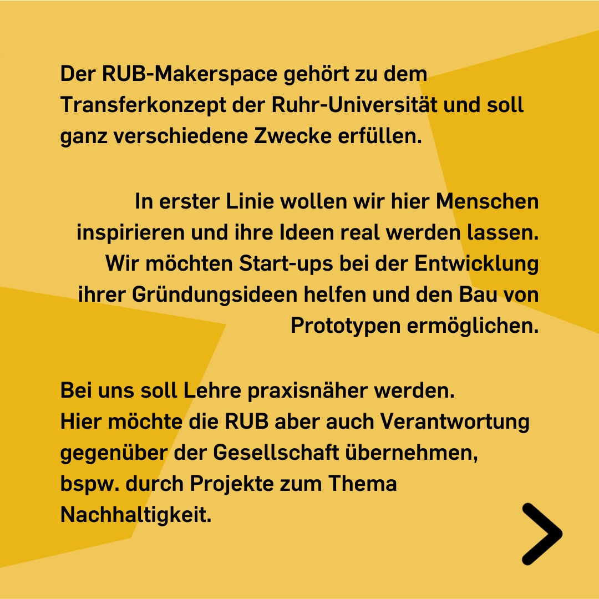
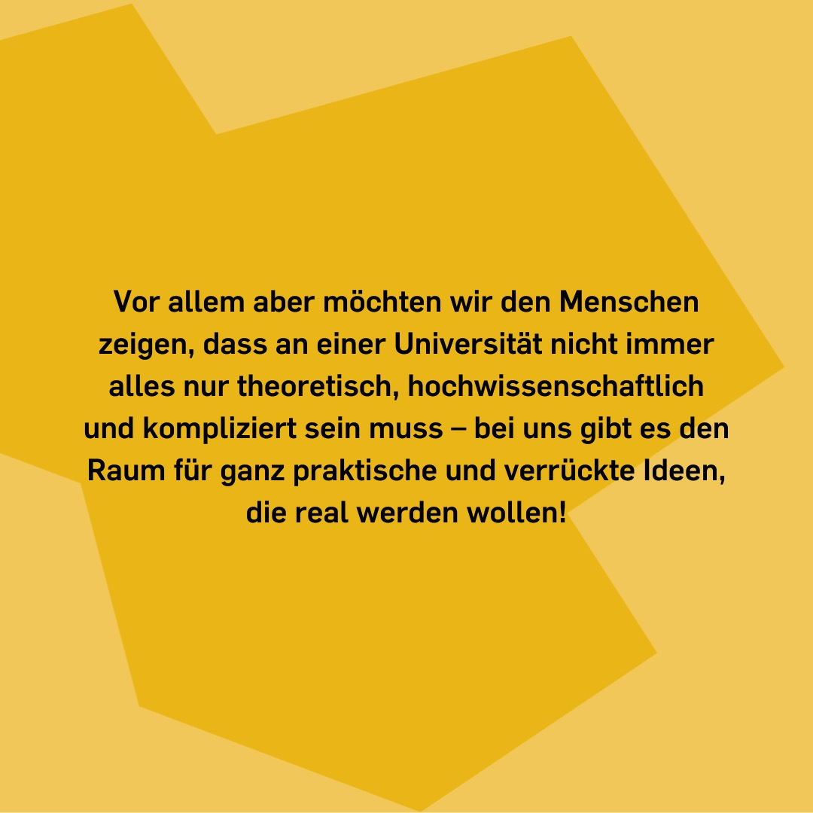

---
hide:
  - toc
date: "2022-08-24"
authors: "LS"   
---

# FAQ: Warum gibt es den RUB-Makerspace?

Der RUB-Makerspace gehört zu dem Transferkonzept der Ruhr-Universität und soll ganz verschiedene Zwecke erfüllen.

In erster Linie wollen wir hier Menschen inspirieren und ihre Ideen real werden lassen. Wir möchten Start-ups bei der Entwicklung ihrer Gründungsideen helfen und den Bau von Prototpen ermöglichen.
Bei uns soll Lehre praxisnäher werden. Hier möchte die RUB aber auch Verantwortung gegenüber der Gesellschaft übernehmen, beispielsweise durch Projekte zum Thema Nachhaltigkeit.

Vor allem aber möchten wir den Menschen zeigen, dass an einer Universität nicht immer alles nur theoretisch, hochwissenschaftlich und kompliziert sein muss - bei uns gibt es den Raum für ganz praktische und verrückte Ideen, die real werden wollen! 

{ width="45%" }
{ width="45%" }
{ width="45%" }
