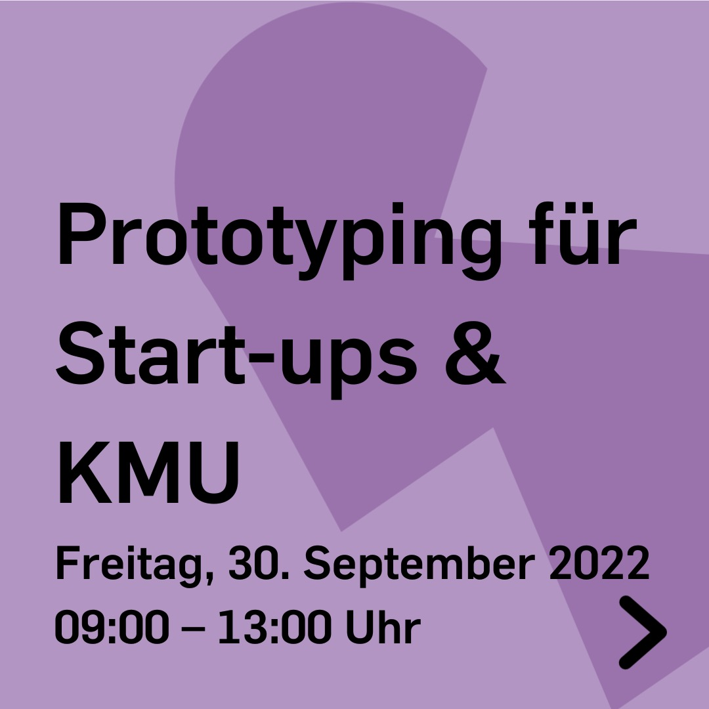
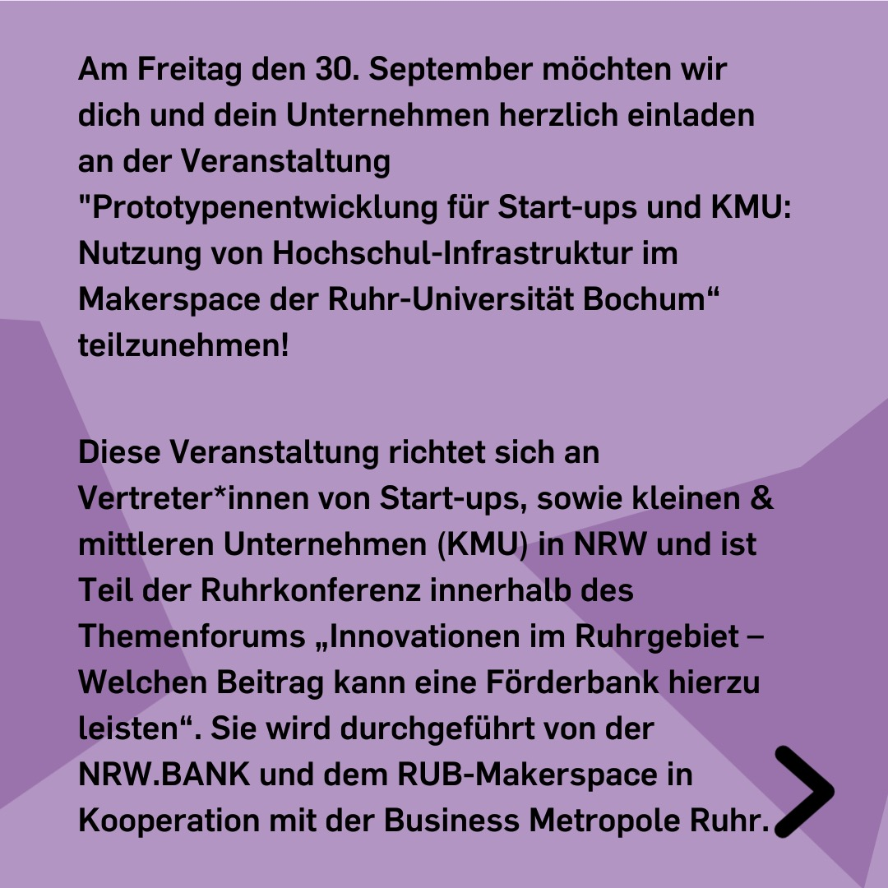
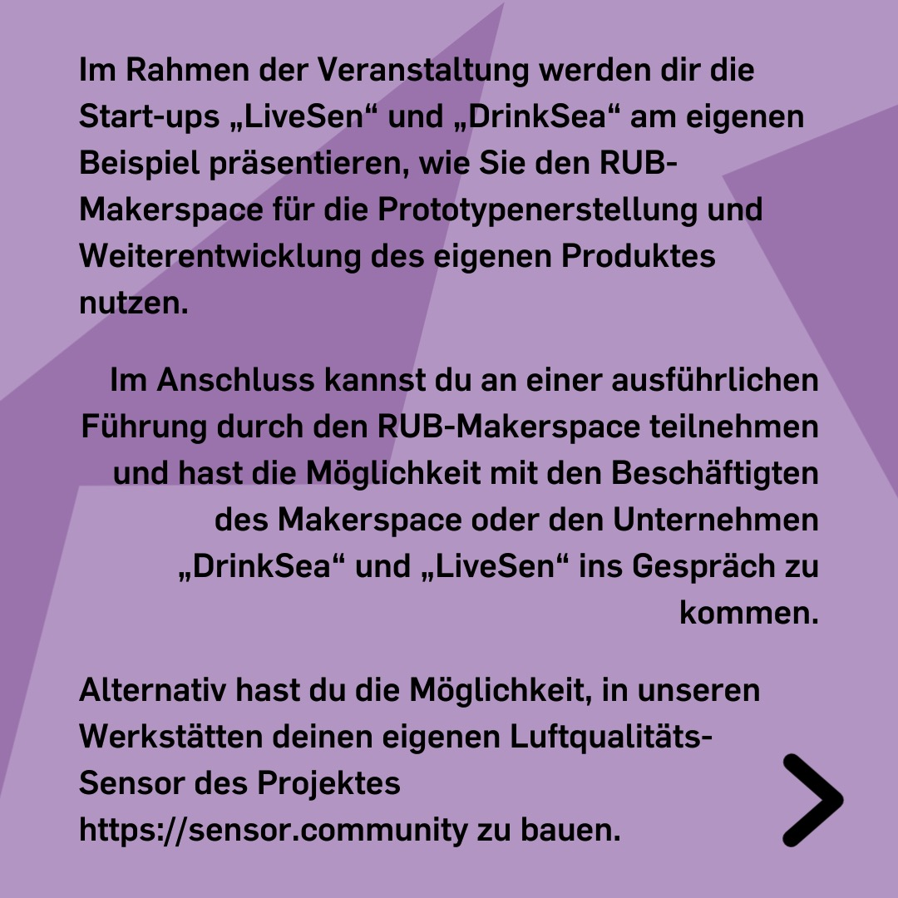
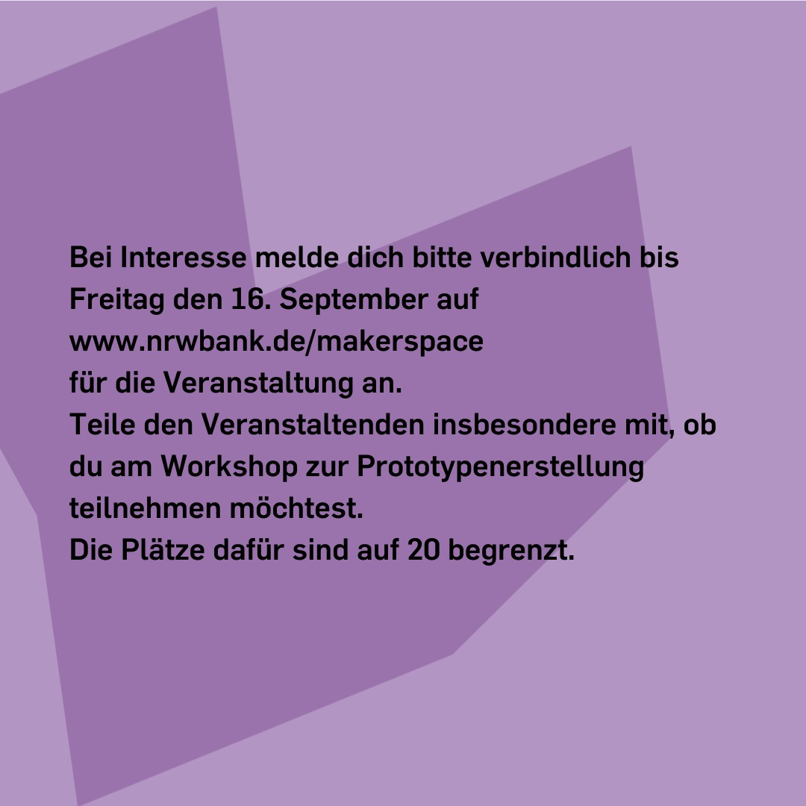

---
hide:
  - toc
date: "2022-09-07"
authors: "LS"   
---

# Prototypenentwicklung für Start-ups & KMU

Am Freitag den 30. September 2022 möchten wir Dich und Dein Unternehmen herzlich einladen an der Veranstaltung "Prototypenentwicklung für Start-ups und KMU: Nutzung von Hochschul-Infrastruktur im Makerspace der Ruhr-Universität Bochum" teilzunehmen!

Diese Veranstaltung richtet sich an Vertreter\*innen von Start-ups, sowie kleinen & mittleren Unternehmen (KMU) in NRW und ist Teil der Ruhrkonferenz innerhalb des Themenforums „Innovationen im Ruhrgebiet – Welchen Beitrag kann eine Förderbank hierzu leisten“. Sie wird durchgeführt von der NRW.BANK und dem RUB-Makerspace in Kooperation mit der Business Metropole Ruhr.

Im Rahmen der Veranstaltung werden Dir die Start-ups „LiveSen“ und „DrinkSea“ am eigenen Beispiel präsentieren, wie Sie den RUB-Makerspace für die Prototypenerstellung und Weiterentwicklung des eigenen Produktes nutzen.

Im Anschluss kannst Du an einer ausführlichen Führung durch den RUB-Makerspace teilnehmen und hast die Möglichkeit mit den Beschäftigten des Makerspace oder den Unternehmen „DrinkSea“ und „LiveSen“ ins Gespräch zu kommen.

Alternativ hast Du die Möglichkeit, in unseren Werkstätten deinen eigenen Luftqualitäts-Sensor des Projektes https://sensor.community zu bauen.

Bei Interesse melde Dich bitte verbindlich bis Freitag den 16. September auf www.nrwbank.de/makerspace
für die Veranstaltung an.
Teile den Veranstaltenden insbesondere mit, ob Du am Workshop zur Prototypenerstellung teilnehmen möchtest.
Die Plätze dafür sind auf 20 begrenzt.

{ width="45%" }
{ width="45%" }
{ width="45%" }
{ width="45%" }
