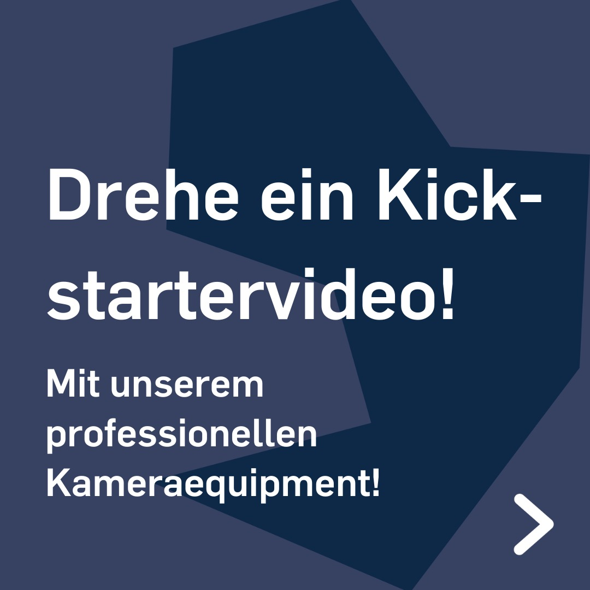
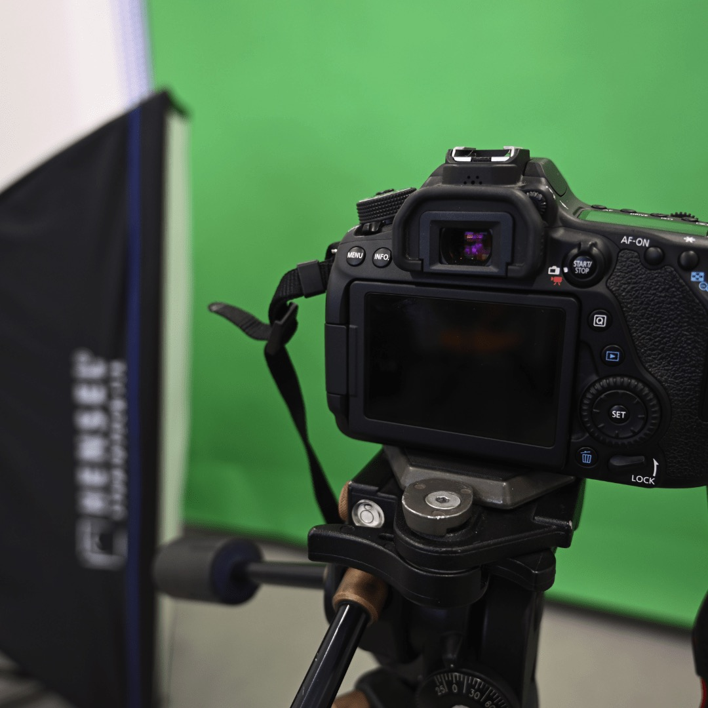
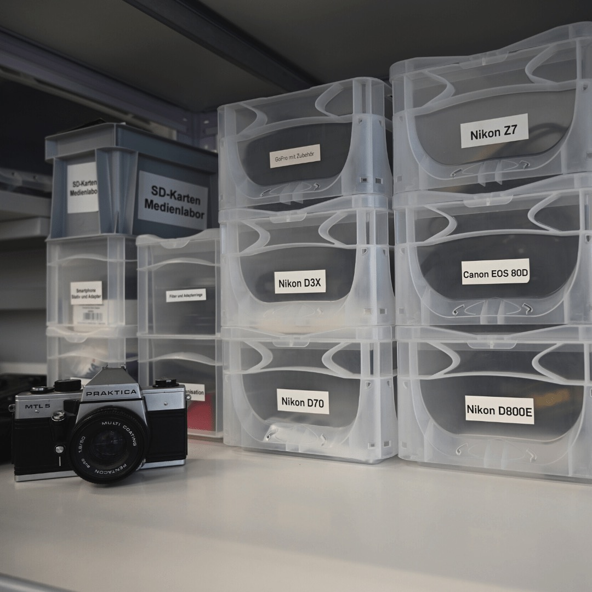

---
hide:
  - toc
date: "2022-09-30" 
authors: "LS"  
---

# Drehe ein Kickstartervideo!

Wusstest Du...  

...dass Du bei uns im [Medienlabor](../medienlabor.md) nicht nur Produktfotos machen kannst, sondern wir auch Equipment für Videoproduktionen zur Verfügung stellen?
Also falls Du demnächst Dein eigenes Kickstartervideo drehen möchtest, dann melde Dich bei uns und wir helfen Dir mit Equipment und Know-How!

Melde Dich bitte vorher per E-Mail unter makerspace@rub.de und wir vereinbaren zusammen einen passenden Termin.  

[Unsere Öffnungszeiten](../oeffnungszeiten.md)

{ width="45%" } 
{ width="45%" } 
{ width="45%" } 
