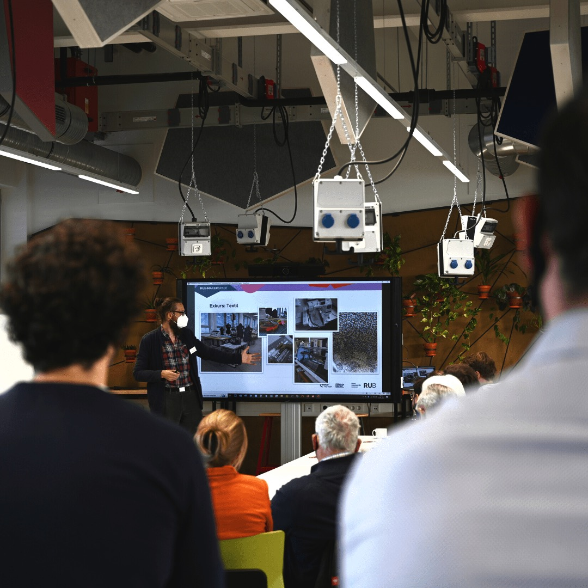
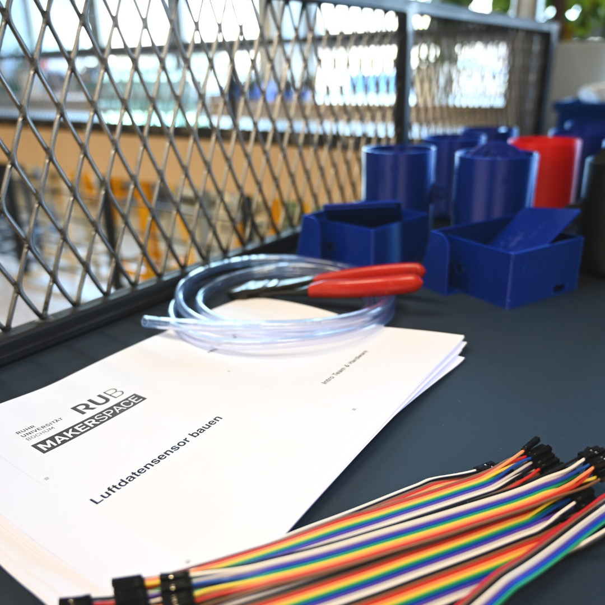

---
hide:
  - toc
date: "2022-10-20"  
---

# Rückblick 30.09.22

Prototypenentwicklung für Start-ups und KMU im RUB-Makerspace 

Vielen Dank für dein Interesse! 

Und vielen Dank an @nrw.bank und @business_ruhr, dass wir, im Rahmen des Themenforums "Innovationen im Ruhrgebiet - Welchen Beitrag kann eine Förderbank hierzu leisten?", die Prototypenentwicklung, anhand des Baus eines Luftqualitäts-Sensors des Projektes "sensor community", den Teilnehmenden näher bringen konnten!

Wir freuen uns immer über neue Start-ups und Gründer\*innen, die wir bei der Verwirklichung ihrer Ideen unterstützen können!

Falls auch Du Lust hast an Deinen Ideen zu tüfteln oder einfach gerne den RUB-Makerspace kennenlernen möchtest, dann komm doch am Dienstag oder Donnerstag in der Zeit von 10-16Uhr mal bei uns vorbei!
Bitte melde Dich dafür vorher per Mail unter makerspace@rub.de an, damit wir Dir bestmöglich weiterhelfen können!

{ width="45%" } { width="45%" }