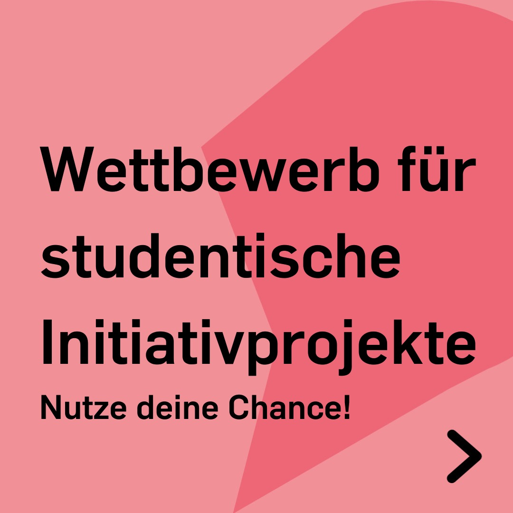
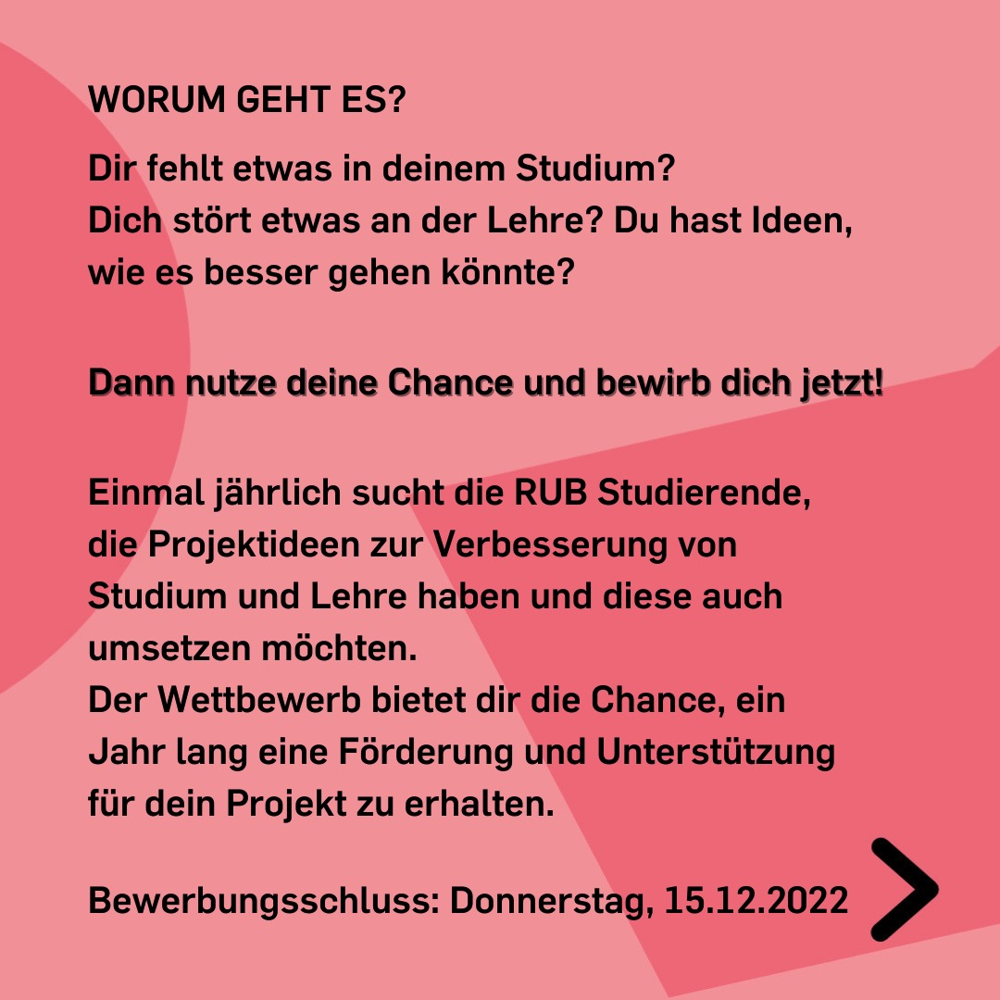
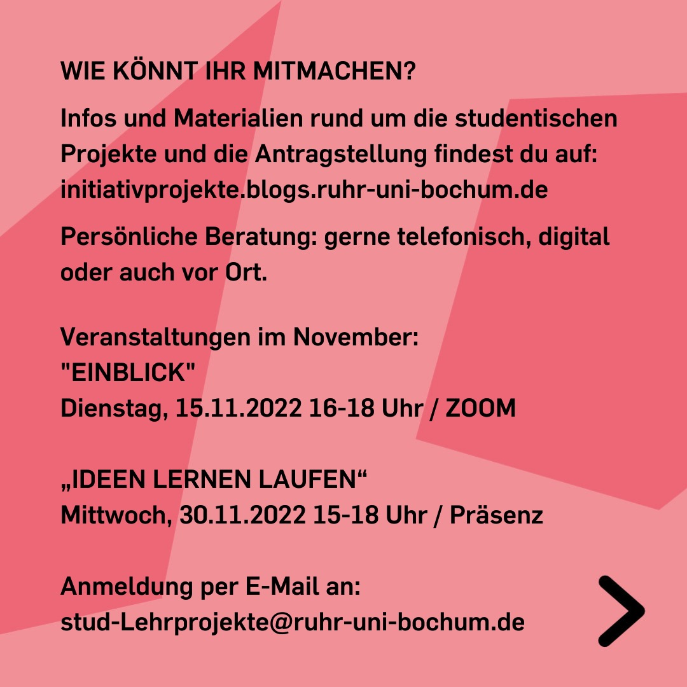
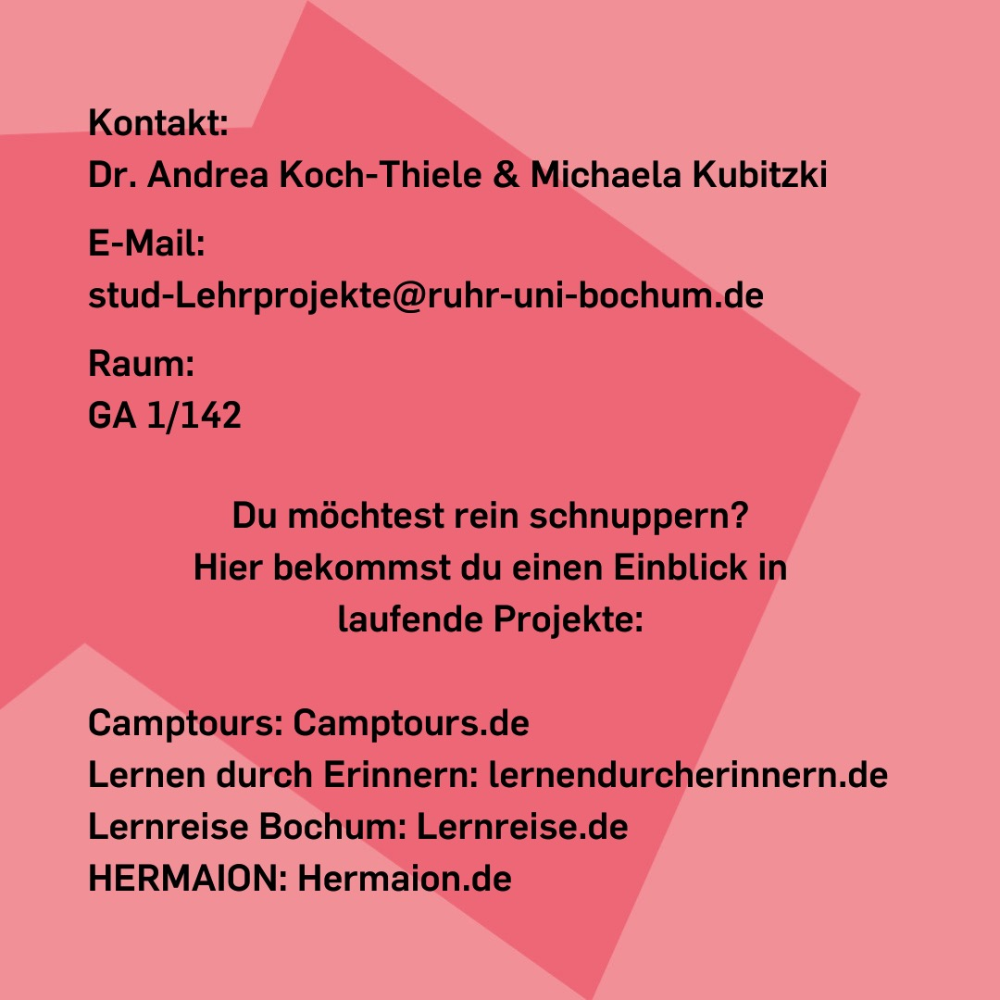

---
hide:
  - toc
date: "2022-11-12"  
---

# Die RUB sucht Deine Ideen

Dir fehlt etwas in deinem Studium?
Dich stört etwas an der Lehre? Du hast Ideen, wie es besser gehen könnte?
Dann nutze Deine Chance und bewirb Dich jetzt!
Einmal jährlich sucht die RUB Studierende, die Projektideen zur Verbesserung von
Studium und Lehre haben und diese auch umsetzen möchten.
Der Wettbewerb bietet Dir die Chance, ein Jahr lang eine Förderung und Unterstützung für dein Projekt zu erhalten.
Bewerbungsschluss: Donnerstag, 15.12.2022

WIE KÖNNT IHR MITMACHEN?
Infos und Materialien rund um die studentischen Projekte und die Antragstellung findest Du auf:
initiativprojekte.blogs.ruhr-uni-bochum.de
Persönliche Beratung: gerne telefonisch, digital oder auch vor Ort.

Veranstaltungen im November:
"EINBLICK"
Dienstag, 15.11.2022 16-18 Uhr / ZOOM

„IDEEN LERNEN LAUFEN“
Mittwoch, 30.11.2022 15-18 Uhr / Präsenz

Anmeldung per E-Mail an:
stud-Lehrprojekte@ruhr-uni-bochum.de

Kontakt: Dr. Andrea Koch-Thiele & Michaela Kubitzki
E-Mail: stud-Lehrprojekte@ruhr-uni-bochum.de
Raum: GA 1/142

Du möchtest rein schnuppern?
Hier bekommst Du einen Einblick in
laufende Projekte:
Camptours: Camptours.de
Lernen durch Erinnern: lernendurcherinnern.de
Lernreise Bochum: Lernreise.de
HERMAION: Hermaion.de

{ width="45%" } { width="45%" } { width="45%" } { width="45%" }