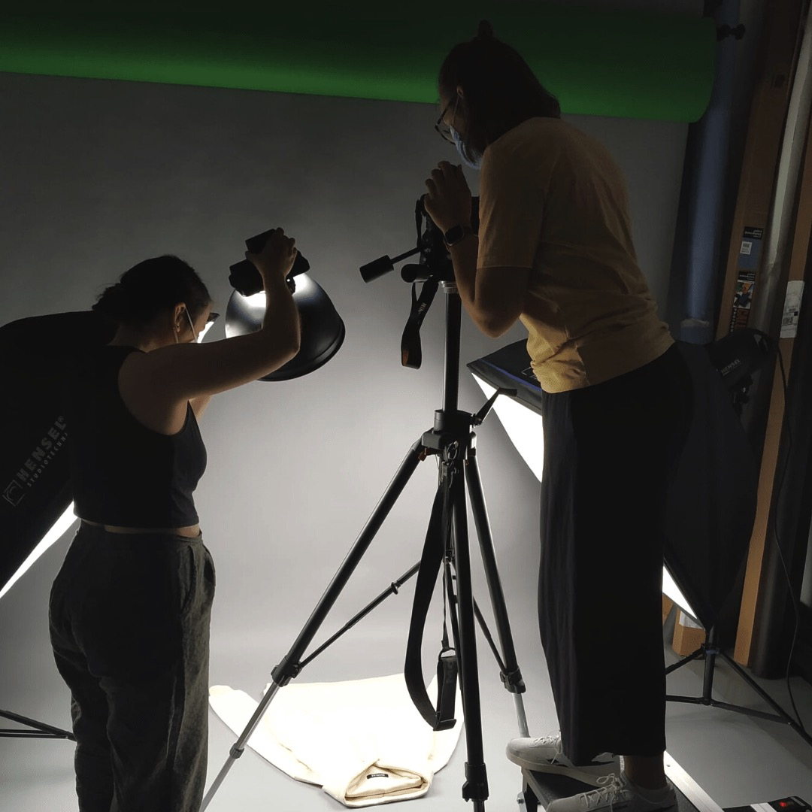
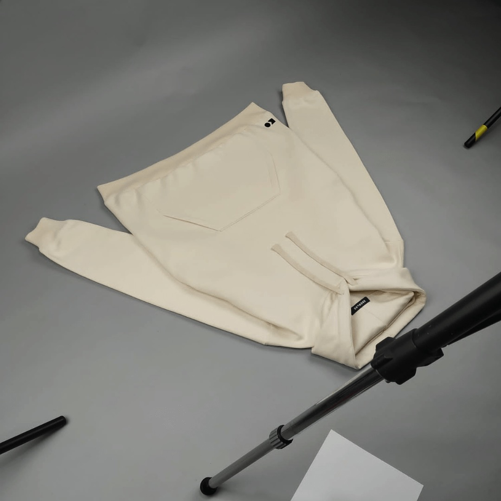
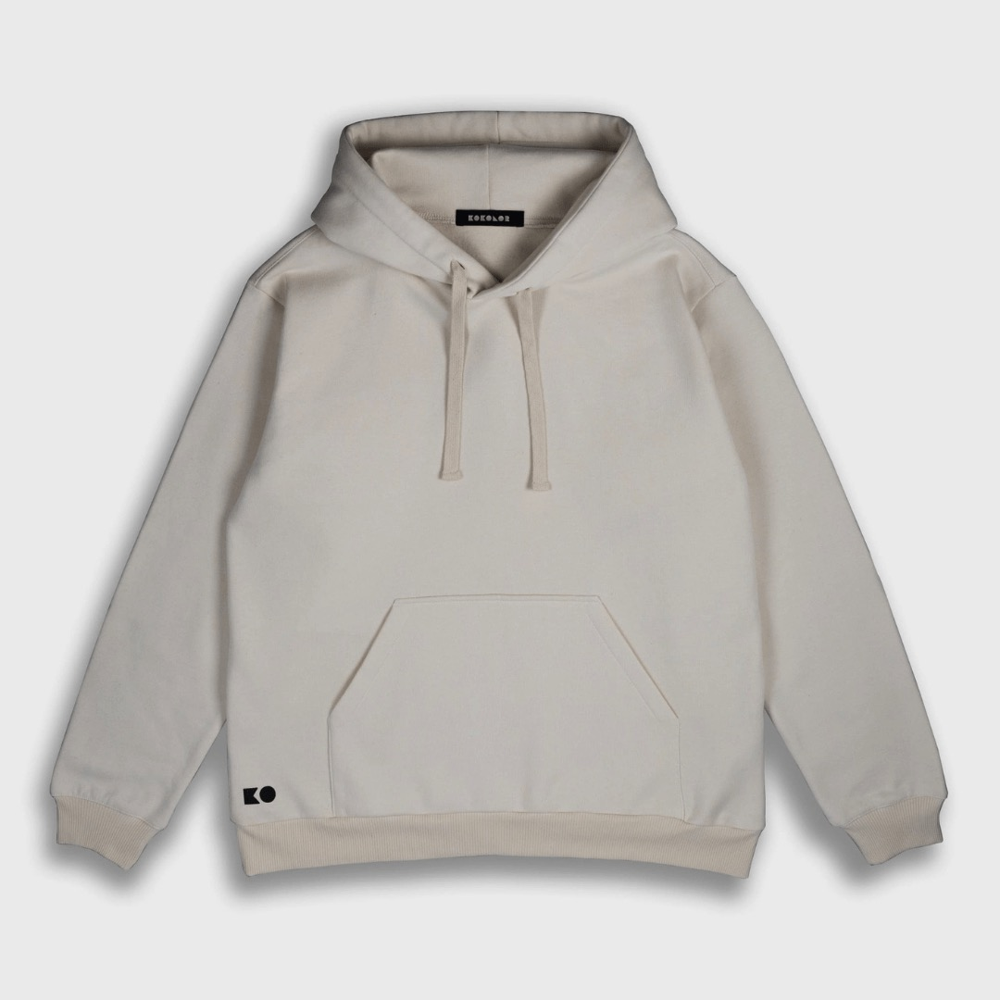

---
hide:
  - toc
date: "2022-11-19"  
---

# Produktfotografie im Makerspace! 

Vor allem für Start-Ups und Designer\*innen ist der Aspekt der Produktfotografie ein wichtiges Instrument für ein professionelles Auftreten.

Gründerin Katerina Amprazi hat für ihr Modelabel kokolor clothing unser Fotostudio genutzt, um ihre Pullover-Modelle für den Internetauftritt zu fotografieren. Die Fotos dienen als Basis für einen Konfigurator im Shop www.kokolor-clothing.de, mit dem der Pullover individuell gestaltet werden kann.

Richtig cool: produziert wird nur auf Nachfrage!

Du möchtest auch unser Equipment im Fotostudio nutzen? Schreib uns eine Mail an makerspace@rub.de 

{ width="45%" } { width="45%" } { width="45%" }