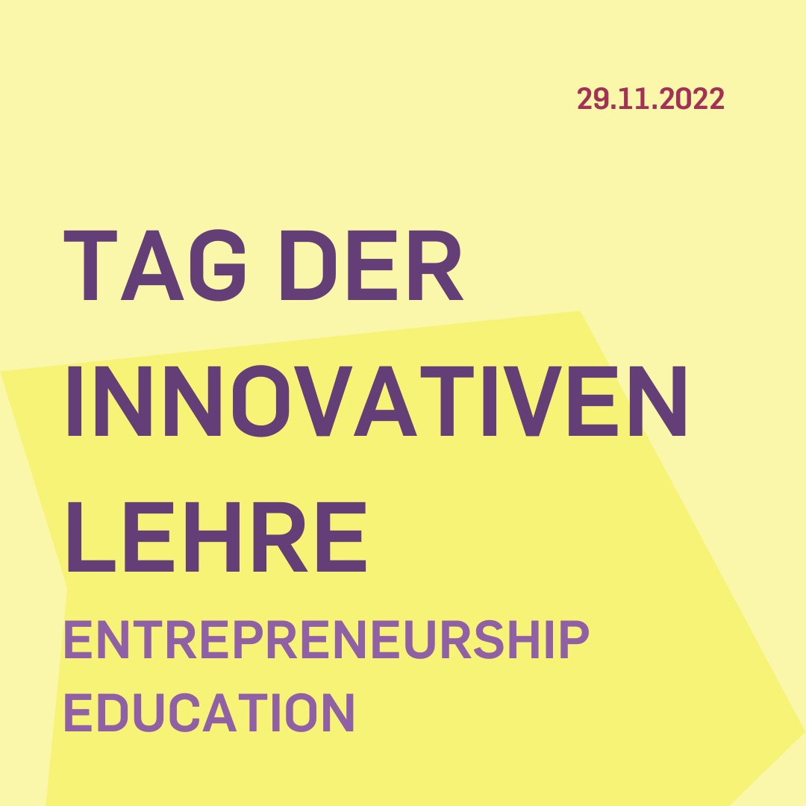
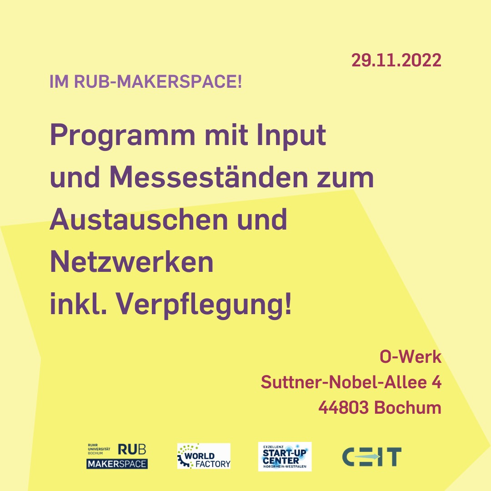
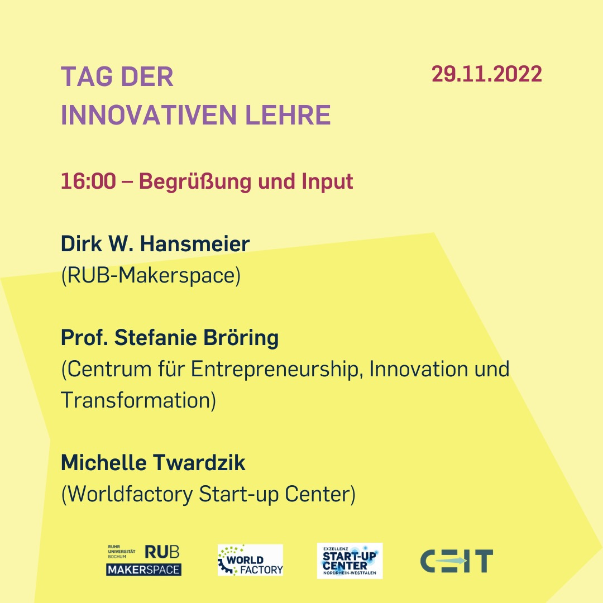
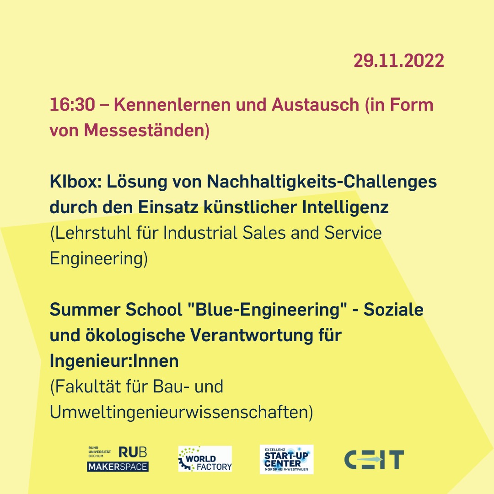
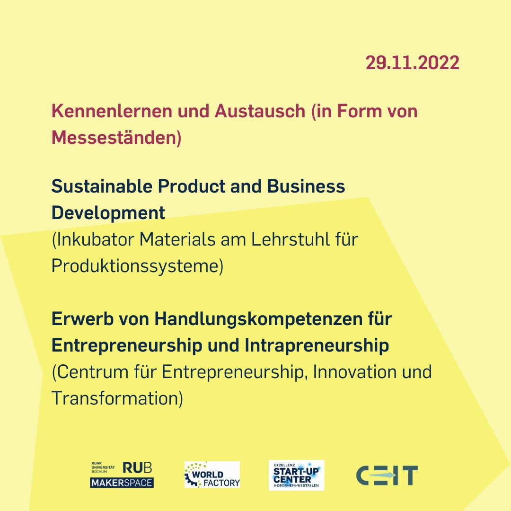
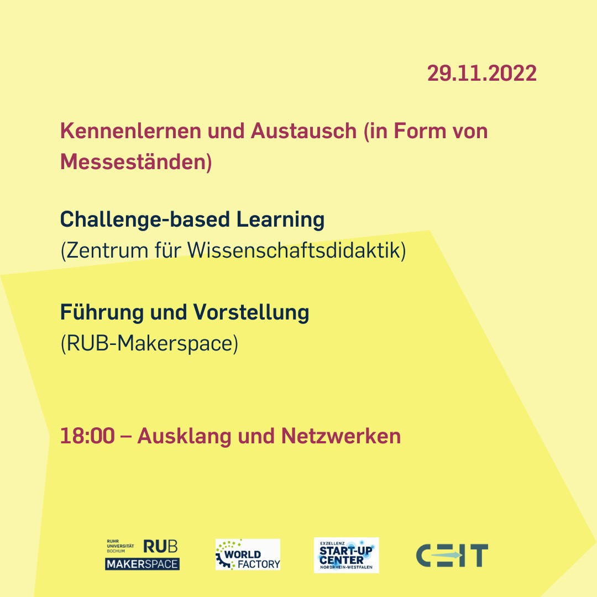

---
hide:
  - toc
date: "2022-11-27"  
---

# Entrepreneurship Education am 29.11.2022

Tag der innovativen Lehre: Entrepreneurship Education am 29.11.2022 im RUB-Makerspace!

Programm mit Input und Messeständen zum Austauschen und Netzwerken inkl. Verpflegung!

16 Uhr geht es los mit der Begrüßung und Input von Dirk. W. Hansmeier, dem Leiter des RUB-Makerspace, Prof. Stefanie Bröring, vom Centrum für Entrepreneurship, Innovation und Transformation und Michelle Twardzik vom Worldfactory Start-up Center.

16:30 Uhr laden wir zum Kennenlernen und Austauschen, in Form von Messeständen, ein.
Folgende Stände wird es geben:

 - KIbox: Lösung von Nachhaltigkeits-Challenges durch den Einsatz künstlicher Intelligenz
(Lehrstuhl für Industrial Sales and Service Engineering)

 - Summer School "Blue-Engineering" - Soziale und ökologische Verantwortung für Ingenieur:Innen
(Fakultät für Bau- und Umweltingenieurwissenschaften)

 - Sustainable Product and Business Development
(Inkubator Materials am Lehrstuhl für Produktionssysteme)

 - Erwerb von Handlungskompetenzen für Entrepreneurship und Intrapreneurship
(Centrum für Entrepreneurship, Innovation und Transformation)

 - Challenge-based Learning
(Zentrum für Wissenschaftsdidaktik)

Außerdem hast Du die Möglichkeit an einer Führung durch den RUB-Makerspace teilzunehmen und unsere Arbeit näher kennenzulernen!

Ab 18 Uhr lassen wir den Tag ausklingen und nutzen die Zeit zum Netzwerken! 

{ width="45%" } { width="45%" } { width="45%" } { width="45%" } { width="45%" } { width="45%" }