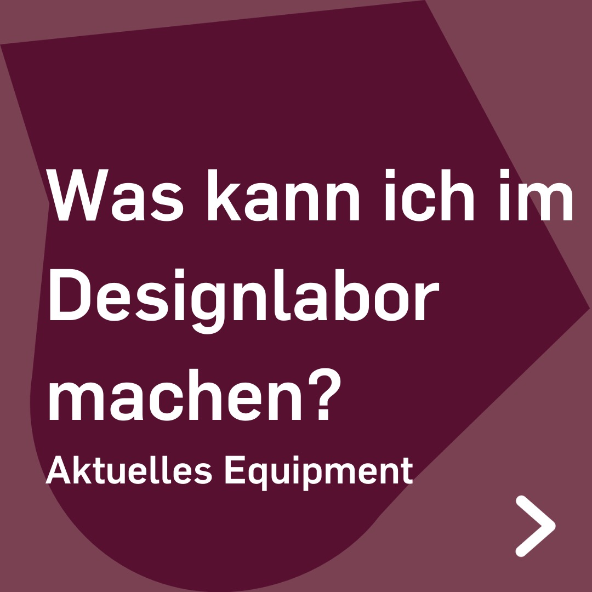
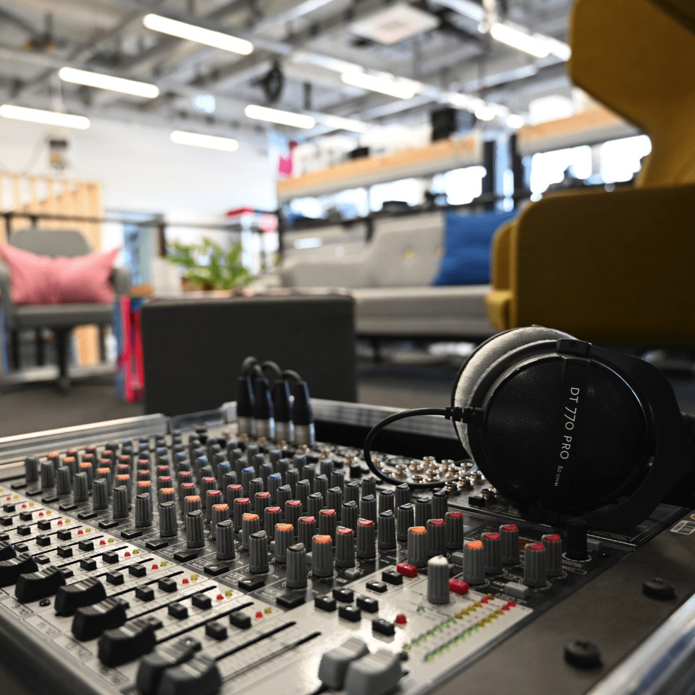
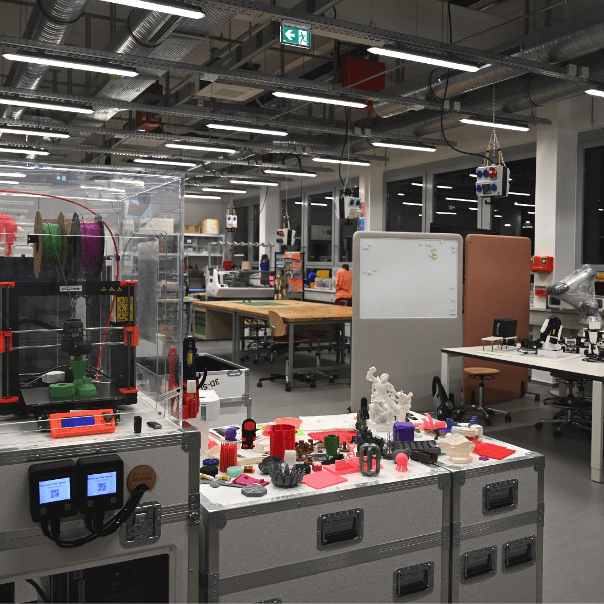

---
hide:
  - toc
date: "2022-12-16"  
---

# Was kann ich im Designlabor machen?

Deine Möglichkeiten:

- Lasercutten mit verschiedenen Materialien
- 3D-Drucken mit dem FDM-Verfahren
- Textildesign und -gestaltung
- Einführung in die Robotik
- Gestalten und Drucken von Papier bis A0
- Co-Working auf freier Fläche & in Seminarräumen
- uvm.

Wir haben immer Dienstag und Donnerstag von 10-16 Uhr geöffnet und freuen uns auf Deinen Besuch!
Bitte melde Dich vorher per Mail, an makerspace@rub.de, an.

{ width="45%" } { width="45%" } { width="45%" }
