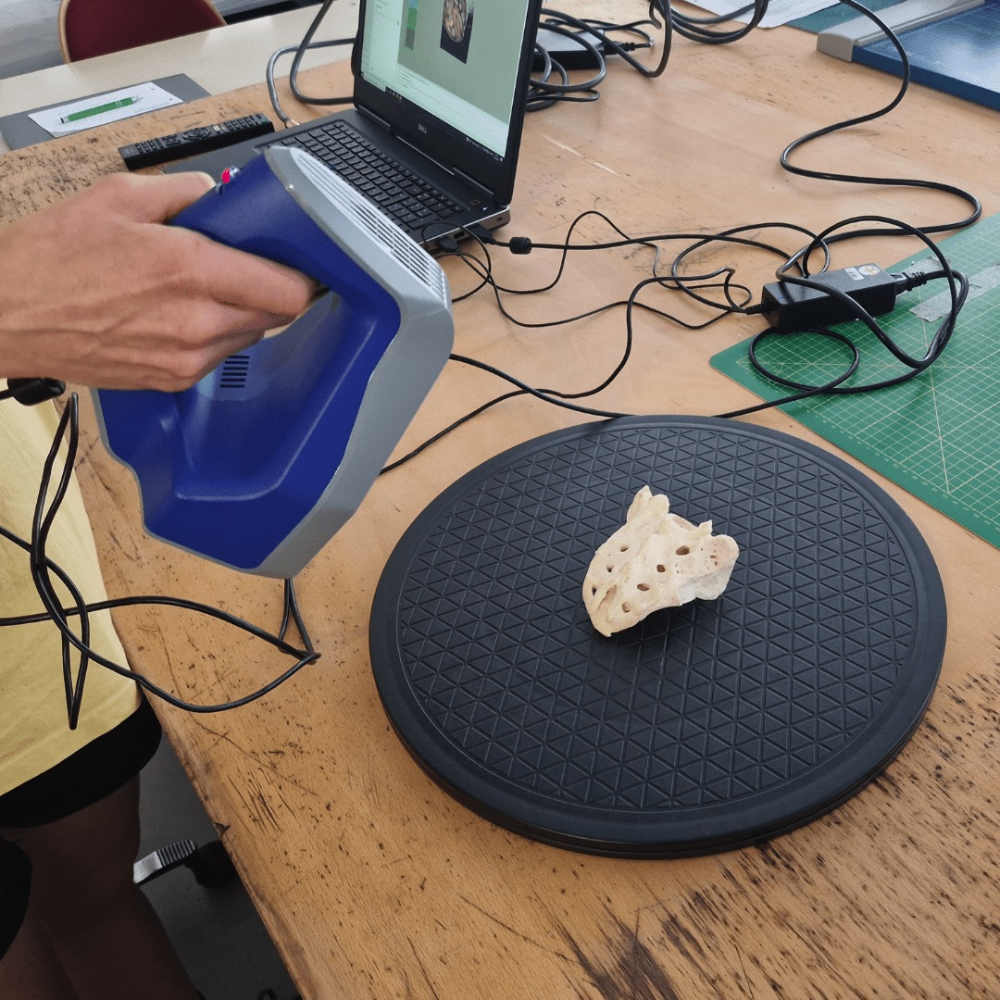
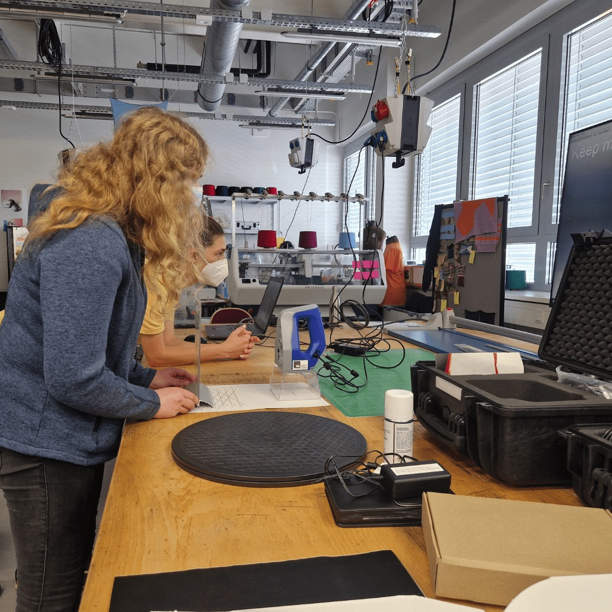
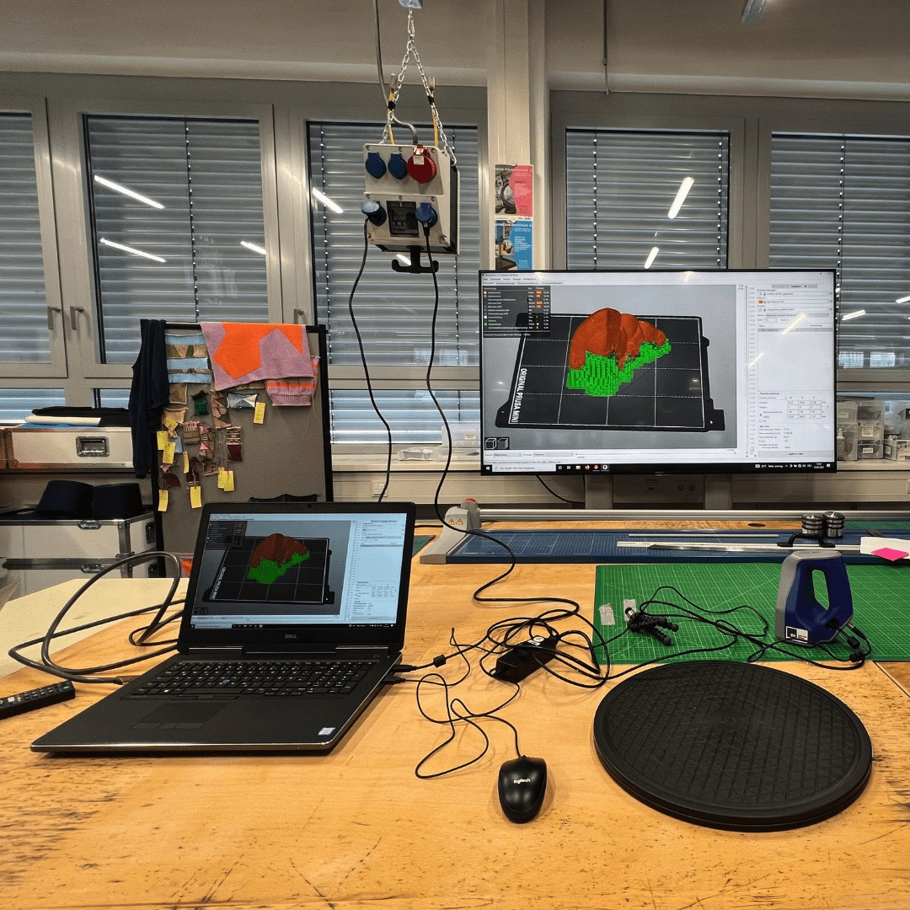
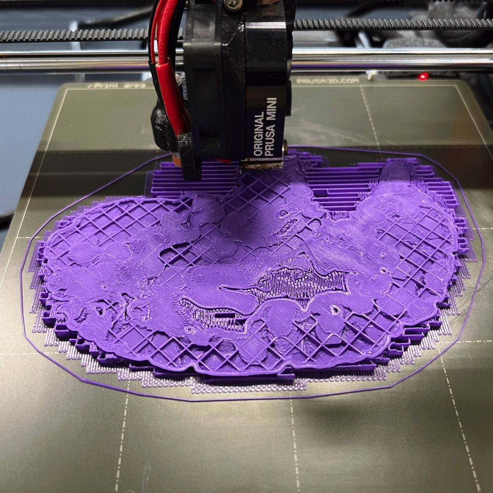

---
hide:
  - toc
date: "2022-12-22"
authors: "LS"   
---

# Präparator\*innen im Makerspace 

3 Klassen von angehenden Präparator\*innen in den Bereichen Medizin, Biologie und Geologie des Walter-Gropius-Berufskolleg waren im Makerspace, um ihre Präparate, die häufig sehr fragil oder verfallsanfällig sind, kontaktlos und dreidimensional zu erfassen.

Gearbeitet wurde mit dem [3D-Scanner](../designlabor.md##3d-scan) Artec Spider. Im Anschluss wurden einige Modelle per [FDM-Verfahren](../designlabor.md#fdm) 3D-gedruckt.

{ width="45%" } 
{ width="45%" } 
{ width="45%" } 
{ width="45%" } 
