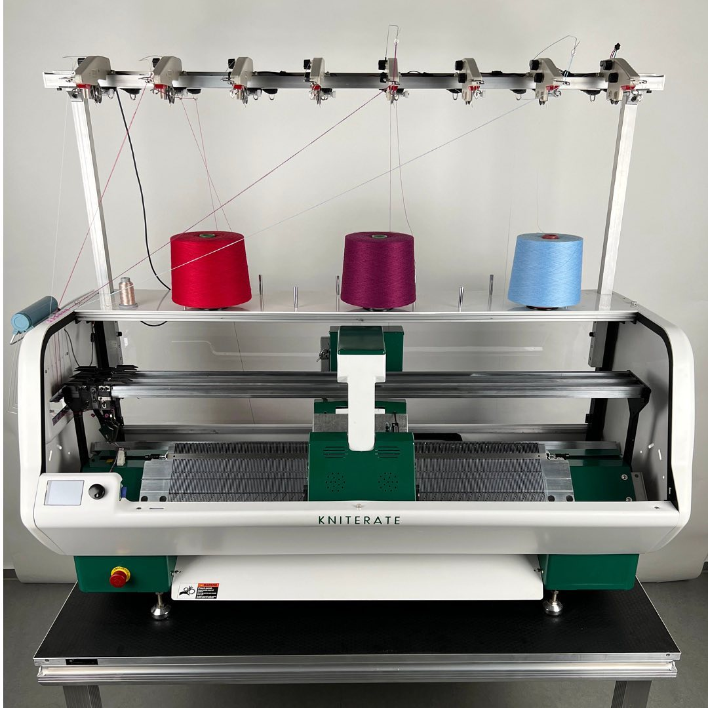
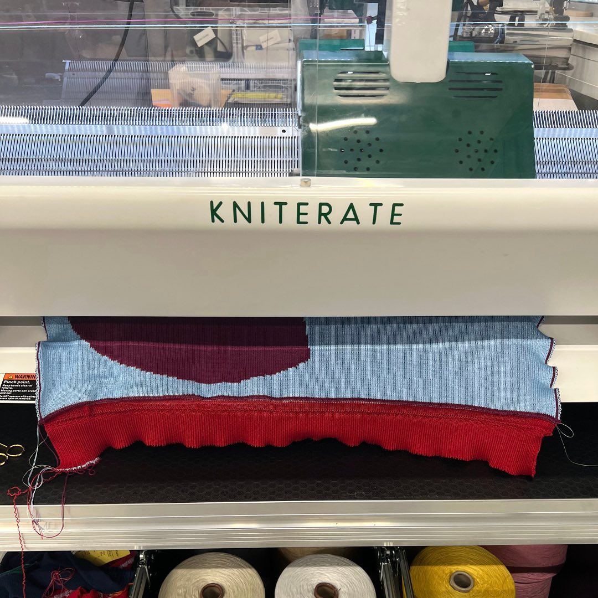

---
hide:
  - toc
date: "2023-01-12"
authors: "LS"   
---

# Kniterate - unsere digitale Strickmaschine

Lerne unsere digitale Strickmaschine, die [Kniterate](../textillabor.md), kennen! Die Kniterate ist eine eigens für den Werkstattbetrieb entwickelte Strickmaschine, um schnelle und einfache Strickprototypen und Kleinserien herstellen zu können. Mit einer kostenlosen Software, die über den Browser genutzt wird, kannst Du eigene Motive und Muster in strickbare Dateiformate umwandeln. Unter [www.kniterate.com](https://www.kniterate.com) kannst Du Dich bereits im Vorfeld umfassend darüber informieren.
Du möchtest an der Knierate in Aktion treten? Bereits vorhandenes Wissen über das Stricken ist von Vorteil, aber nicht zwingend notwendig. Wie immer gilt: wir finden gemeinsam den besten Weg zu Deinem Projekt!

{ width="45%" }
{ width="45%" }
{ width="45%" }