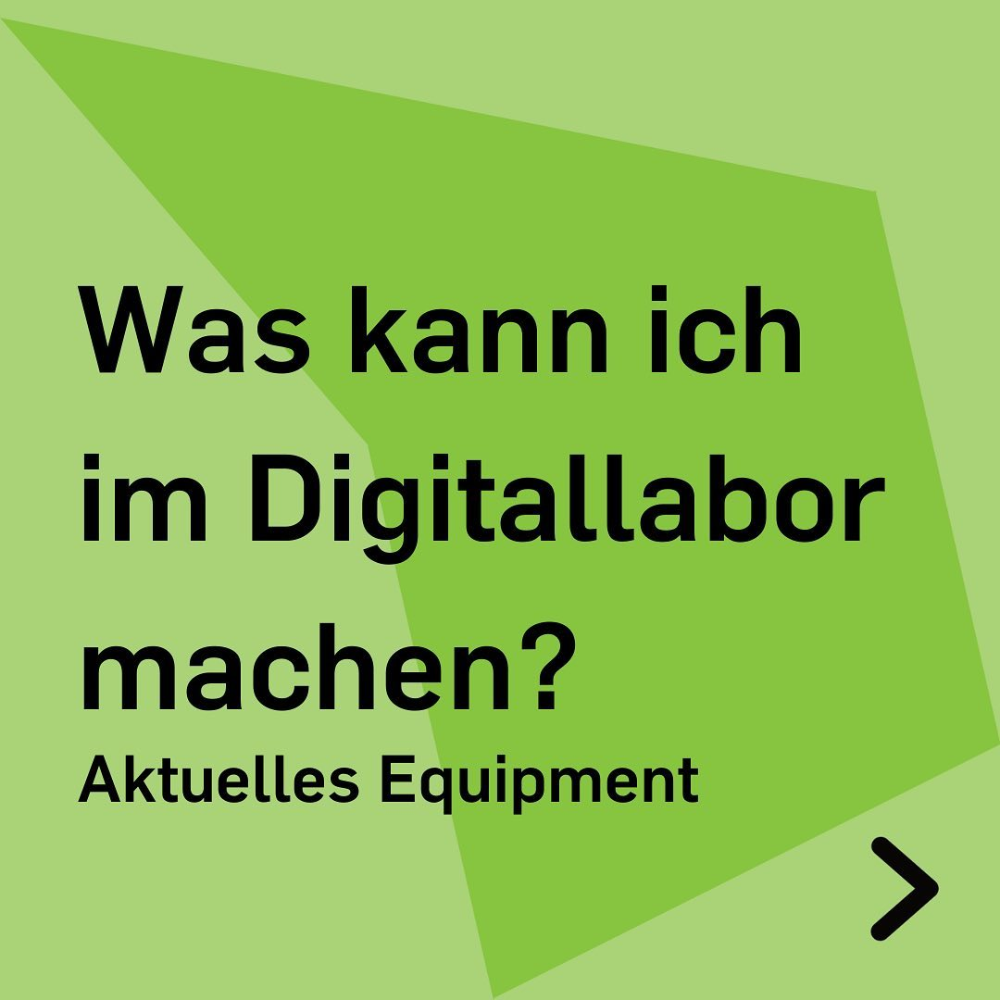
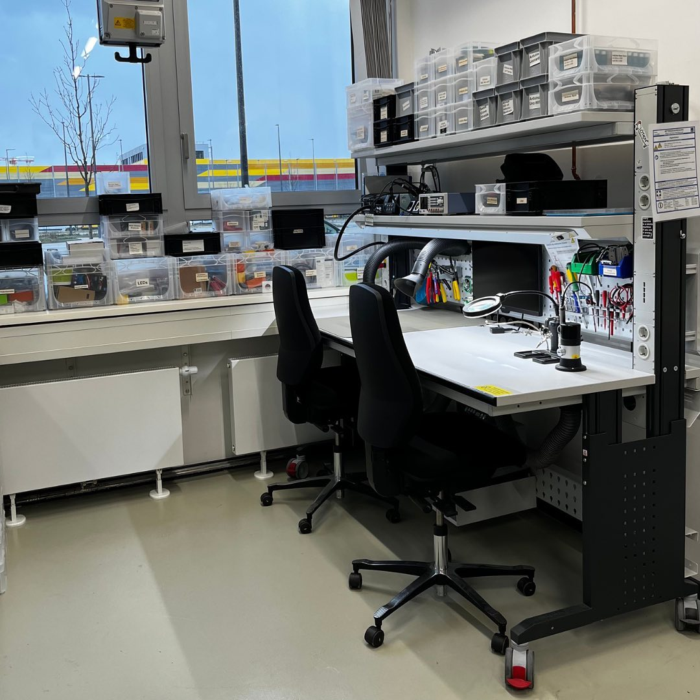
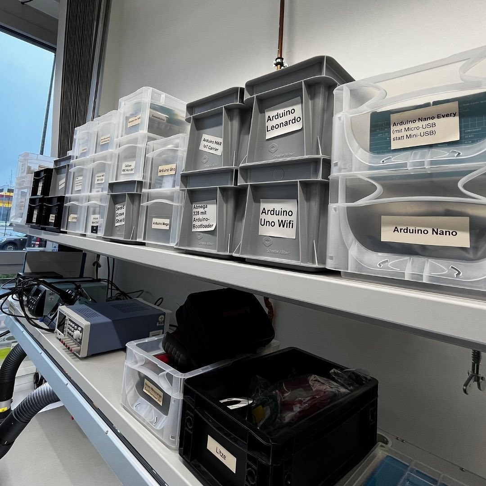
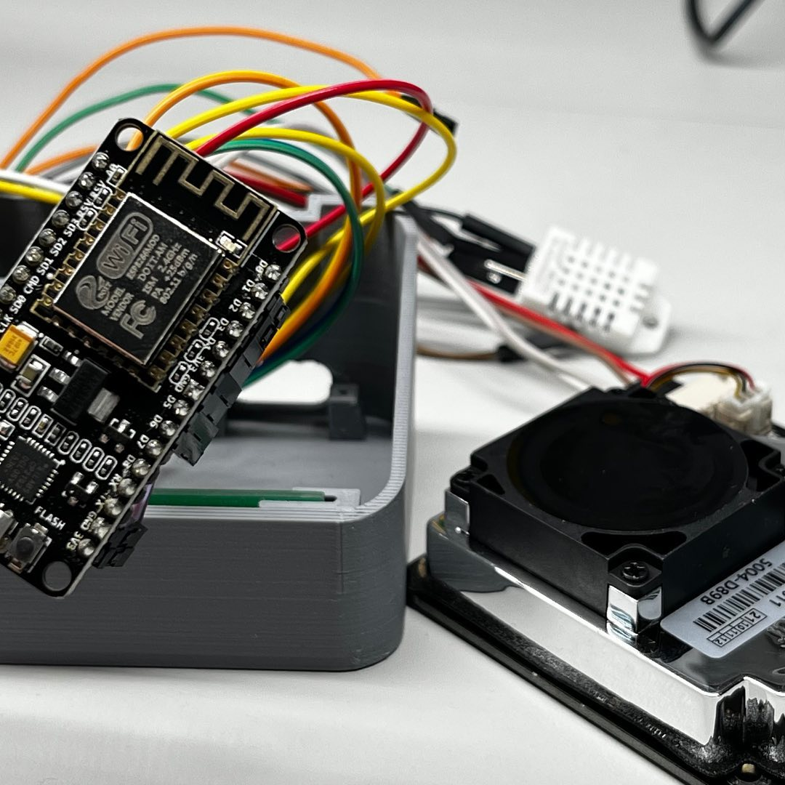

---
hide:
  - toc
date: "2022-01-19"
authors: "LS"   
---

# Aktuelles Equipment im Digitallabor

Unser [Digitallabor](../digitallabor.md) ist Deine Anlaufstelle für alles, was Computer, Interaktivität, Löten und (Mikro-)Elektronik betrifft. Hier findest Du, was Du für Entwicklungsarbeiten aus der Informations- und Elektrotechnik brauchst.

Deine Möglichkeiten:

- Löten, Messen & Platinen drucken
- Zur Ausstattung gehören neben mehreren klassischen Lötstationen auch eine Heißluft-Lötstation und verschiedenes Lötwerkzeug sowie eine in die Labortische integrierte Lötrauchabsaugung. Mobile Lötkolben mit kleiner Absaugung, Arbeitsmatte und so weiter zum ortsflexiblen Löten mit Gruppen sind ebenfalls vorhanden.
- Um den Fertigungsprozess zu unterstützen, ihre Funktionalität zu überprüfen oder Fehler zu finden, gibt es im Makerspace verschiedene Messgeräte wie zum Beispiel Multimeter und Oszilloskope.
- Mit unserem Voltera V-One Platinendrucker kannst Du Leiterplatten bedrucken, löten, backen und bohren. Alternativ kannst Du in Zukunft auch Platinen mit unserer kleinen Desktop-CNC-Fräse im Isolationsfräsverfahren herstellen.

Im Digitallabor sind oft benötigte Materialien aus der Computer- und Elektrotechnik vorrätig:

- Verbrauchsmaterial (Litze, Lötmaterial, ...)

- IT-Zubehör (Adapter, Kabel, Speichermedien, ...)

- Standardbauteile (LEDs, Widerstände, Netzteile, ...)

- Microcontroller und Einplatinencomputer (zum Beispiel diverse Arduinos, Raspberry Pis, BBC micro:bit, Adafruit Circuit Playground Express, D1, ESP8266, ESP32, ...)

- Verschiedenste "Breakout"-Boards und Zubehörteile für Microcontroller

- Verschiedenste Sensorik und Aktorik, zum Beispiel zum Anschluss an Microcontroller

- Diverse Hardware zum Ausschlachten. Es gibt auch eine "Löten Lernen"-Kiste für defekte Dinge, die sich aber noch gut zum Lernen/Ausprobieren verschiedener Löt-Arbeiten eignen.

Wir haben immer Dienstag und Donnerstag von 10-16 Uhr geöffnet (Stand: 19.01.2023) und freuen uns auf Deinen Besuch!
Bitte melde Dich vorher per Mail an makerspace@rub.de an.

{ width="45%" }
{ width="45%" }
{ width="45%" }
{ width="45%" }

