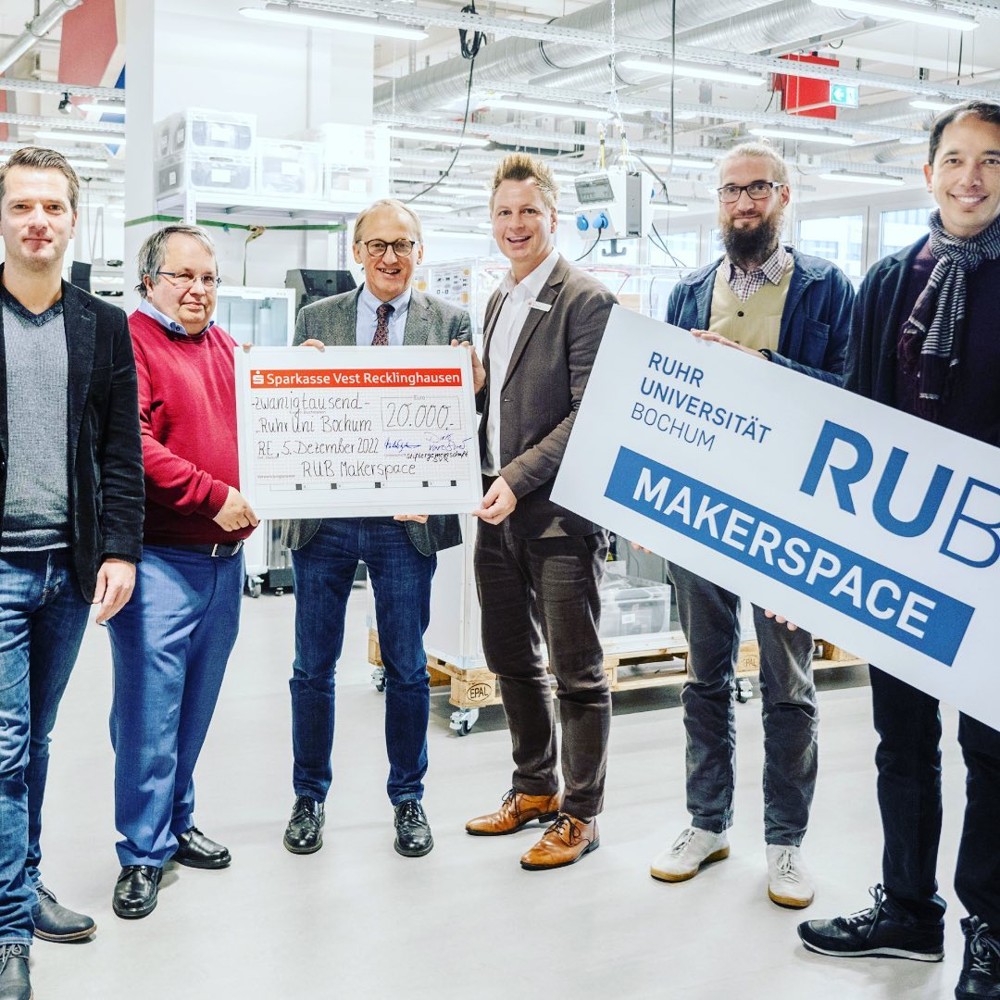

---
hide:
  - toc
date: "2023-01-26"  
authors: "LS"
---

# "Makers in Residence" startet im Makerspace

Im RUB-Makerspace ist der offizielle Startschuss für das [„Makers in Residence“](../mir.md) Programm gefallen!
Mit einer feierlichen Scheckübergabe vor Ort läutete die Stiftergemeinschaft der Sparkasse Vest Recklinghausen am 5. Dezember 2022 das mehrwöchige Programm ein.
Der Ansatz von „Makers in Residence“ ist, durch Austausch und gezieltes Mentoring seitens Expert\*innen innovative und kreative Lösungsansätze zu finden. Das Programm richtet sich sowohl an gründungsmotivierte Studierende der Ruhr-Universität und der Bochumer Hochschulen allgemein als auch an außenstehende Personen. Alle Teilnehmenden profitieren dabei von der Kombination aus fachlichem und kreativem Input und können in Workshops gezielt neue Denkweisen und Lösungsansätze ausprobieren. Langfristig soll damit an der Universität weiterhin ein Klima kultiviert werden, in dem die Kombination von Erfahrung und Innovation etwas Neues entstehen lässt.

Mehr Infos gibt im [Artikel auf dem RUB Newsportal](https://news.rub.de/presseinformationen/transfer/2022-12-08-innovatives-format-startschuss-fuer-makers-residence)!  

{ width="45%" }
