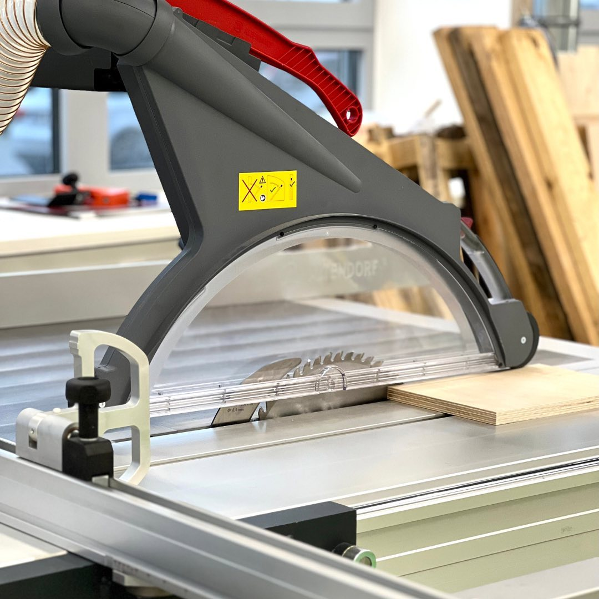
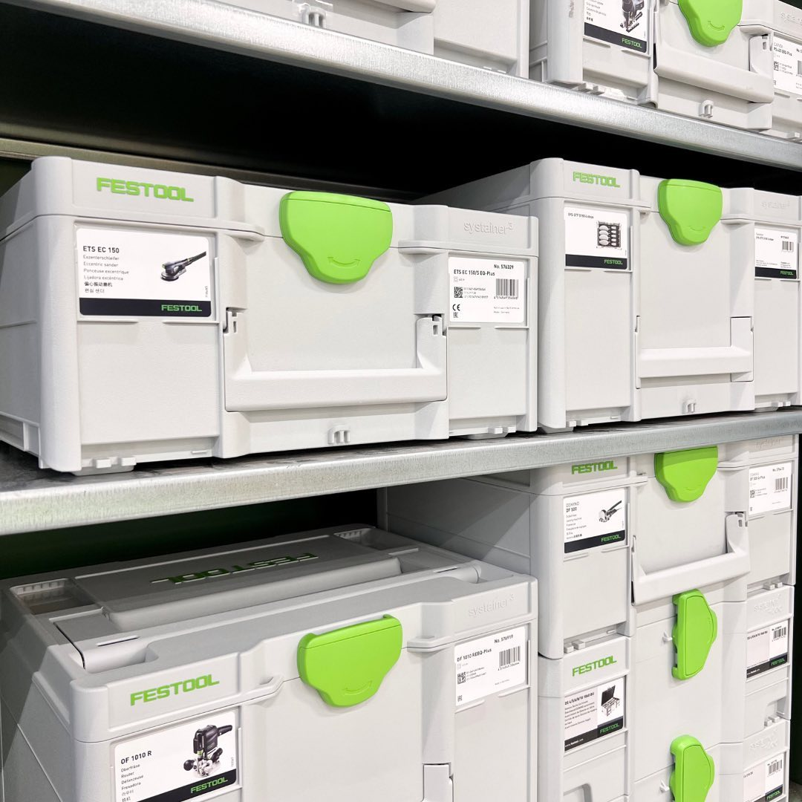
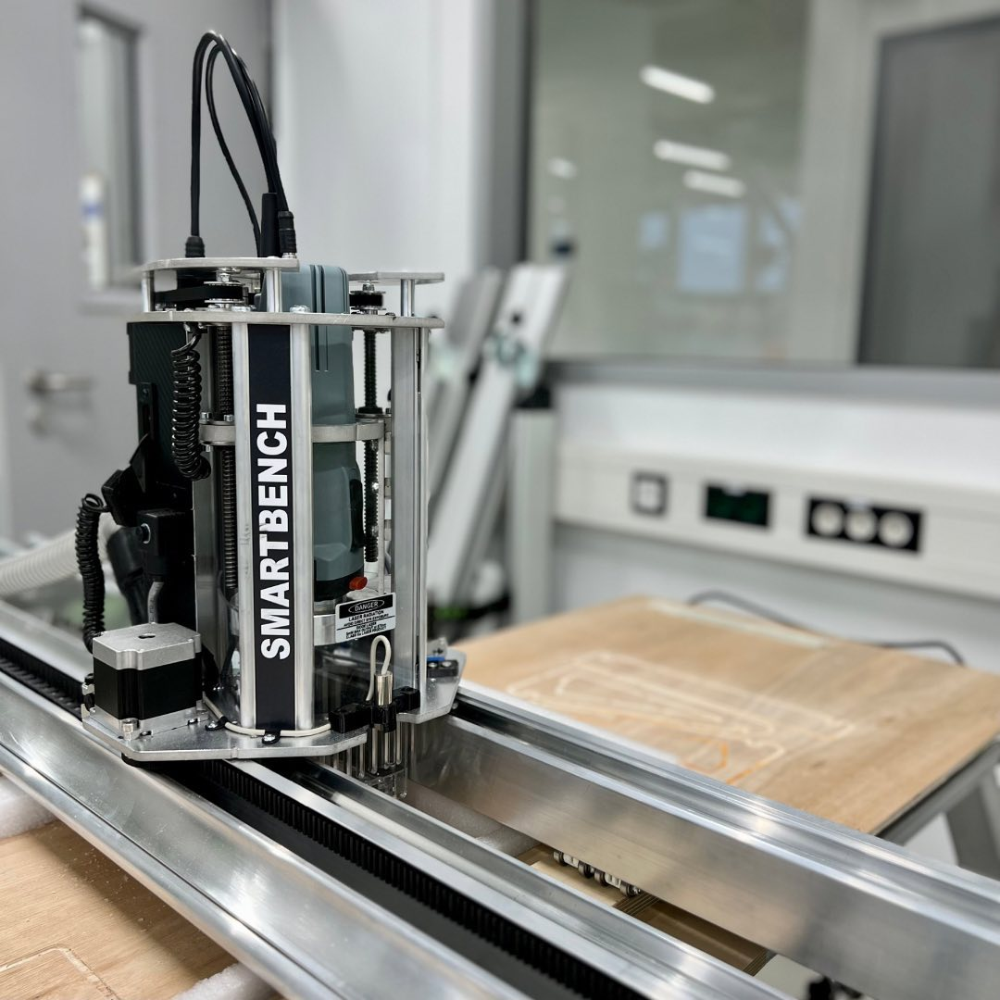

---
hide:
  - toc
date: "2023-02-05"  
authors: "LS"
---

# Holzwerkstatt im Aufbau

Das erwartet Dich zukünftig in [unserer Holzwerkstatt](../holzwerkstatt.md):

Zurzeit befindet sich unsere Holzwerkstatt noch im Aufbau und ist noch nicht geöffnet. Dennoch wollen wir Dir gerne schon mal einen Einblick geben, was Dich künftig erwarten wird.

In der Holzwerkstatt dreht sich, wie es der Name schon vermuten lässt, alles um das Thema Holz. Hier wirst Du unsere Maschinen nutzen können, um Deine Idee ins Leben zu tischlern. Überlege Dir welche Materialien am besten für dein Projekt geeignet sind und besorge diese im Vorfeld. Wenn Du Dir unschlüssig bist, helfen wir gerne weiter.

Wir werden Dir hier unter anderem Geräte fürs Bohren, Fräsen, Sägen, Schleifen bieten und nahezu alles an Werkzeug, was Du für die Holzbearbeitung benötigst, damit Du dein Projekt verwirklichen kannst.

{ width="45%" }
{ width="45%" }
{ width="45%" }
{ width="45%" }
