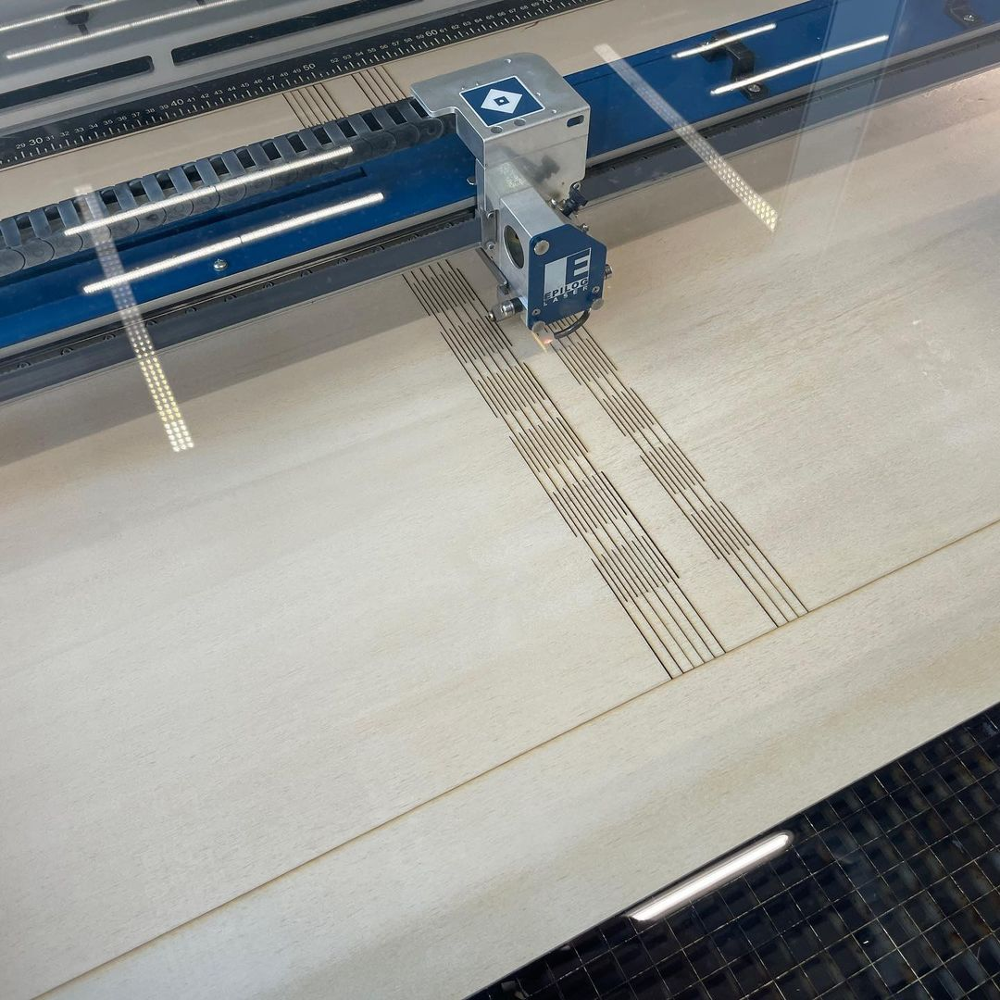

---
hide:
  - toc
date: "2023-02-12"  
authors: "LS"
---

# Holzbiegen mit dem Lasercutter

Holz biegen geht nicht nur mit Wasserdampf, sondern auch per Gravur!

Hier kannst Du sehen, wie ein Nutzer bei uns den [Lasercutter](../designlabor.md#laser) einsetzt, um ein Muster in Holz zu schneiden, sodass das Teil anschließend biegsam wird.
Durch solche Techniken lassen sich viele Ideen umsetzen, beispielsweise wenn es um prototypenartige Gehäuse geht. Du musst dazu nicht mal besonders tiefe Konktruktions-Skills haben, sondern kannst beispielsweise Tools wie [Makercase](https://www.makercase.com/#/) nutzen.
Falls Du doch gerne selbst konstruieren möchtest und dazu fragen hast, [kontaktiert uns](../kontakt.md) gerne oder sprech uns an!

Hier geht es zur [Holzwerkstatt auf unserer Webseite](../holzwerkstatt.md)

{ width="45%" }

