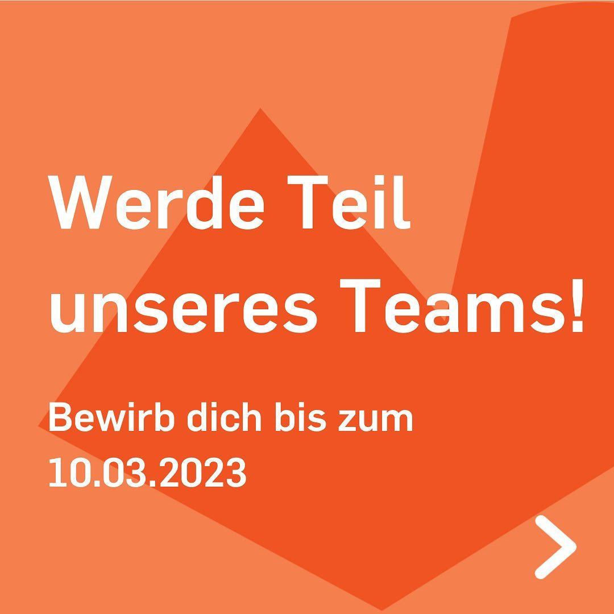
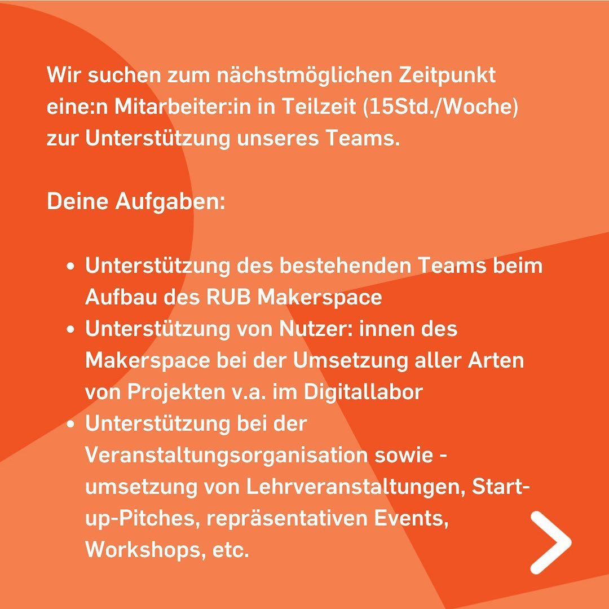
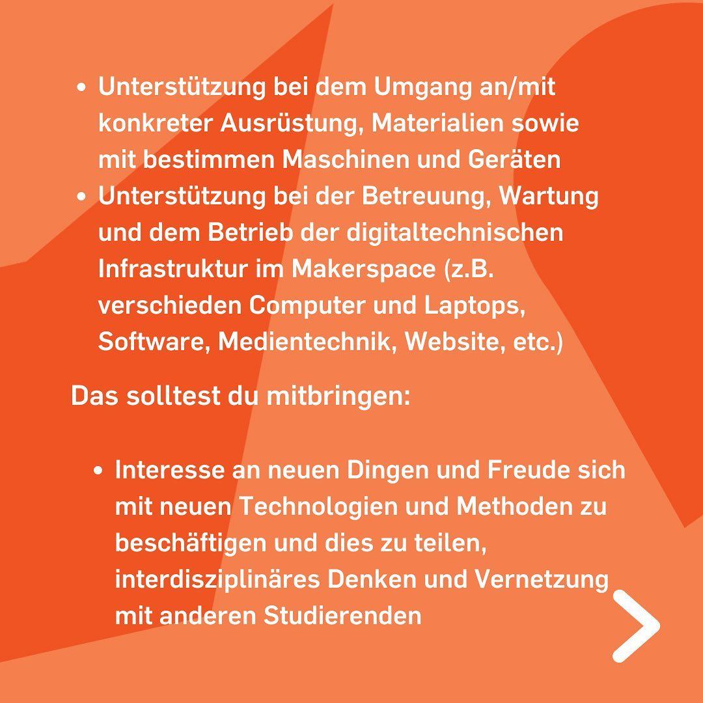
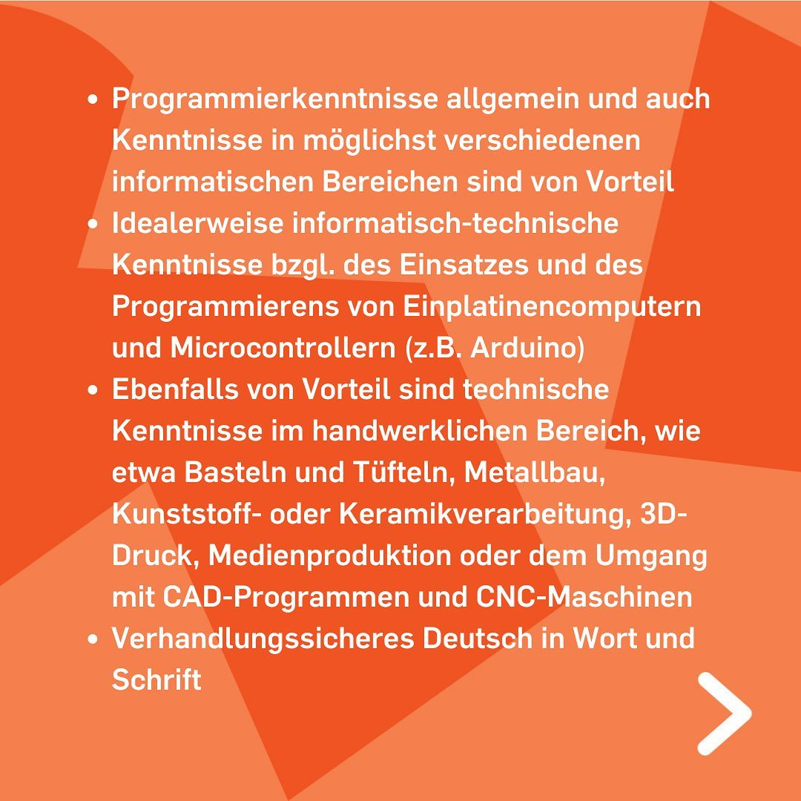
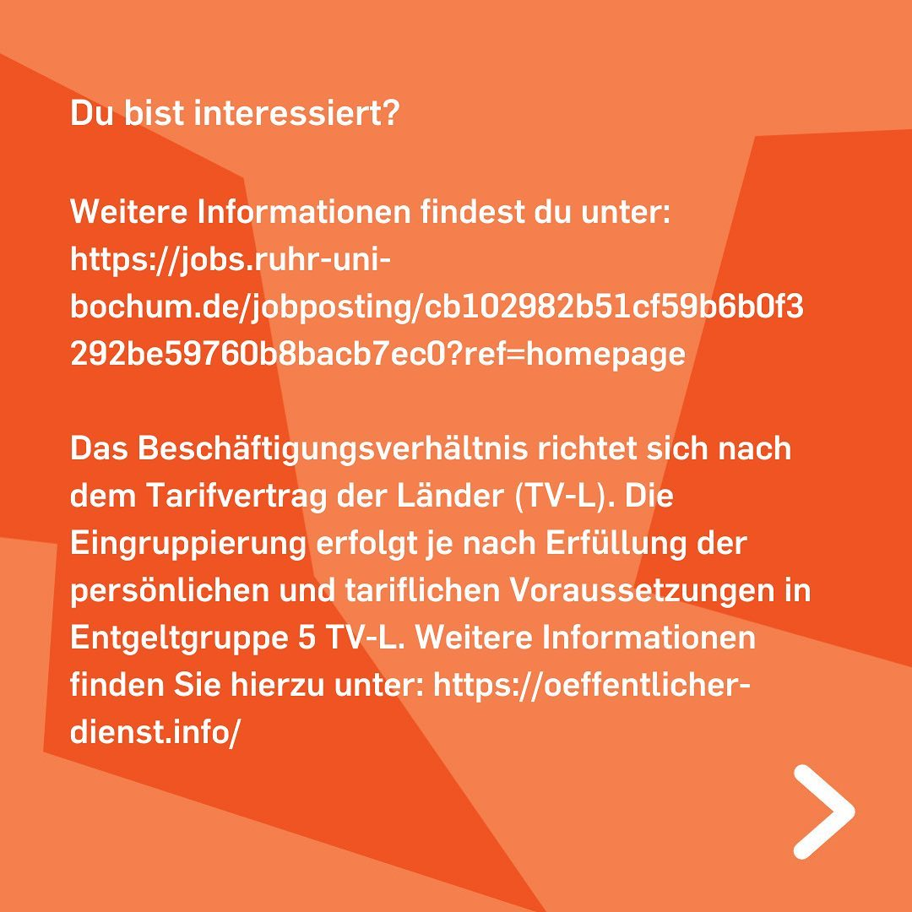
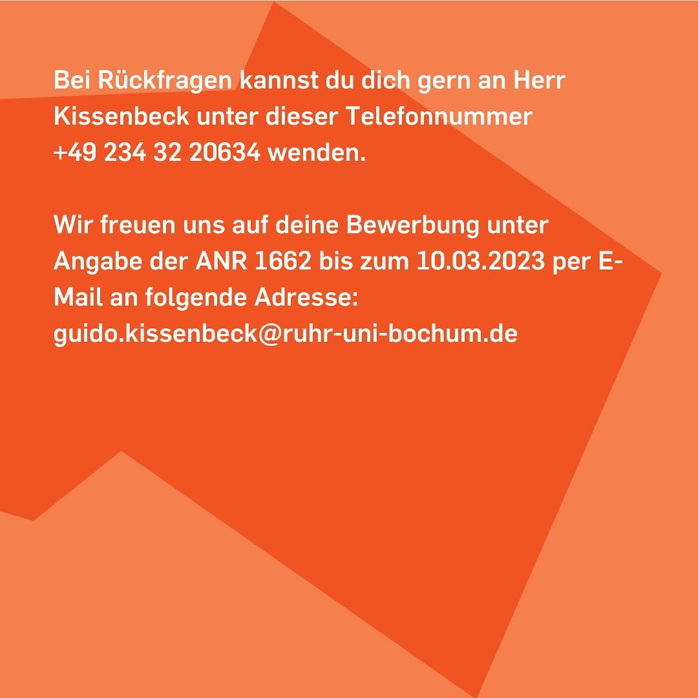

---
hide:
  - toc
date: "2023-02-21"  
authors: "LS"
---

# Werde Teil des Teams

## Mitarbeiter\*in in Teilzeit (m/w/d) zur Unterstützung im RUB-Makerspace gesucht
  
### Deine Aufgaben:  
- Unterstützung des bestehenden Teams beim Aufbau des Makerspace. 
- Unterstützung von Nutzer\*innen des Makerspace und insbesondere zu deren allgemeiner Unterstützung bei der Umsetzung aller Arten von Projekten im Makerspace. 
- Unterstützung bei der Veranstaltungsorganisation sowie -umsetzung von Lehrveranstaltungen, Start-up-Pitches, repräsentative Events, Workshops und so weiter. 
- Unterstützung bei der Orientierung und dem Umgang mit dem Makerspace allgemein sowie auch an/mit konkreter Ausrüstung, Materialien und dem Umgang mit bestimmen Maschinen und Geräten 
- Unterstützung bei der aktiven Vernetzung zwischen verschiedenen Nutzenden   
  
### Dein Profil: 
- Interesse an neuen Dingen und Freude sich mit neuen Technologien und Methoden zu beschäftigen und dies zu teilen.
- Interdisziplinäres Denken und Vernetzung mit anderen Studierenden 
- Programmierkenntnisse allgemein und auch Kenntnisse in möglichst verschiedenen informatischen Bereichen sind von Vorteil, idealerweise verfügst Du über informatisch-technische Kenntnisse bzgl. des Einsatzes und des Programmierens von Einplatinencomputern und Microcontrollern (zum Beispiel Arduino). 
- Ebenfalls von Vorteil sind technische Kenntnisse im handwerklichen Bereich, wie etwa Basteln und Tüfteln, Metallbau, Kunststoff- oder Keramikverarbeitung, 3D-Druck, Medienproduktion oder dem Umgang mit CAD-Programmen und CNC-Maschinen. 
- Verhandlungssicheres Deutsch in Wort und Schrift 
  
Dein Ansprechpartner für weitere Informationen ist: Herr Kissenbeck, Tel.: +49 234 32 20634 Wir freuen uns auf Deine Bewerbung unter Angabe der ANR 1662 bis zum 10.03.2023 per E-Mail an folgende Adresse: guido.kissenbeck@ruhr-uni-bochum.de  
Die Stellenanzeige findest Du [hier](https://jobs.ruhr-uni-bochum.de/jobposting/cb102982b51cf59b6b0f3292be59760b8bacb7ec0?ref=homepage).

{ width="45%" }
{ width="45%" }
{ width="45%" }
{ width="45%" }
{ width="45%" }
{ width="45%" }

