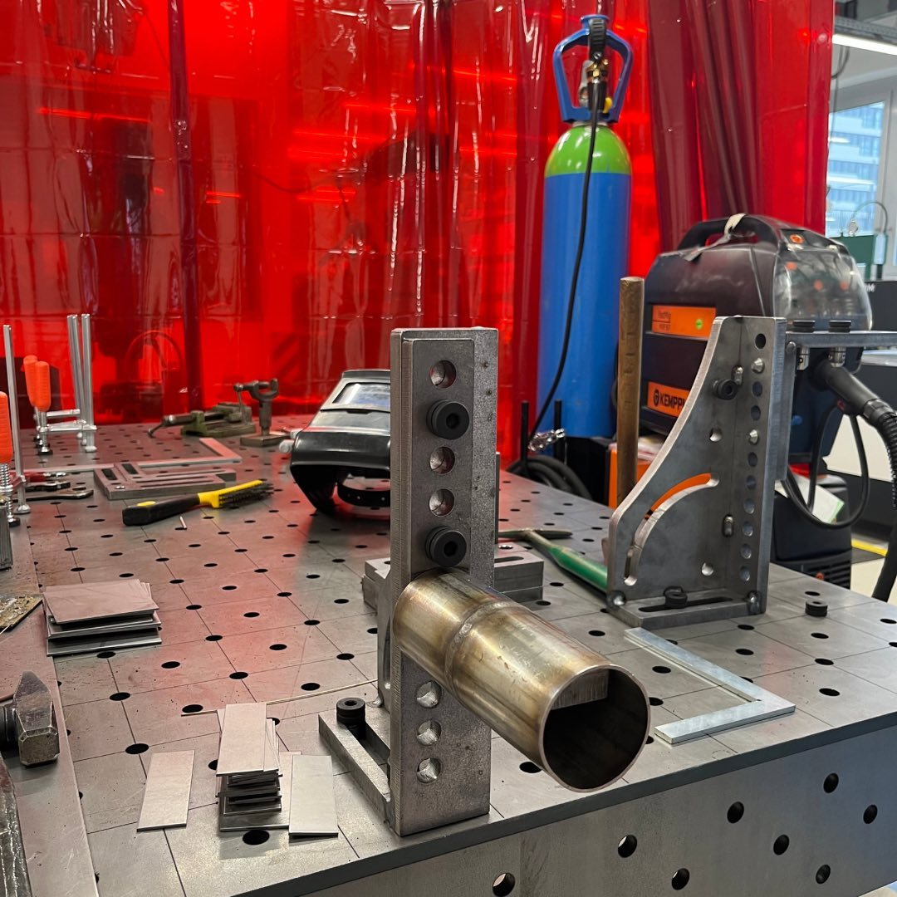

---
hide:
  - toc
date: "2023-03-03"  
authors: "LS"
---

# Schweißen in der Metallwerkstatt

Wusstest Du...    
dass Du bei uns in der [Metallwerkstatt](../metallbauwerkstatt.md) demnächst schweißen kannst? Vom Elektrodenschweißen, Wolfram-Inertgas-Schweißen (WIG-Schweißen) über Metall-Inertgasschweißen (MIG-Schweißen) & Metall-Aktivgasschweißen (MAG-Schweißen) bis hin zum Autogenschweißen ist nach der Eröffnung unseres Untergeschosses alles möglich. Aktuell ist die Metallbauwerkstatt noch mitten im Aufbau und nur in Einzelfällen nach Absprache nutzbar. Insbesondere sind die meisten Maschinen noch nicht oder nur eingeschränkt in Betrieb.

{ width="45%" }
{ width="45%" }

