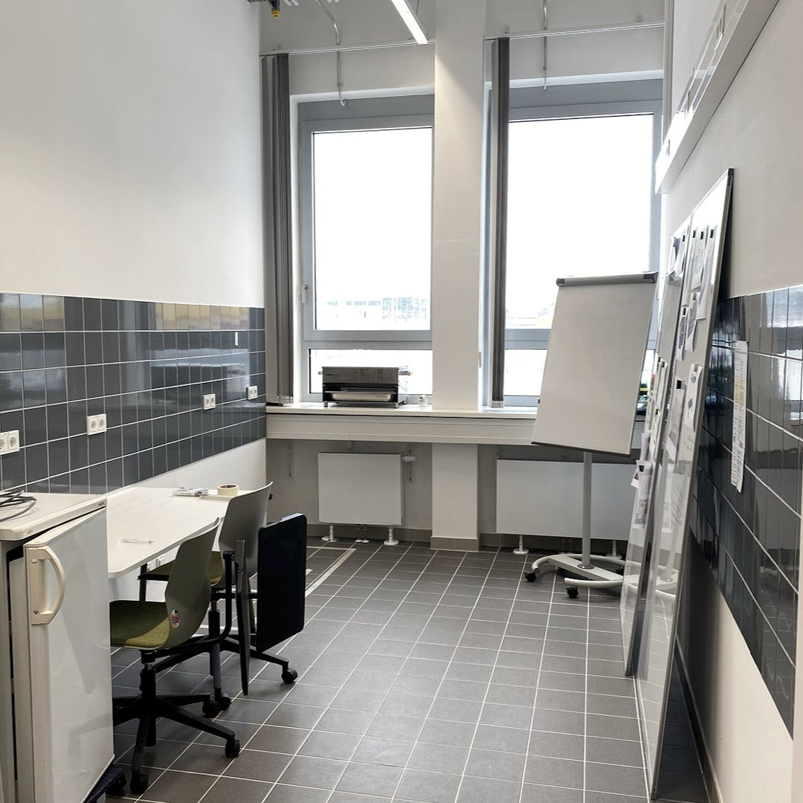
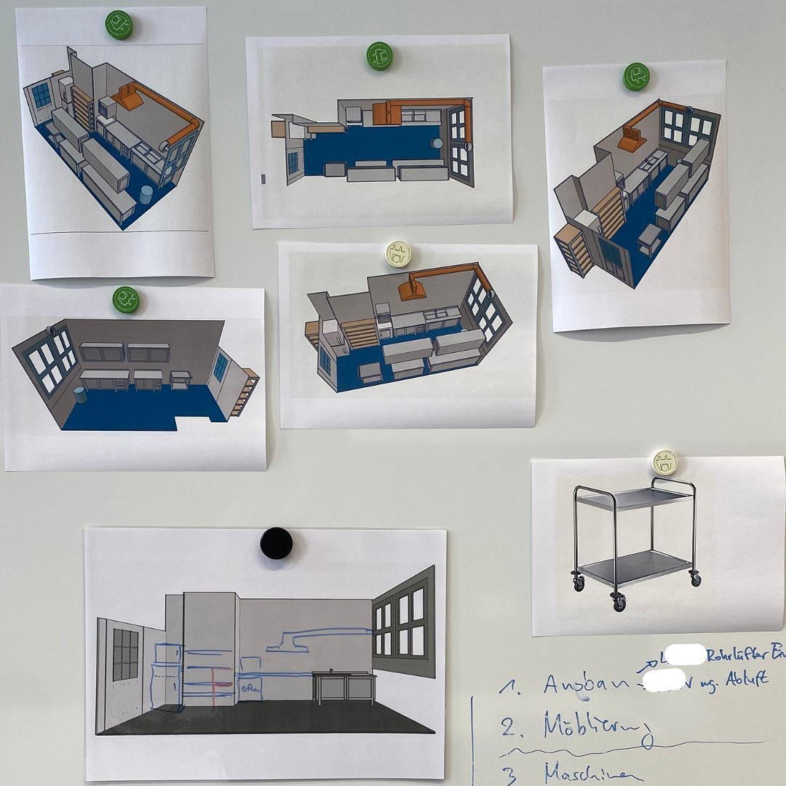
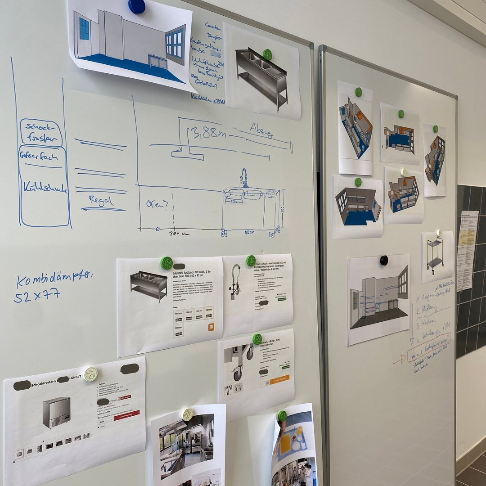

---
hide:
  - toc
date: "2023-03-10"  
authors: "LS"
---

# Planung des Küchenlabors

Die Planung unserers [Küchenlabors](../kuechenlabor.md) geht in die nächste Runde! Nachdem alles vermessen wurde und wir ein Grundkonzept zur Gestaltung des Küchenlabors entworfen haben, überlegen wir nun welche Maschinen und Geräte wichtig sind. Hast Du Anregungen und Wünsche, was in unserem Küchenlabor zur Verfügung stehen sollte? Melde Dich bei uns [hier](../kontakt.md).

{ width="45%" }
{ width="45%" }
{ width="45%" }
{ width="45%" }

